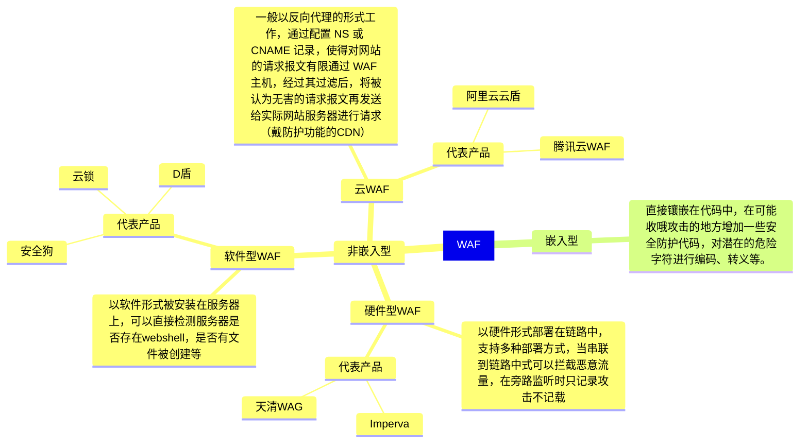

# web应用搭建

网站四大件
 
1. 操作系统
2. 中间件
3. 数据库
4. 源码

## 常规搭建

常规的 web 应用搭建流程：购买服务器，域名（按量付费会比较实惠） -> 服务器上搭建中间件（用于简化开发，IIS之类的）-> 下载并上传 web 程序源码 -> 添加网站并绑定域名目录

`主机记录（域名前缀）.域名`

常规的网站搭建情况：

- *子域名模式搭建*：搭建子域名站点（baidu.com -> tieba.baidu.com 一个程序，xxx.baidu.com 一个程序）
- *端口模式*：xxx.baidu.com 一个程序，xxx.baidu.com:88 一个程序
- *目录模式*：xxx.baidu.com/faker 一个程序，xxx.baidu.com/bbs 一个程序

其他：分配站（cnblog）（更安全）、集成软件、docker容器等

中间件配置
- 身份验证
- 目录权限
- 解析规则

*源码*
- 拥有结构组成（数据库目录，后台目录，文件目录之类的，渗透方将后门放入重要的目录中可能可以防止目录被锁导致后门失效）具体有：
	- 配置文件（option之类的，从中可能可以找到数据库文件等配置信息，也存在 *站库分离（数据库文件在另外的服务器或云上）* 的情况）
- 类型
	- 开源：在网上就能下载 
		- 源码可见
		- 源码不可见
			- 加密
			- 语言特性决定（.class）
		- **不管怎样，有源码的话就能进行白盒测试（代码审计，即从源码中分析漏洞）**
	- 闭源：花钱请人开发
	- 自写

```tx
常见的目录含义 ||
:==: | :==: 
Admin | 后台
bin | 可执行程序
database | 数据库相关
images | 图片相关
js | 前端
```

路由访问
1. 常规访问：URL跟文件目录对应
2. 路由决定：URL不跟文件目录对应，根据配置路由决定（mvc源码、java源码、python源码）

## 非常规搭建

除了常规化搭建（源码与数据都在服务器，使用常规安全测试手法）与站库分离（需连接数据库才能影响数据）外还有搭建方法：

**前后端分离** ：

前端是网站的前界面（我们看到的界面），后端则是后台管理等。前端使用 js 框架开发，利用 api 传输数据，常规的网站也有前后端之分，但基本上都是在同一台服务器上，前端和后端代码往往紧密结合在一个项目里。前端页面（HTML、CSS、JavaScript）和后端逻辑（如用 Java、Python、PHP 等语言编写的服务器端代码）混杂在一起，而前后端分离与常规前后端的主要区别就是前后端之间的工作与开发基本上都是独立的，两者之间使用 API 进行通信。

使用常规前后端开发就像是，比如一个基于 PHP 的网页应用，PHP 文件中可能既包含用于生成 HTML 页面的代码，又包含用于处理数据库查询、业务逻辑等后端功能的代码。而前后端分离就像是，一个电商网站的前端是一个独立的 Vue.js 项目，后端是一个基于 Spring Boot 构建的 API 服务，两者通过 HTTP 请求进行通信。

对测试思路的影响：
1. 前端页面大部分不存在漏洞
2. 后台大部分不在同域名
3. 获取权限可能不影响后端

安全测试：能找到后端就测后端，找不到尝试寻找框架是否存在历史漏洞，还没有的话基本上就只能从社工或其他的应用点入手了。

**用集成式环境搭建（宝塔）**：方便，会自动对权限配置做限制（文件管理会锁定目录，命令执行无法执行）（phpstudy：不安全 ，可以执行命令，自己装 iis ：有些命令可以执行，有些目录可访问）

`whoami` : 查看当前用户

**docker 容器**：虚拟化技术独立磁盘空间，而非真实物理环境，给程序打造独立运行环境，所以攻击者攻击的是虚拟空间磁盘 -> docker 逃逸，要从虚拟空间中逃出去。

**建站/分配站**：利用别人的域名、模板来搭建，攻的是别人的托管平台，收集信息环节就可以分辨出来（基本不必测试这种网站，这种网站没东西）

静态网站：html 等写的网站，数据全都在html源码中，不会进行传输（js传输不算），这样就没有漏洞。另外还有“伪静态”这种东西


part1: 网络安全 win
part2: 系统安全 linux
part3: 代码安全 web渗透

# web 架构

## 安全产品

**WAF**

web 应用防火墙，旨在提供防护，常规web安全测试手段会因此受到拦截。



**CDN**

内容分发服务，旨在提高访问速度

当你把网站部署z

对象存储oss：如果web应用使用了这个，我们上传的后门会被丢到这里而不是网站服务器的源码目录中，这样就减去了上传漏洞。

反向

负载均衡

# 虚拟环境部署

## 概述

什么是虚拟机？

传统运行模式中，一台计算机只能同时运行一个操作系统……

但*虚拟化*后就不一样！

### 虚拟机运行架构

1. 寄居架构（便宜，实验环境，虚拟机软件装在个人操作系统上）
2. 原生架构（贵，生产环境，虚拟机软件直接装在硬件上，虚拟机本身即操作系统）

## VMware

[VMware Workstation虚拟机合集+激活密钥_Win+Linux_10∕11∕12∕14∕15∕16∕17 - 『逆向资源区』 - 吾爱破解 - LCG - LSG |安卓破解|病毒分析|www.52pojie.cn](https://www.52pojie.cn/thread-1804571-1-1.html)

[VMware 17 下载安装及永久激活使用教程 - 嘿笨笨熊 - 博客园 (cnblogs.com)](https://www.cnblogs.com/hellogmy/p/17253041.html)

- VMware
	- 寄居：VMware Workstation
	- 原生：VMware vSphere
- Microsoft : Hyper-V（寄居）

### FTP服务器

我的电脑 -> `ftp://XXX.XXX.XXX.XXX`

[8uFtp-首页|免费FTP|免费FTP工具|FTP软件下载|FTP下载|永久免费](http://www.8u.cn/)

## 管理虚拟机

# win

## 关闭更新服务

win + r -> services.msc -> windows update -> 常规 -> 禁用 -> 恢复 -> （第一次失败）无操作

win + r -> gpedit.msc -> windows配置 -> windows update -> 配置自动更新

