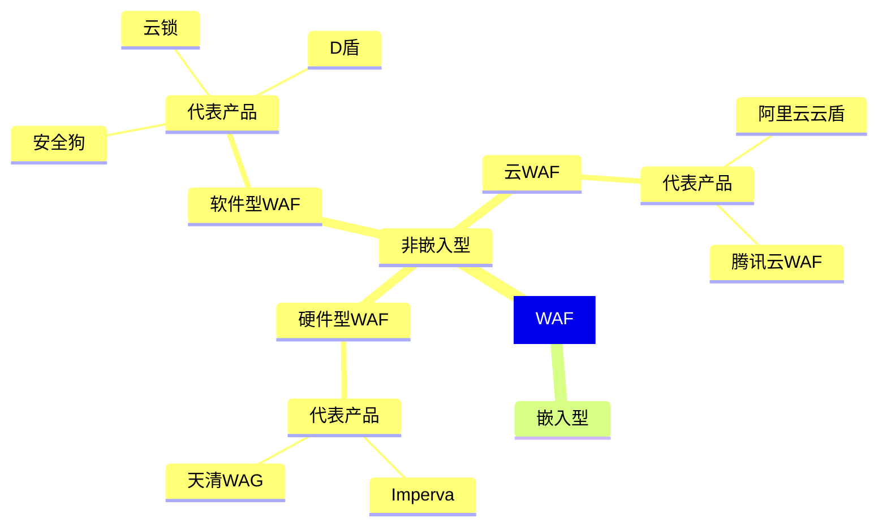

# 网络

两台电脑之间可以用网线连接起来，多台电脑间也可以用多条网线来连接起来，但这样有点麻烦，于是这里可以添置一个中间设备，所有电脑只需连接它然后使用这个中间设备来转发信息就行了，它就是 *集线器* 。

*集线器* 能将传入的数据包不做任何处理转发到所有出口，但这样就不能一对一通信了。解决方法是：给每台电脑起个名字（*Mac 地址*），然后发送数据包时在数据包前加上从哪里来到哪里去。这样一来，作为接收方的电脑看到信息不是给自己的就能忽略了。不过只是这样的话其他所有电脑还是能看到不属于自己的数据包，所以让这个集线器更智能一点，让信息只发送给目标电脑一个，它就变成了 *交换机* 。

交换机内部维护着一张 *Mac 地址表*，记录着每一个设备的 Mac 地址连接在哪个端口上。一开始的时候这张表时空的，交换机跟集线器没有区别，不过它会学习数据帧的源 MAC 地址来更新自己的表，这样之后就能正常工作了。

随着电脑数量越来越多，交换机的端口也不够用了。这是只要将多个交换机连接起来就行了，当然，另一个交换机所连接的所有设备对应的这个交换机的端口也就都是同一个。故虽然交换机的端口数量就会够用，但里面维护的 Mac 地址表确实是越来越大了，这样随着电脑数量的增多总有一天会出问题，这该怎么办呢？

这里的问题在于连到另一个交换机的那条线后面不知道有多少的设备连接进来，使得这张表越来越大，故可以让它接入一个新的设备，该设备拥有自己独立的 Mac 地址，还能帮我们做一次数据的转发，这个设备就是 *路由器* 。路由器的每个端口都有独立的 Mac 地址，这样只要往地址表中添加一条路由器地址与端口的映射关系数据就够了。而要将要发给另外一个交换机上的设备的所有信息先发给路由器又该怎么办呢？可以在 Mac 地址上做手脚（比如让一个交换机的设备的地址前几位统一），这样就可以根据地址来判断了。不过修改已有设备的 Mac 地址显然是不现实的：

*Mac 地址*
	也叫物理地址、硬件地址，长度为 48 位，其中前24位代表网络硬件制造商的编号，后面 24 位由厂家自行分配，一般表系列号。**一台设备的 Mac 地址在全世界范围内都是唯一的** 。

故我们尝试给电脑起一个新的随时能更改的名字，可以用一个 32 位的二进制编号，将它平均分为4部分，每部分用点相连，再将每部分转换为十进制，这就是 *ip 地址* 。这样就可以根据 ip 地址的前几位来判断是否要发给路由器了，然后之后的事就交给路由器。还要有一个机制用以将 ip 地址映射到 Mac 地址上，这个机制就是 *ARP 协议* ，每个设备中都会存一张 ARP 缓存表用以记录 ip 与 mac 地址的对应关系，这张表也像交换机中的那个表一样一开始空的然后经过一轮 ARP 请求才会往表中填东西。于是现在，一个数据包里除了要添加数据链路层头部信息（Mac 地址信息）之外，还要再加一个网络层的头部（ip 地址信息）。

这样一来，假如设备 A 的数据包要发给另一个交换机上的设备 B ，数据包的传输过程就像：
1. 先记录网络层头部信息，然后根据 ip 地址判断目标 Mac 地址——这里显然要传给路由器，于是就将路由器 Mac 地址写在数据链路层头部。
2. 数据包收到信息后，会根据 ip 地址修改数据链路层头部信息将目标 Mac 地址改为 B 的，然后将源 Mac 地址改为另一个端口的 Mac 地址，接着发出去。
3. 这样 B 就能接收到信息了。

这个过程中，A 判断是否通过路由器传输的根据就是 *子网* ，就是说若原 ip 与目标 ip 在同一子网就通过交换机发送出去，若不在一个子网就直接交给路由器。是否在同一子网就看 ip 地址前几位，也就是要使用 *子网掩码*  分别跟原 ip 和目标 ip 进行与运算，若结果相等则为同一子网。

A 要知道哪个设备是路由器，就要在 A 设置 *默认网关* 。*默认网关* 就是路由器端口的 ip 地址，当遇到不在同一个子网的电脑时，就将包先发到那里（这时设备 A 会查询默认网关的 mac 地址）。

路由器要实现继续将包往下传输的功能，就还需要一张 *路由表* ，存储地址范围与端口的对应关系。路由表中还可能会有 *下一跳地址* ，表示如果包不能直接传到目的地，可以再转交给下一个路由器来处理。

也就是说，网络层本身没有传输包的功能，包的实际传输是委托给数据链路层来实现的。交换机中有 Mac 地址表，路由器中有路由表，ARP 缓存表设备与路由器中都有。


# dns

**DNS（Domain Name System，域名系统）** 是互联网的“电话簿”，它的核心功能是将人类可读的域名（如 `www.google.com`）转换为机器可识别的 IP 地址（如 `142.250.189.196`）。没有 DNS，我们就需要记住复杂的数字串才能访问网站。

**查询过程（简化版）：**

当你在浏览器输入 `www.example.com` 时：

1. **本地查询**：设备先检查本地缓存（如浏览器、系统缓存）。
2. **递归解析器**：若未命中，请求运营商或公共DNS（如 `8.8.8.8`）。
3. **根域名服务器**：递归解析器向根服务器（全球13组）询问顶级域（如 `.com`）的位置。
4. **顶级域服务器**：根服务器返回 `.com` 服务器的地址。
5. **权威域名服务器**：`.com` 服务器返回 `example.com` 的权威服务器地址。
6. **获取IP**：权威服务器提供 `www.example.com` 的 IP 地址，结果逐级缓存返回给用户。

整个过程通常在毫秒级完成！

# web应用搭建

网站四大件
 
1. 操作系统
2. 中间件
3. 数据库
4. 源码

## 常规搭建

常规的 web 应用搭建流程：购买服务器，域名（按量付费会比较实惠） -> 服务器上搭建中间件（用于简化开发，IIS之类的）-> 下载并上传 web 程序源码 -> 添加网站并绑定域名目录

简单的说：买服务器 → 装环境 → 传代码 → 绑域名。

不过这套流程在今天已经有些过时了，特别是手动装中间件那部分。现在连阿里云腾讯云都默认提供宝塔镜像。

`主机记录（域名前缀）.域名`

常规的网站部署中的 **路由分发策略** （用于将不同业务或服务映射到同一服务器的不同入口）：

- *子域名模式搭建*：搭建子域名站点，通过 *DNS 解析* 将不同子域名指向同一服务器 IP ，然后服务器 Web 程序（如 Nginx）根据 `Host` 头将请求路由到不同服务（baidu.com -> tieba.baidu.com 一个程序，xxx.baidu.com 一个程序）
- *端口模式*：xxx.baidu.com 一个程序，xxx.baidu.com:88 一个程序
- *目录模式*：xxx.baidu.com/faker 一个程序，xxx.baidu.com/bbs 一个程序

中间件配置
- 身份验证
- 目录权限
- 解析规则

*源码*
- 拥有结构组成（数据库目录，后台目录，文件目录之类的，渗透方将后门放入重要的目录中可能可以防止目录被锁导致后门失效）具体有：
	- 配置文件（option之类的，从中可能可以找到数据库文件等配置信息，也存在 *站库分离（数据库文件在另外的服务器或云上）* 的情况）
- 类型
	- 开源：在网上就能下载 
		- 源码可见
		- 源码不可见
			- 加密
			- 语言特性决定（.class）
		- **不管怎样，有源码的话就能进行白盒测试（代码审计，即从源码中分析漏洞）**
	- 闭源：花钱请人开发
	- 自写

```tx
常见的目录含义 ||
:==: | :==: 
Admin | 后台
bin | 可执行程序
database | 数据库相关
images | 图片相关
js | 前端
```

路由访问
1. 常规访问：URL跟文件目录对应
2. 路由决定：URL不跟文件目录对应，根据配置路由决定（mvc源码、java源码、python源码）

## 非常规搭建

除了常规化搭建（源码与数据都在服务器，使用常规安全测试手法）与站库分离（需连接数据库才能影响数据）外还有搭建方法：

**前后端分离** ：

前端是网站的前界面（我们看到的界面），后端则是后台管理等。前端使用 js 框架开发，利用 api 传输数据，常规的网站也有前后端之分，但基本上都是在同一台服务器上，前端和后端代码往往紧密结合在一个项目里。前端页面（HTML、CSS、JavaScript）和后端逻辑（如用 Java、Python、PHP 等语言编写的服务器端代码）混杂在一起，而前后端分离与常规前后端的主要区别就是前后端之间的工作与开发基本上都是独立的，两者之间使用 API 进行通信。

使用常规前后端开发就像是，比如一个基于 PHP 的网页应用，PHP 文件中可能既包含用于生成 HTML 页面的代码，又包含用于处理数据库查询、业务逻辑等后端功能的代码。而前后端分离就像是，一个电商网站的前端是一个独立的 Vue.js 项目，后端是一个基于 Spring Boot 构建的 API 服务，两者通过 HTTP 请求进行通信。

对测试思路的影响：
1. 前端页面大部分不存在漏洞
2. 后台大部分不在同域名
3. 获取权限可能不影响后端

安全测试：能找到后端就测后端，找不到尝试寻找框架是否存在历史漏洞，还没有的话基本上就只能从社工或其他的应用点入手了。

**用集成式环境搭建（宝塔）**：方便，会自动对权限配置做限制（文件管理会锁定目录，命令执行无法执行）（phpstudy：不安全 ，可以执行命令。自己装 iis ：有些命令可以执行，有些目录可访问）

`whoami` : 查看当前用户

**docker 容器**：虚拟化技术独立磁盘空间，而非真实物理环境，给程序打造独立运行环境，所以攻击者攻击的是虚拟空间磁盘 -> docker 逃逸，要从虚拟空间中逃出去。

**建站/分配站**：利用别人的域名、模板来搭建，攻的是别人的托管平台，收集信息环节就可以分辨出来（基本不必测试这种网站，这种网站没东西）

静态网站：html 等写的网站，数据全都在html源码中，不会进行传输（js传输不算），这样就没有漏洞。另外还有“伪静态”这种东西

part1: 网络安全 win
part2: 系统安全 linux
part3: 代码安全 web渗透

# web 架构服务

**WAF**

web 应用防火墙，旨在提供防护，常规web安全测试手段会因此受到拦截。



非嵌入型WAF
- *硬件型WAF* ：以硬件形式部署在链路中，支持多种部署方式，当串联到链路中式可以拦截恶意流量，在旁路监听时只记录攻击不记载。
- *软件型WAF* ：以软件形式被安装在服务器上，可以直接检测服务器是否存在webshell，是否有文件被创建等
- *云WAF* ：一般以 *反向代理* 的形式工作，通过配置 NS 或 CNAME 记录，使得对网站的请求报文有限通过 WAF 主机，经过其过滤后，将被认为无害的请求报文再发送给实际网站服务器进行请求（戴防护功能的CDN）

嵌入型WAF ：直接镶嵌在代码中，在可能收哦攻击的地方增加一些安全防护代码，对潜在的危险字符进行编码、转义等。

它会导致你的测试遭到拦截。

**CDN**

内容分发服务，旨在提高访问速度

当你把网站部署在自己的所在地时，自己所在地这边的人访问的速度就会很快，但其他地区的 人访问的话就会慢。开放 CDN 服务之后就会在所选区域中分布各种节点来提高访问速度。

CDN 会隐藏真实源 IP ，导致对目标测试错误。

使用：

1. 配置域名绑定
2. 配置 cdn 加速选项
3. 添加 dns cname 记录

**对象存储oss**

如果web应用使用了这个，我们上传的后门会被丢到这里而不是网站服务器的源码目录中，这样上传漏洞就不行了，也解析不了。

但它还有个 Accesskey 安全隐患，拿到这个就能控制当前账户开放的服务器或应用之类的。

**反向代理**

正向代理为客户端服务，客户端主动建立代理访问目标（翻墙之类的）。
反向代理为服务端服务，服务器自己将流量给到代理服务器。

两种代理都解决了访问不可达的问题，而反向代理的影响是你的访问目标不是真实服务器，而只是代理服务器。

**负载均衡**

用多个服务器来支撑服务，防止服务器出现问题导致服务终止。

这样在测试过程中就会存在多个目标。

# APP 搭建

## APP 应用开发架构

**原生开发**

安卓基本都用 java 来开发，简单的说就是用安卓提供的一系列控件来实现页面。这样开发的app开发的成本很大，但效果是最好的。

安全测试策略：利用安卓逆向技术反编译&抓包技术&其他各种可能的测试策略

**用 flutter 开发**

**常规 web 开发 + APP 封装**

开发一个网站，然后套 app 的壳。-> 一门 app 之类的服务就可以干这个（可以搜索 APP 封装查找相关服务）。

这种 app 一般很小，而且受制于网页技术本身，可实现功能少，每次打开几乎所有内容都要重新加载，故反应速度也慢。

其安全测试的策略就和常规的 web 测试的策略没有区别。

**用 html5 + vue 之类的前端语言开发 + APP 封装（直接使用了HbuiderX）**

界面由 html5 进行开发，数据传输用 vue 。

小程序也可以这样开发。

安全测试策略：要关注框架本身的安全问题和其提交数据的结构问题&js前端测试。

***小程序搭建基本上是用 html5 + vue 之类的前端语言开发或常规 web 开发 + 封装平台封装***

判断应用如何开发的最为稳妥的方式是反编译看源码，但基本上只凭经验也都可以看出。

# 渗透命令

分为常规命令和文件上传下载

## 文件上传下载命令

> 用于解决无图形化 & 数据传输。

自己去下载文件时，都会有一个下载地址，有的直接访问就可以下载，有的要在页面中点击下载等等，但在安全测试场景中（得到了某些权限，但只允许你输入命令行之类的），很多时候不允许这些图形化的操作，这时候需要命令来完成。

# 相关术语

*肉鸡*
	指能够随意被黑客操控的计算机

*木马*
	伪装成了正常的程序，但实际运行起来就会获取整个系统的操控权限的程序。而 *网页木马* 是伪装成了正常的网页，但一访问就会利用对方系统的漏洞将木马程序下载到对方计算机上并主动运行的网页。

*挂马*
	在别人的网站文件中放入网页木马火或将木马代码嵌入正常网页中。

*后门*
	绕过安全性操控获取程序或系统控制权的方法。一般程序员会在程序中留后门来修正程序中的缺陷，不能被其他人知道，发布时也应该删除，否则会造成安全隐患。

# 虚拟环境部署

## 概述

什么是虚拟机？

传统运行模式中，一台计算机只能同时运行一个操作系统……

但 *虚拟化* 后就不一样！

### 虚拟机运行架构

1. 寄居架构（便宜，实验环境，虚拟机软件装在个人操作系统上）
2. 原生架构（贵，生产环境，虚拟机软件直接装在硬件上，虚拟机本身即操作系统）

## VMware

[VMware Workstation虚拟机合集+激活密钥_Win+Linux_10∕11∕12∕14∕15∕16∕17 - 『逆向资源区』 - 吾爱破解 - LCG - LSG |安卓破解|病毒分析|www.52pojie.cn](https://www.52pojie.cn/thread-1804571-1-1.html)

[VMware 17 下载安装及永久激活使用教程 - 嘿笨笨熊 - 博客园 (cnblogs.com)](https://www.cnblogs.com/hellogmy/p/17253041.html)

- VMware
	- 寄居：VMware Workstation
	- 原生：VMware vSphere
- Microsoft : Hyper-V（寄居）

### FTP服务器

我的电脑 -> `ftp://XXX.XXX.XXX.XXX`

[8uFtp-首页|免费FTP|免费FTP工具|FTP软件下载|FTP下载|永久免费](http://www.8u.cn/)

## 管理虚拟机

# win

## 关闭更新服务

win + r -> services.msc -> windows update -> 常规 -> 禁用 -> 恢复 -> （第一次失败）无操作

win + r -> gpedit.msc -> windows配置 -> windows update -> 配置自动更新

