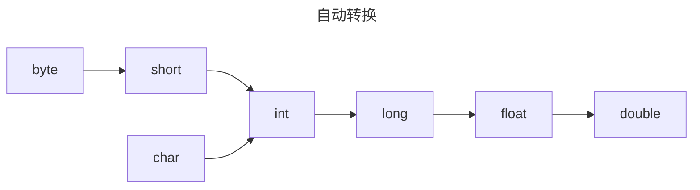
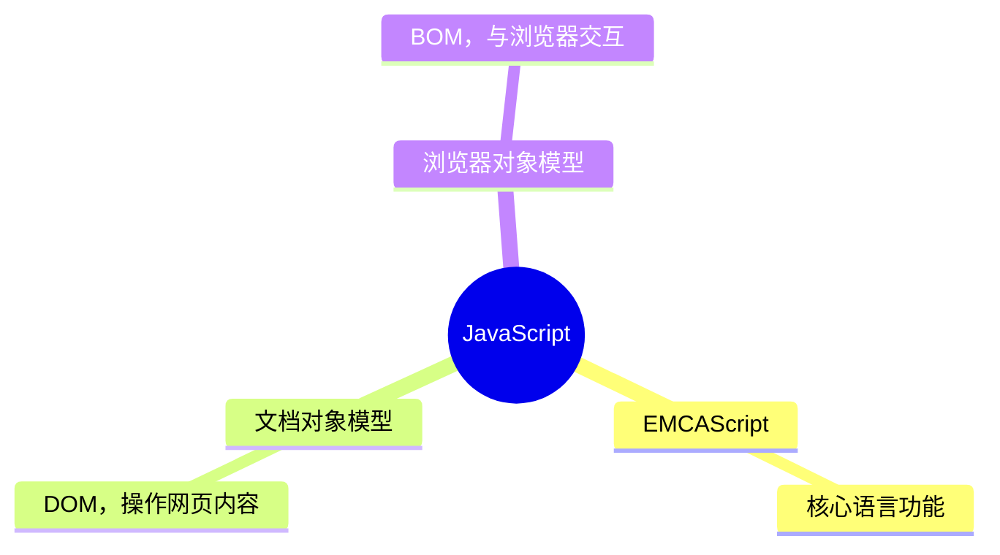
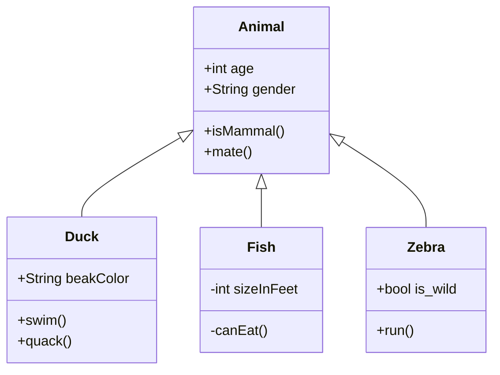

Make a note of something, [[从（1）开始学习 stm32 开发]], or try [the Importer](https://help.obsidian.md/Plugins/Importer)!

When you're ready, delete this note and make the vault your own.

# sfsdf

## sdfsdfs

### sdfsdfs

#### sadfsdfg

##### sadfsdfsd

###### sdfsdfsdfsdf

**sdfsdf** *sdfsdfsd* ***sdfsdfsdsdfaodishfoisd***

[Obsidian-DATAVIEW 官方文档 中文版 05 Javascript API JS接口 - 知乎](https://zhuanlan.zhihu.com/p/508434025)

[obsidian：双向链接的基本用法 - 知乎](https://zhuanlan.zhihu.com/p/499417467)





> vxcvxcvxd
> ***fsdfsdfsd***
> **fsdf**
> *sadufhiuwedf*

`vsvs` 

**vscvcvsc**

***fgdfgdf***

*sdscvcv*

==dsfgbb==

~~dfgdfgdfg~~

 - [ ] 这里是列表文本
 - [ ] sdsf

1. sdfsdfs
2. dfsdsdsf

- jghjfgfg
- fgjfgjf
- dfdfgdfgdfg


> [!NOTE] Title
> Contents


---

```
sdgsdgs
```

"sdsdgs"

| zxfdfsdfs | fdgdfhdhd  |
|:--------- | ---------- |
| dfdfhdf   | dfhdfhdfhd |
| dfdfhdf   | dfhdfhdfhd |
| dfdfhdf   | dfhdfhdfhd |
| dfdfhdf   | dfhdfhdfhd |

```tx
阶段 | 直接产物 | ATP产量
:----: | --------------: | ---------:
糖酵解 | 2 ATP ||
^^ | 2 NADH | 3--5 ATP |
丙酮酸氧化 | 2 NADH | 5 ATP |
柠檬酸循环 | 2 ATP ||
^^ | 6 NADH | 15 ATP |
^^ | 2 FADH2 | 3 ATP |
**30--32** ATP |||
```


sgsdgss `sefsdfs`
: sdsdfsdfsdfsd`asfasfa`jdfd

$E=mc^2$

$$
\sum_{i=0}^{n} i^2 = \frac{(n^2+n)(2n+1)}{6}
$$

[MathJax basic tutorial and quick reference - Mathematics Meta Stack Exchange](https://math.meta.stackexchange.com/questions/5020/mathjax-basic-tutorial-and-quick-reference)

$$
\left[
\begin{matrix}
1 & 2 & 3 \\
4 & 5 & 6
\end{matrix}
\right]
$$

$$
\left[
\begin{array}{cc|c}
1 & 2 & 3 \\
4 & 5 & 6 \\
\hline
7 & 8 & 9
\end{array}
\right]
$$

$$
\begin{CD}
A @>a>> B \\
@VbVV  = @VVcV \\
C @>>d> D
\end{CD}
$$

$$
\alpha\beta\dots\omega
$$

$$
x'x''x'''
$$

$$
\int_a^b f(x) \,dx = F(b) - F(a)
$$

$$
\begin{array}{cc}
\text{Bad} & \text{Better} \\
\hline \\
|\sin{x}| & \lvert \sin{x} \rvert \\[2ex]
e^{i\frac{\pi}{2}} \,\, e^{\frac{i\pi}{2}} & e^{i\pi/2} \\[2ex]
\int_{-\frac{\pi}{2}}^{\frac{\pi}{2}} \sin{x} \, dx & \int_{-\pi/2}^{\pi/2} \sin{x} \, dx \\[2ex]
\left\{ x | x^2 \in \Bbb{Z}\right\}
& \left\{ x \mid x^2 \in \Bbb{Z}\right\}
\end{array}
$$

$$
\begin{array}{}
\hline
\int & \iint & \iiint \\
\dot{x} & \ddot{x} & \prod \\
\infty & \Bbb R & \mathbf x \\
\pm & \gets & \Leftarrow \\
\mapsto & \implies & \iff \\
\land\lor\lnot & \oplus & \forall\exists \\
a \equiv b \pmod{n} & a \bmod b \\
\overline{xyz} & \overrightarrow{AB} & \vec{x} \\
\cong & \sqrt[3]{x} & \Vert \\
\lceil x\rceil & \langle x\rangle & \lt\gt\ge\neq \\
\emptyset & \varnothing & \phi\varphi\epsilon\varepsilon\\
\subset\subseteq & \binom{a}{b} & \nabla\partial\\
\times\cdot\div & \cdots\vdots\ddots \\
\hat{j} & \fbox{sdsf} & \overset{\frown}{PQ}\\
\operatorname{arsinh}(x) \\
\hline
\end{array}
\lim_{x \to 0}
$$

$$
\begin{align}
f(x) & = \text{blahblahblah} \\
& = \text{blahblahblah} \\
& = \text{blahblahblah} \\
& \approx \text{blahblahblah}
\end{align}
$$

$$
f(x) = 
\begin{cases}
n/2, & \text{huhu} \\
3n+1, & \text{wocenimenma} 
\end{cases}
$$



```music-abc
X:1
T:The Legacy Jig
M:6/8
L:1/8
R:jig
K:G
GFG BAB | gfg gab | GFG BAB | d2A AFD |
GFG BAB | gfg gab | age edB |1 dBA AFD :|2 dBA ABd |:
efe edB | dBA ABd | efe edB | gdB ABd |
efe edB | d2d def | gfe edB |1 dBA ABd :|2 dBA AFD |]
```

```quicktab
notes 4-5-6b7/3 10/4 | 5-4-2/3 2/2

notes 6-7b9b7/3 7/4 | 9-8-7-6/2
```

 秋闱软月云梳翅， 松拥黛粉更航安。 快莺两望走夏蛙， 撇草追鱼滨鸟眠。

```tikz
\usepackage{circuitikz}
\begin{document}
\begin{circuitikz}[american, voltage shift=0.5]
\draw (0,0)
to[isource, l=$I_0$, v=$V_0$] (0,3)
to[short, -*, i=$I_0$] (2,3)
to[R=$R_1$, i>_=$i_1$] (2,0) -- (0,0);
\draw (2,3) -- (4,3)
to[R=$R_2$, i>_=$i_2$]
(4,0) to[short, -*] (2,0);
\end{circuitikz}
\end{document}
```

```latex
\usepackage{circuitikz}
\begin{document}

\begin{circuitikz}[american, voltage shift=0.5]
\draw (0,0)
to[isource, l=$I_0$, v=$V_0$] (0,3)
to[short, -*, i=$I_0$] (2,3)
to[R=$R_1$, i>_=$i_1$] (2,0) -- (0,0);
\draw (2,3) -- (4,3)
to[R=$R_2$, i>_=$i_2$]
(4,0) to[short, -*] (2,0);
\end{circuitikz}

\end{document}
```


```tikz
\begin{document}
  \begin{tikzpicture}[domain=0:4]
    \draw[very thin,color=gray] (-0.1,-1.1) grid (3.9,3.9);
    \draw[->] (-0.2,0) -- (4.2,0) node[right] {$x$};
    \draw[->] (0,-1.2) -- (0,4.2) node[above] {$f(x)$};
    \draw[color=red]    plot (\x,\x)             node[right] {$f(x) =x$};
    \draw[color=blue]   plot (\x,{sin(\x r)})    node[right] {$f(x) = \sin x$};
    \draw[color=orange] plot (\x,{0.05*exp(\x)}) node[right] {$f(x) = \frac{1}{20} \mathrm e^x$};
  \end{tikzpicture}
\end{document}
```


```tikz
\usepackage{pgfplots}
\pgfplotsset{compat=1.16}

\begin{document}

\begin{tikzpicture}
\begin{axis}[colormap/viridis]
\addplot3[
	surf,
	samples=18,
	domain=-3:3
]
{exp(-x^2-y^2)*x};
\end{axis}
\end{tikzpicture}

\end{document}
```

```math
||{"id":933187298776}||

a + a = b
```
```tikz
\usepackage{chemfig}
\begin{document}
\definesubmol\fragment1{
    (-[:#1,0.85,,,draw=none]
    -[::126]-[::-54](=_#(2pt,2pt)[::180])
    -[::-70](-[::-56.2,1.07]=^#(2pt,2pt)[::180,1.07])
    -[::110,0.6](-[::-148,0.60](=^[::180,0.35])-[::-18,1.1])
    -[::50,1.1](-[::18,0.60]=_[::180,0.35])
    -[::50,0.6]
    -[::110])
    }
\chemfig{
!\fragment{18}
!\fragment{90}
!\fragment{162}
!\fragment{234}
!\fragment{306}
}
\end{document}
```


```tikz
\begin{document}
\begin{tikzpicture}
\draw (0, 0)--(5, 0);
\draw[->] (0, -1)--(5, -1);
\draw[<-] (0, -2)--(5, -2);
\draw[<->] (0, -3)--(5, -3);
\draw[|<->|] (0, -4)--(5, -4);
\draw (0, -5) to (5, -5);
\end{tikzpicture}
\end{document}
```

```tikz
\begin{document}
\begin{tikzpicture}[>=latex]
\draw[->] (0, -1)--(5, -1);
\draw[<-] (0, -2)--(5, -2);
\draw[<->] (0, -3)--(5, -3);
\draw[|<->|] (0, -4)--(5, -4);
\end{tikzpicture}
\end{document}
```

```tikz
\begin{document}
\begin{tikzpicture}[>=stealth]
\draw[->] (0, -1)--(5, -1);
\draw[<-] (0, -2)--(5, -2);
\draw[<->] (0, -3)--(5, -3);
\draw[|<->|] (0, -4)--(5, -4);
\end{tikzpicture}
\end{document}
```

```tikz
\begin{document}
\begin{tikzpicture}[>=stealth]
% 虚线
\draw[dashed] (0,0)--(5,0);
% 点线
\draw[dotted] (0,-1)--(5,-1);
% 点划线
\draw[dashdotted] (0,-2)--(5,-2);
% 不同粗细
\draw[|<->|, dashed, thick] (0, -3)--(5, -3);
\draw[very thick] (0,-4)--(5,-4);
\draw[ultra thick] (0,-5)--(5,-5);
\draw[thin] (0,-6)--(5,-6);
% 标注
\draw[|<->|, dashed, thick] (0, -7)--node{18cm}(5, -7); % 这样不太好
\draw[|<->|, dashed, thick] (0, -8)--node[above]{18cm}(5, -8); % 上方不错
\draw[|<->|, dashed, thick] (0, -9)--node[below]{18cm}(5, -9); % 下方也行
\draw[|<->|, dashed, thick] (0, -10)--node[left]{18cm}(5, -10);
\draw[|<->|, dashed, thick] (0, -11)--node[right]{18cm}(5, -11);
\draw[|<->|, dashed, thick] (0, -12)--node[below=2mm]{18cm}(5, -12); % 指定下方距离
\draw[|<->|, dashed, thick] (0, -13)--node[fill=white]{18cm}(5, -13); % 这样也不错
\end{tikzpicture}
\end{document}
```

```tikz
\begin{document}
\begin{tikzpicture}[>=stealth]
\draw[|<->|] (0, 0)--node[fill=red!20!white]{18cm}(5, 0); % 20%为红色，剩下的是白色
\end{tikzpicture}
\end{document}
```

```tikz
\begin{document}
\begin{tikzpicture}[>=latex]
\draw[->] (-1, 0)--(4, 0)node[right]{$x$};
\draw[->] (0, -1)--(0, 4)node[left]{$y$};
\end{tikzpicture}
\end{document}
```

## 摘抄：爱猫与男娘——作为真实的虚拟

[爱猫与男娘——作为真实的虚拟_哔哩哔哩_bilibili](https://www.bilibili.com/video/BV1Ef421i7EC/?spm_id_from=333.788.recommend_more_video.8&vd_source=7a774f3cabca1af30bf72e095164a42b) 作者：符号社

如果说，如今往流浪汉铁腕里扔钢镚已是令人嗤之以鼻，那么在手机上花点钱就能投喂流浪猫则是当下的潮流。这种模式十分有趣地勾勒出一种看似新颖的欲望图景，

