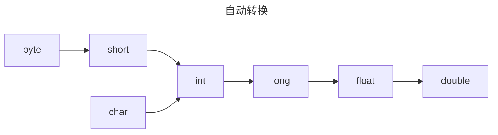
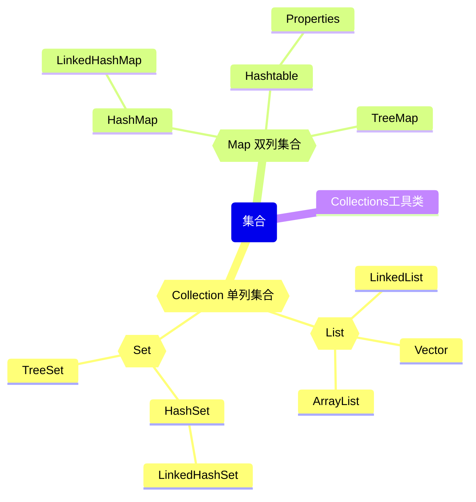
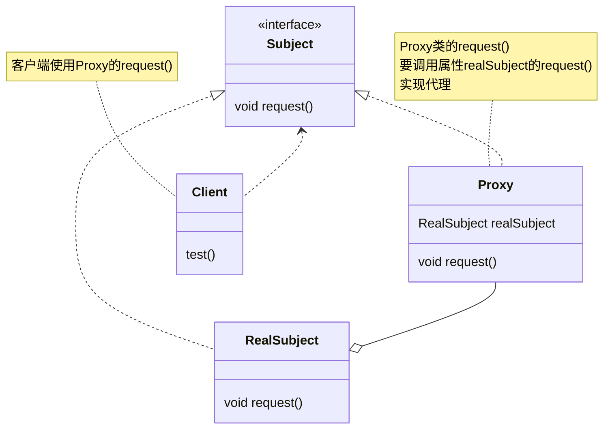
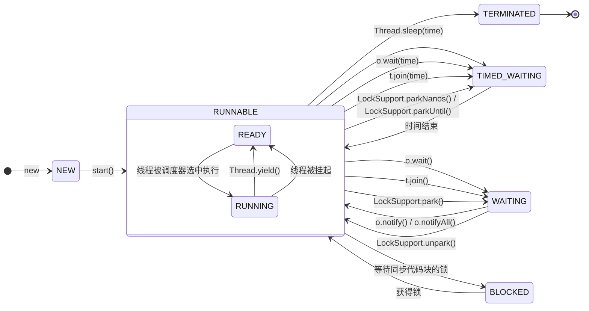

# java 概述与初识 

## java特点

1. 面向对象
2. 健壮： 强类型机制、异常处理、垃圾自动收集
3. 跨平台性（一个编译好的.class文件能在多个系统下运行）
4. 解释性
## 配置 Java

- JVM：java虚拟机，包含在jdk中（对于不同平台，有不同的JVM）
- 编译：javac Test.java ; 运行： java Test
- JDK（java development kit） = JRE + java开发工具
- JRE（java runtime environment） = jvm + java核心类库
- 配置：当前执行程序在当前目录下如果不存在，win10系统会在系统中已有的一个名为**path**的环境变量指定的目录里去查找。

*所以要配置环境变量path！*

步骤：
1. 我的电脑--属性--高级系统设置--环境变量
2. 增加`JAVA_HOME`环境变量，其值为bin所在的位置
3. 编辑`path`环境变量，增加变量`%JAVA_HOME%\bin`

## java API（application programming interface）文档

- 告诉开发者如何使用java提供的类
- 在线中文文档：[*bean*](https://www.matools.com/api)

## IDEA使用

java项目的编写往往需要借助集成开发环境，`IDEA`就是其中常见的一个

[IDEA 2023.2.5 最新破解版安装教程（附激活码，亲测好用） - 犬小哈教程 (quanxiaoha.com)](https://www.quanxiaoha.com/idea-pojie/idea-pojie-202325.html)

- 新建项目：可以自由选择项目所属目录，若没有（自己打的）那个目录的话就会新建一个目录
- 新建类：在`src`下右键再点相应选项新建类
- 运行：`ctrl + shift + F10`
- 设置字体：file -> settings -> appearance
- 字符编码：... -> settings -> editor -> file encodings
- *在idea中我们run一个文件时，会先编译为.class文件再运行（存放在`out`中）*
- `src`存放源码文件

- **快捷键**
    - 找：settings -> Keymap
    - 删除当前行：默认 <kbd>ctrl</kbd> +<kbd> y</kbd> (配置为 <kbd>ctrl</kbd> + <kbd>d</kbd> 可能更好)
    - 复制当前行：配置为<kbd>ctrl</kbd> + <kbd>alt</kbd> + <kbd>↓</kbd> (我的电脑不行……)
    - 补全代码：<kbd>alt</kbd> + <kbd>/</kbd>
    - 添加/取消注释：<kbd>Ctrl</kbd> + <kbd>/</kbd>
    - 导入该行所需要的类（注意在editor -> general -> auto import里设置好）：<kbd>alt</kbd> + <kbd>enter</kbd>
    - 快速格式化代码：<kbd>ctrl</kbd> + <kbd>alt</kbd> + <kbd>l</kbd>
    - 快速运行程序：配置为 <kbd>alt</kbd> + <kbd>r</kbd>
    - 生成构造器等：<kbd>alt</kbd> + <kbd>insert</kbd>
    - 查看一个类的层级关系：<kbd>ctrl</kbd> + <kbd>H</kbd>（**学习继承后十分有用！！**）
    - 将光标放在一个方法上 <kbd>ctrl</kbd> + <kbd>b</kbd> 可以定位到方法（<kbd>ctrl</kbd> + <kbd>左键</kbd> 也很舒服~）
    - 自动分配变量名：`.var`
    - 去掉参数提示：settings -> inlay hints -> java,勾掉parameter hints

- **模板（template）**
    - **像“main”之类的……可高效完成开发！**
    - **查看/自定义：file -> settings -> editor -> live templates**


- **补充·win7关闭ctrl+alt+方向键屏幕翻转**
    **1. 开始 -> 控制面板**
    **2. 屏幕分辨率**
    **3. 高级设置**
    **4. 图形属性**
    **5. 高级模式**
    **6. 选项与技术支持 -> 去掉“启用热键”**

- 显示完整数据：file -> settings -> Build, Execution.. -> Debugger -> Data Views -> java ->  关闭Enable alternative view for Collections classes

## 断点调试

**断点调试**是指在程序的某一行设置一个断点，调试时，运行到这一行就会停住，然后可以一步一步往下调试，过程中可以看各个变量的值，出错的话，调试到出错的代码行就显示错误，停下，进行分析从而找到bug。**断点调试是程序员必备的技能，它也可以帮助我们查看java底层源代码的执行过程，提高java水平**

快捷键：

- `F7`: 跳入方法内
- `F8`: 逐行执行代码
- `shift+F8`: 跳出方法
- `F9`: 直接执行到下一个断点

```java
// Debug查看java底层源代码的执行过程

package com.bean.debug_;
import java.util.Arrays;

public class Debug03 {
    public static void main(String[] args) {
        int arr[] = {8,-1,199,70,10};

        Arrays.sort(arr); // 按alt+shift+F7(强制跳进)跳入方法内
        for(int i = 0; i < arr.length; i++) {
            System.out.print(arr[i] + "\t");
        }
    }
}

// debug如何跳入jdk源码呢？
// 1. alt+shift+F7
// 2(推荐). setting -> build,execution,deployment -> debugger ->Stepping
// 把do not step into the classes中的java.*与jaax.*取消勾选
```


## 如何快速掌握技术/知识点

1. 考虑需求
2. 考虑能否用传统技术解决
    - 能，但不完美
    - 解决不了
3. 引出学习的新技术和知识点
4. 学习新技术的基本语句与基本语法（不要考虑细节）
5. 完成基本程序（哪怕只是增删改查）
6. 开始研究注意事项，使用细节、规范，如何优化

## DOS（Disk Operating System,磁盘操作系统）

### 路径

文件夹 = 目录

相对路径：从当前目录开始定位形成的路径（`..\` : 到上一级目录）
绝对路径：从顶级目录开始定位形成的路径

### 常用DOS指令

`dir （+目标路径）`：查看当前/目标目录
`help + 指令`：查看一指令如何使用
`cd (切换盘+"/D") +路径`：切换目录（`cd \`切换到根目录）
`tree + 路径`：查看指定目录下所有子目录
`cls`：清屏
`exit`：退出DOS系统

拓展：[Dos命令大全完整版](https://blog.csdn.net/chengxuyuanxb/article/details/81093398)

## 进制转换

…… => 十进制：从最低位开始，将每个位上的数提取出来乘基数的位数-1次幂并求和

十进制 => ……：不断除以基数取余放在最右边

二进制 => ……：

- 八进制：每三位一组转为八进制
- 十六进制：每四位一组转为十六进制

…… => 二进制：与上面相反

# Hello World 与基础语法

## hello world!

新建`HelloWorld.java`文件，在里面打上这些内容：

```java
public class HelloWorld {
	// 注意类名应与文件名一致
	public static void main(String[] args) {
		System.out.println("hello world!");
	}
}
```

在文件对应路径中打开cmd（在路径的地方输入`cmd`后回车），先 `javac HelloWorld.java` 来编译，后 `java HelloWorld` 来运行。

## java开发细节

1. java源文件以.java为扩展名，其基本组成部分是*类*
2. java程序执行入口是main方法，有固定书写格式
3. 严格区分大小写
4. 语句以";"结束
5. 一个源文件中至多只能有一个public类
6. 文件名以public类名命名
7. 可以将main方法写在非public类中，指定运行非public类，入口方法就是非public类的main方法（"java Dog"）

## 转义字符

常用转义字符 ：
1. `\t`: tab
2. `\n`: 换行符
3. `\\`: 一个\
4. `\"`: 一个" 
5. `\'`: 一个'
6. `\r`: 一个**回车**

扩展：[Java常用的转义字符](https://www.cnblogs.com/EasonJim/p/6561576.html)
## 注释

- 单行：`//comment`
- 多行：`/*comment*/`
- *文档注释* ：内容可被 jdk 提供的工具 javadoc 所解析，生成一套以网页文件形式体现的该程序的说明文档，一般写在类或方法前

```
/**
 *
 * @author EBAOBAO
 * @version 1.0
 *
 */
```
 
生成文档指令：`javadoc -d (目标文件夹) -xx -yy Demo3.java`

拓展：[javadoc标签](https://www.cnblogs.com/jddreams/p/14503641.html)

## java代码规范基础

1. 类、方法的注释要用javadoc来写
2. 非Javadoc注释往往给代码维护者看，着重告诉读者为什么这样写，如何修改，注意什么问题等
3. 用tab实现缩进
4. 运算符和 = 两边习惯性各加一空格
5. 源文件用utf-8编码
6. 行宽度不要超过80字符
7. 代码编写次行风格或行尾风格

拓展：[java代码规范](https://blog.csdn.net/qq_34869143/article/details/94554253)

---

# java变量与数据类型

## 变量

### 声明变量

要创建变量，必须指定其类型并为其分配一个值：

```java
type variableName = value;
```

要声明多个相同类型的变量，可以使用逗号分隔的列表：

```java
int x = 5, y = 6, z = 50;
System.out.println(x + y + z);
```

### 标识符

所有 Java 变量都必须用独特的名称来标识。Java 对各种变量，方法，类等命名时使用的字符序列称为 **标识符**

标识符可以是短名称（如 `x` 和 `y`），也可以是更具描述性的名称（如 `age`、`sum`、`totalVolume`）。

示例:

```java
// 优秀
int minutesPerHour = 60;

// 可以，但不太容易理解 m 实际代表什么
int m = 60;
```

命名变量的一般规则：

- 名称可以包含字母、数字、下划线和美元符号
- 名称不能以数字开头
- 名称不能包含空格
- 名称区分大小写 ("myVar" 和 "myvar" 是不同的变量)
- 保留字 (例如 Java 关键字，如 `int` 或 `boolean`) 不能用作名称

规范：

1. 包：所有单词小写（aa.bbb.ccc）
2. 类，接口：所有单词首字母大写（XxxYyyZzz）
3. 变量，方法：第二个开始所有单词首字母大写
4. 常量：所有字母大写，单词之间用_来连接
### 变量作用域

在Java中，多行语句用`{ ... }`括起来。很多控制语句，例如条件判断和循环，都以`{ ... }`作为它们自身的范围，例如：

```java
if (...) { // if开始
    ...
    while (...) { // while 开始
        ...
        if (...) { // if开始
            ...
        } // if结束
        ...
    } // while结束
    ...
} // if结束
```

只要正确地嵌套这些`{ ... }`，编译器就能识别出语句块的开始和结束。而在语句块中定义的变量，它有一个作用域，就是从定义处开始，到语句块结束。超出了作用域引用这些变量，编译器会报错。举个例子：

```java
{
    ...
    int i = 0; // 变量i从这里开始定义
    ...
    {
        ...
        int x = 1; // 变量x从这里开始定义
        ...
        {
            ...
            String s = "hello"; // 变量s从这里开始定义
            ...
        } // 变量s作用域到此结束
        ...
        // 注意，这是一个新的变量s，它和上面的变量同名，
        // 但是因为作用域不同，它们是两个不同的变量:
        String s = "hi";
        ...
    } // 变量x和s作用域到此结束
    ...
} // 变量i作用域到此结束
```

**定义变量时，要遵循作用域最小化原则，尽量将变量定义在尽可能小的作用域，并且，不要重复使用变量名。**

## 数据类型

### 基本数据类型

```tx
| 分类 | 数据类型 | 占用字节数 |
| :--: | :--: | :-- |
| **整数型** | byte | 1B |
| ^^ | short | 2B |
| ^^ | int | 4B |
| ^^ | long | 8B |
| **浮点型** | float | 4B |
| ^^ | double | 8B |
| **字符型** | char | 2B |
| **布尔型** | boolean | ? |
```

相信你也注意到了，这里其他类型都有字节标识，唯独 boolean 没有，这是怎么回事呢？来看看 java 官网的说法：

> boolean: The boolean data type has only two possible values: true and false. Use this data type for simple flags that track true/false conditions. This data type represents one bit of information, but its “size” isn’t something that’s precisely defined.
> 
> 翻译：
> 布尔数据类型只有两个可能的值：true和false。 将此数据类型用于跟踪真/假条件的简单标志。 此数据类型表示一位信息，但其“大小”不是精确定义的内容。

再看看 jdk 文档中的说法：

> 虽然Java虚拟机定义了一个boolean类型，但它只为它提供了非常有限的支持。没有Java虚拟机指令专门用于对boolean值的操作。相反，Java编程语言中对boolean值进行操作的表达式被编译为使用Java虚拟机int数据类型的值。
> 
> Java虚拟机直接支持boolean数组。它的newarray指令可以创建boolean数组。使用byte数组指令baload和bastore访问和修改类型为boolean的数组。
> 
> > 在Oracle的Java虚拟机实现中，Java编程语言中的boolean数组被编码为Java虚拟机byte数组，每个布尔元素使用8位。
> 
> Java虚拟机使用1表示boolean数组组件的true，0表示false。其中Java编程语言布尔值由编译器映射到Java虚拟机类型int的值，编译器必须使用相同的编码。

总而言之，**如果 boolean 是 “单独使用”，则被编译为 int 类型，占4个字节；如果 boolean 是以数组的形式使用的话，在Oracle的JVM中，编码为byte数组，每个boolean元素占用1字节。具体占用多少终归还是要看 jvm 的处理！**

细节：
1. `double num = 1.1f` 是合法的，这里发生了 [[#自动类型转换]] 。
2. 当对运算结果为小数的进行相等判断时要小心！应以作差法比较，容忍一定误差
3. 字符型的变量存放数字也是可以的！本质是一整数，输出时会按照对应Unicode码输出字符
4. **不可用数字代替true或false！！**

### 引用数据类型

类：class，接口：interface， 数组，还有字符串

## var 关键字

有些时候，类型的名字太长，写起来比较麻烦。例如：

```java
StringBuilder sb = new StringBuilder();
```

这个时候，如果想省略变量类型，可以使用`var`关键字：

```java
var sb = new StringBuilder();
```

编译器会根据赋值语句自动推断出变量`sb`的类型是`StringBuilder`。对编译器来说，语句：

```java
var sb = new StringBuilder();
```

实际上会自动变成：

```java
StringBuilder sb = new StringBuilder();
```

因此，使用`var`定义变量，仅仅是少写了变量类型而已。

## 类型转换

### 自动类型转换

**精度小的类型可自动转化为精度大的类型**



简单地说，**混合运算时，自动将所有数据转为容量最大的那种** 。

byte,short，char参与运算，会自动转换为int。

boolean不参与转换。

把精度（容量）大的数赋值给精度（容量）小的数时会报错。

### 强制类型转换

强制类型转换:加上强制转换符`()`

```java
int a = (int) 123e8; //123e8太大了，超出了int的范围
// 故被赋值为Integer.MAX_VALUE
// 亦即0x7fffffff(2147483647)
```

强转符号只针对于最近的操作有效，往往用小括号提升优先级

#### 与字符串相关的强转

要注意，引用类型的转换与基本类型的转换不完全是同一回事。

基本->String: `…… + ""`

string->基本:

- int: `Integer.parseInt()`
- double: `Double.parseDouble()`
- float: `Float.parseFloat()`
- long: `Long.parseLong()`
- byte: `Byte.parseByte()`
- boolean: `Boolean.parseBoolean()`
- short: `Short.parseShort()`
- **char: `str.charAt([index])`**
- 若格式不正确，会抛出异常


## 字符编码表

- ASCII：共128个字符
- Unicode：用两个字节表示字符
- utf-8
- gbk（汉字用两个字节）
- gb2312（< gbk）
- big5：繁体

在线 unicode 工具（这里还有 ASCII 码表）：[在线 Unicode 编码转换 | 菜鸟工具](https://www.jyshare.com/front-end/3602/)

---

# Java 字面量

## 基本数据类型

### 数值型

首先，java 支持对于多种进制的数的字面量：
- 二进制：以0b或0B开头
- 十进制：正常
- 八进制：以0开头
- 十六进制：以0x或0X开头

```java
int a = 01001; //八进制，前缀为0
int b = 0b1001; //二进制，前缀为0b
int c = 0xff; //十六进制，前缀为0x
```

一个整数字面量的默认类型为 int，一个浮点数字面量的默认类型是 double。

一个 long 型的整数后面要加 “l” 或 “L”，一个 float 型的浮点数后面加 “f” 或 “F”。

浮点数=符号位+指数位+尾数位，尾数部分可能丢失造成精度损失，可以是十进制或科学计数法。

```java
double d = 1.14514E5
```

（**注意使用科学计数法后的数据默认是double类型的**）

扩展链接：
- [Java 科学计数法-CSDN博客](https://blog.csdn.net/yinni11/article/details/88710061)
- [java科学计数法的基本使用与如何看科学计数法_java 科学计数法用什么表示-CSDN博客](https://blog.csdn.net/qq_50816785/article/details/110732566)

### 字符型

像 'z' 这种的，或者还有使用 `\u` 转义字符+Unicode编码来表示一个字符的：

```java
// 注意Unicode编码是十六进制:
char c3 = '\u0041'; // 'A'，因为十六进制0041 = 十进制65
char c4 = '\u4e2d'; // '中'，因为十六进制4e2d = 十进制20013
```

### 布尔型

`true` 或 `false` 。

## 引用类型

### 字符串

和`char`类型不同，字符串类型`String`是引用类型，我们用双引号`"..."`表示字符串。一个字符串可以存储0个到任意个字符：

```java
String s = ""; // 空字符串，包含0个字符
String s1 = "A"; // 包含一个字符
String s2 = "ABC"; // 包含3个字符
String s3 = "中文 ABC"; // 包含6个字符，其中有一个空格
```

因为字符串使用双引号`"..."`表示开始和结束，那如果字符串本身恰好包含一个`"`字符怎么表示？例如，`"abc"xyz"`，编译器就无法判断中间的引号究竟是字符串的一部分还是表示字符串结束。这个时候，我们需要借助转义字符`\`：

```java
String s = "abc\"xyz"; // 包含7个字符: a, b, c, ", x, y, z
```

因为`\`是转义字符，所以，两个`\\`表示一个`\`字符：

```java
String s = "abc\\xyz"; // 包含7个字符: a, b, c, \, x, y, z
```

常见的转义字符包括：

- `\"` 表示字符`"`
- `\'` 表示字符`'`
- `\\` 表示字符`\`
- `\n` 表示换行符
- `\r` 表示回车符
- `\t` 表示Tab
- `\u####` 表示一个Unicode编码的字符

例如：

```java
String s = "ABC\n\u4e2d\u6587"; // 包含6个字符: A, B, C, 换行符, 中, 文
```

如果我们要表示多行字符串，使用+号连接会非常不方便：

```java
String s = "first line \n"
         + "second line \n"
         + "end";
```

从Java 13开始，字符串可以用`"""..."""`表示多行字符串（Text Blocks）了。举个例子：

```java
// 多行字符串
public class Main {
    public static void main(String[] args) {
        String s = """
                   SELECT * FROM
                     users
                   WHERE id > 100
                   ORDER BY name DESC
                   """;
        System.out.println(s);
    }
}
```

上述多行字符串实际上是5行，在最后一个`DESC`后面还有一个`\n`。如果我们不想在字符串末尾加一个`\n`，就需要这么写：

```java
String s = """ 
           SELECT * FROM
             users
           WHERE id > 100
           ORDER BY name DESC""";
```

还需要注意到，多行字符串前面共同的空格会被去掉，即：

```java
String s = """
...........SELECT * FROM
...........  users
...........WHERE id > 100
...........ORDER BY name DESC
...........""";
```

用`.`标注的空格都会被去掉。

所以如果多行字符串的排版不规则，那么，去掉的空格就会变成这样：

```java
String s = """
.........  SELECT * FROM
.........    users
.........WHERE id > 100
.........  ORDER BY name DESC
.........  """;
```

即总是以最短的行首空格为基准。

### 其他

引用类型的变量可以指向一个空值`null`，它表示不存在，即该变量不指向任何对象。例如：

```java
String s1 = null; // s1是null
String s2 = s1; // s2也是null
String s3 = ""; // s3指向空字符串，不是null
```

注意要区分空值`null`和空字符串`""`，空字符串是一个有效的字符串对象，它不等于`null`。

# Java 运算符

## 运算符

- 用以表示数据的运算、赋值、比较等
- 分类：
    1. 算术运算符
    2. 赋值运算符
    3. 关系运算符
    4. 逻辑运算符
    5. 位运算符
    6. 三元运算符

## 算术运算符

- `+`, `-`, `*`, `/`, `+(正号)`, `-(负号)`, `%`, `++`, `--`, `+(拼串)`
- `+` 左右两边都是数值时做加法，只要有一边为字符串即为拼接

```
i = i++;(temp = i;i = i + 1;i = temp;)
i = ++i;(temp = i;i = temp;i = i + 1;)
```

#### 自增自减

自增自减的运算对象可以是 int 类型变量，float 类型变量，double 类型变量，char 类型变量。

除了在变量后面的 `++` 与 `--` 符是先赋值后运算的外，在变量前的 `++` 与 `--` 符以及 `=`、`+=`、`-=` 等赋值符号都是先运算后赋值的，也就是说

```java
y = i++;
```

这里的 `y` 是 `i` 原来的值，`i++` 作为一条语句而言能使 `i` 自增，但作为一个赋给其他变量的值而言 `i++` 会返回 `i` 自增前的值。

而

```java
a = ++i;
b = (i = 7);
c = (i += 6);
``` 
这些语句就返回的都是 `i` 在运算后的值了。

有趣的是，

```java
i = i++;
```

执行完这样的语句后，`i` 的值依旧是其自增前的值，你可以这么理解它：

```java
int temp = i; // 先赋值……
i += 1; // 后运算，正如上文所说，不是吗？
i = temp;

// 简单地说……
// int temp = i++;
// i = temp;
```

相应地，`i = ++i` 也就像是这样：

```java
i += 1; // 先运算
int temp = i // 后赋值
i = temp;

// 同理……
// int temp = ++i;
// i = temp;
```

## 关系运算符

- `==`, `!=`, `<`, `>`, `<=`, `>=`, **`instanceof（检查是否为类的对象）`**

（结果都是boolean）

String比较：用 `==` 的话，比较的是地址，比较内容，应该`str1.equals(str2)`

## 逻辑运算符

- `&`, `&&`, `|`, `||`, `!`, `^(逻辑异或)`

（结果都是boolean）

注意：&& 或 || 可能使后面的语句不执行（逻辑与与逻辑或都是短路的）。

## 赋值运算符

`=`, `+=`, `-=`, `*=`, `/=`, `%=`

复合赋值运算符会进行类型转换：

```java
byte b = 3;
b += 2;//b = (byte)(b + 2)
b++;//b = (byte)(b + 1)
```

## 三元运算符
 `条件表达式?表达式1:表达式2`

顺带一提：

```java
Object e = true ? 1 : 2.0;  
System.out.println(e);
```

这里将输出`1.0`，**三元运算符是个整体，数据参与运算就会触发自动类型转换**

## 运算符优先级

[这个链接中给出了Java运算符的优先级及结合性](https://www.sojson.com/operation/java.html)

大致：
1. ()、{}等
2. 单目运算符
3. 算术运算符
4. 位移运算符
5. 比较运算符
6. 逻辑运算符
7. 三元运算符
8. 赋值运算符

## 位运算

- `~`: 按位取反, `&`, `|`, `^`: 按位逻辑运算
- `>>`: 算术右移，低位溢出，符号位不变，并用符号位补溢出的高位，== /2
- `<<`: 算术左移，符号位不变，低位补0，== *2
- `>>>`: 逻辑右移，低位溢出，高位补0

### 补充：原码，反码，补码

正数的原码，反码，补码都一样。

负数的反码就是符号位不变，其他位取反。负数的补码是反码+1。

0的原码，反码，补码都为0。

**计算机运算的时候都以补码的方式来运算**

**看运算结果时要看它的原码**

深入理解：[bean](https://www.cnblogs.com/zhangziqiu/archive/2011/03/30/ComputerCode.html)

---

# (4) 流程控制

三大流程控制语句

1. 顺序控制
2. 分支控制
3. 循环控制

## 顺序控制

从上至下逐行进行，没有任何判断和跳转
## 分支控制

语法：

```java
if(条件表达式) {
    语句1;
} else {
    语句2;
}
```

多分支：

```java
if(条件表达式1) {
    语句1;
} else if(条件表达式2) {
    语句2;
} else if(条件表达式3) {
    语句3;
} ··· {
    语句4;
} else {
    语句n;
}
```

```java
switch(表达式) {
    case 常量1:
    语句1;
    break;
    case 常量2:
    语句2;
    break;
    case 常量3:
    语句3;
    break;
    ···
    default:
    语句;
    break;
}
```

细节：

1. 表达式与常量必须可自动转换为可相互比较的类型
2. 表达式返回值不能为 float,double,long,boolean
3. **case后不能为变量**

## 循环控制

### for

语法：
```java
for (循环变量初始化;循环条件;循环变量迭代) {
    语句;
}
```
细节：
    1. 循环条件返回一个boolean
    2. 初始化与变量迭代可写到其他地方，但循环条件不得省略
    3. **初始值、迭代可有多条语句，但要求类型一样，用“，”隔开**

#### 增强for循环

```java
for (int i: new int[]{1, 3, 4}) {
    System.out.println(i);
} 
```

可以像这样使变量更方便地遍历一个给定的数组！！

### while

语法：

```java
循环变量初始化;
while(循环条件) {
    循环体;
    迭代;
}
```

## break与continue

### break

终止某个语句块的执行，一般用于循环与switch

细节：

可通过**标签**指明要终止哪一层语句块(指定到哪个label就退出到哪里)

```java
label1:
for(……) {
    label2:
    for(……) {
        ……;
        break label1;
    }
}
```

（尽量别用标签）

### continue

跳过**本次**循环

## 键盘输入

创建扫描器（对象）（需导入java.uil.*）:

```java
Scanner input = new Scanner(System.in);
```

调用功能

```java
String name = input.next();
int age = input.nextInt();
```

这里有些细节，`next()`方法读取到空格就停止读取了，如果你想要将一整行读进去，你应该使用 `nextLine()` 方法！

注意：**`next()` 等方法调用后，会残留换行符！！**

这就可能导致一些问题的出现，比如对于这个案例来说：

```java
public class LearningI {  
    public static void main(String[] args) throws IOException, ClassNotFoundException {  
        Scanner sc = new Scanner(System.in);  
  
        System.out.println("请输入一个整数:");  
        int num = sc.nextInt();  
  
        System.out.println("请输入一行字符串:");  
        String str = sc.nextLine();  
  
        System.out.println("你输入的整数是: " + num);  
        System.out.println("你输入的字符串是: " + str);  
    }  
}
```

运行一遍，你会观察到以下输出：

```
请输入一个整数:
12
请输入一行字符串:
你输入的整数是: 12
你输入的字符串是: 
```

怎么回事？为什么这里无法输入字符串且直接给输出了空串？实际上除了 `nextLine()` 之外的方法都会在缓冲区中留下换行符，一般来说这是没什么问题的，但 `nextLine()` 会将换行符也读入并消耗掉，读入了那个残留下来的换行符，所以无法继续读入。

其解决方法也很简单，比如每次都使用 `nextLine()` 加类型转换啊，或者每次读完数据都用一下 `nextline()` 清除一下换行符啊之类的，但总之这是个需要注意的点！！

# (5) 数组相关

## 认识数组

可存放多个同一类型的数据(元素)的类型

定义语法：

```Java
int[] num = {1,2,3,4,5};//静态初始化
int num[]……; // 将 [] 放在变量后面也行
int[] a = new int[5]; //长度为5,动态初始化
int[] arr; //像这样声明后 arr == null
int[] arr = {1,2,3};
int[] arr = new int[]{1,2,3};
```

**不合法的定义方式**：

```java
int[] arr……;
arr = {……};
```

```java
int[] arr = new int[3]{……};
```

## 操作数组

- 可以使用 `arr.length` 得到数组长度
- 数组中的元素可以是任何数据类型，但必须统一
- 创建后，若无赋值，有默认值：
    1. 数字：0
    2. char：\u0000
    3. boolean：false
    4. String：null
- 数组是引用类型，一个数组就是一个对象
- **赋值机制：默认情况下是引用赋值，赋的是地址（基本数据类型是值拷贝）**
- 得到一个新的数组：数组拷贝

```java
int[] arr1 = {10,20,30};
		
int[] arr2 = new int[arr1.length];
for(int i = 0; i < arr1.length; i++) {
	arr2[i] = arr1[i];
}
```

## 冒泡排序

```java
int temp;
for(int i = 1; i <= arr.length - 1; i++) {
    for(int j = 0; j < arr.length - i; j++) {
        if(arr[j] > arr[j + 1]) {
            temp = arr[j + 1];
            arr[j + 1] = arr[j];
            arr[j] = temp;
        }
    }
}
```

## 二维数组

```java
int[][] arr = new int[][];
//前面的是二维数组的长度，后面的是每个一维数组的长度
    
int[] arr[]; //二维数组也可以这么声明
```

---

# (6) 面向对象初步

## 面向对象

面向对象编程，是一种通过对象的方式，把现实世界映射到计算机模型的一种编程方法。

现实世界中，我们定义了“人”这种抽象概念，而具体的人则是“小明”、“小红”、“小军”等一个个具体的人。所以，“人”可以定义为一个类（class），而具体的人则是实例（instance）

*类*
	一种自定义的数据类型。
	
*对象*
	类的一个具体的实例。

对象在内存中的存在形式：
- 方法区的常量池中：存放字符串属性内容，加载属性信息与方法信息
- 堆内存：开辟空间基本类型数据，引用类型地址
- 栈内存：堆内存对应空间的地址

 对象分配机制：
    1. 方法区：加载类的信息
    2. 在堆内存中开辟空间，进行默认初始化
    3. 将该空间的地址分配给栈内存中一变量
    4. 给属性赋值，进行指定初始化

```java
Person p1 = new Person();//"p1"为对象引用，"new Person()"返回的东西才是真正的对象
```

[一文搞懂java对象创建过程 - 知乎](https://zhuanlan.zhihu.com/p/240458901)

## 创建对象

1) 先声明后赋值

```java
Person p;
p = new Person();
```

2) 一步到位

```java
Person p = new Person();
```

## 属性

成员变量 == 属性 == field（字段）

定义语法：
```java
访问修饰符 属性类型 属性名;
```

属性定义类型可为各种类型。

属性若不赋值则有默认值，规则与数组一致。

访问：对象名.属性名

## 成员方法

语法：

```java
访问修饰符 返回类型 方法名() {//形参列表，多个形参用“，”分隔 
    方法体
}

调用：对象名.方法名(参数);
```

调用机制：
    1. 创建对象
    2. 再开一个独立的栈内存空间存储形参
    3. 将实参赋给形参
    4. 执行后返回到调用处
    5. 返回后释放

一个方法最多只能有一个返回值，返回值必须与函数的声明类型一致或兼容。

参数（parameter）类型可为任意类型，一个方法允许有任意多个参数。

方法调用的细节：
- 同一类中可直接调用，无需创建对象（**static方法不能调用非static方法**）
- 跨类的方法需要通过对象名调用（与访问修饰符相关）（内存分析：方法如果调用另一方法就会开另一个栈……套娃罢了）

### **方法传参机制**

传递基本数据类型的机制：不同的方法的栈是独立的数据空间，数据不会相互影响（→ swap(a,b)）

传递引用数据类型的机制：因为传入的值是地址，所以会影响同一堆空间内的数据，两者所指向的数据空间是一致的

### **方法递归调用**

- 自己调用自己
- 执行一个方法时就会创建一个新的受保护的独立空间
- 递归必须向退出递归的条件逼近，否则无限递归，出现StackOverflowError

## 方法重载（Overload）

java允许一个类中多个同名方法的存在，但要求形参列表不一致

```java
class Hello {
    public void hello() {
        System.out.println("Hello, world!");
    }

    public void hello(String name) {
        System.out.println("Hello, " + name + "!");
    }

    public void hello(String name, int age) {
        if (age < 18) {
            System.out.println("Hi, " + name + "!");
        } else {
            System.out.println("Hello, " + name + "!");
        }
    }
}
```

好处：减轻了起名记名的麻烦

## 可变参数

**java允许将同一个类中多个同名同功能但参数个数不同的方法封装成同一个方法。**

语法：
```java
public void methodName(DataType... args) {
    // 方法体
}
```

显然，当你需要一个方法能够接受不确定数量的参数。例如，假设你要实现一个简单的求和函数，但是参数数量不固定，这时可变参数就派上用场了：

```java
public class VarargsExample {
    // 使用可变参数求和
    public static int sum(int... numbers) {
        int total = 0;
        for (int number : numbers) {
            total += number;
        }
        return total;
    }

    public static void main(String[] args) {
        System.out.println("Sum of 1, 2: " + sum(1, 2));
        System.out.println("Sum of 1, 2, 3: " + sum(1, 2, 3));
        System.out.println("Sum of 1, 2, 3, 4, 5: " + sum(1, 2, 3, 4, 5));
    }
}
```

输出结果：

```
Sum of 1, 2: 3
Sum of 1, 2, 3: 6
Sum of 1, 2, 3, 4, 5: 15
```

**事实上，可变参数在底层实现上就是一个数组！** 首先，可以在方法内部将可变参数当做数组来使用：

```java
public class LearningI {  
    public static void showLength(int... p) {  
        System.out.println(p.length);  
    }  
  
    public static void main(String[] args) {  
        showLength(1, 2, 3);  
    }  
}

// 输出结果：3
```

可变参数的实参数量可以是0到任意多，甚至 **可变类型的实参也可以是数组！**

```java
public class LearningI {  
    public static void showLength(int[]... p) {  
        System.out.println(p.length);  
    }  
  
    public static void main(String[] args) throws IOException, ClassNotFoundException {  
        showLength(new int[]{1, 2, 3}, new int[]{4, 5, 6});  
    }  
}

// 输出结果：2
```

另外，其实 `showLength(1, 2, 3)` 与 `showLength(new int[]{1, 2, 3})` **是等价的！！！**

最后，在使用上，请你注意两点：
1. 可变参数可以和普通类型的参数一起放在形参列表，但必须保证可变参数在最后（否则报错）。
2. 一个形参列表里只能有一个可变参数。

## 作用域（scope）

在Java编程中，主要的变量就是 *属性（成员变量）* 与 *局部变量* ，局部变量一般指方法中定义的变量。

**全局变量**：也就是属性，作用域为整个类体
**局部变量**：除属性外的其他变量，作用域为定义它的代码块中

**全局变量有默认值，局部变量没有**

细节：
- 属性和局部变量可以重名，访问时遵循就近原则
- 在同一作用域中两局部变量不能同名
- 属性随对象的创建而创建，伴随着对象的死亡而死亡；局部变量伴随着它的代码块的执行而创建，伴随着其代码块的结束而死亡。
- 全局变量可被本类或其他类调用，局部变量只能在其方法内调用
- **全局变量可以加修饰符，局部变量不可以**

## 构造器（constructor）

主要作用为完成对新对象的初始化（**不是创建对象！**）

语法：

```java
[修饰符] 方法名(形参列表) {
    方法体
}
```

- 构造器可以用任意修饰符
- **构造器没有返回值！！！！**
- 方法名与类名一致
- 构造器的调用由系统完成，创建对象时，系统自动调用该类的构造方法（**所以，并不允许你主动调用！**）
- 一个类可以定义多个不同的构造器，即构造器重载
- 若程序员没有定义构造器，系统会自动给类生成一个默认无参构造器（试试用`javap`对.class文件来反编译！）
- **一旦定义了自己的构造器，默认的构造器就被覆盖了，除非再显式地定义一下，否则无法使用无参构造器**

## 对象创建的流程分析

案例：

```java
class Person {
    int age = 90;
    String name;
    
    Person(String n, int a) {
        name = n;
        age = a;
    }
}

······

main方法里：Person p = new Person("小倩"，20);
```

**在new一个Person时，中间发生了什么？**

1. 在方法区中加载Person类信息
2. 在堆内存中开辟一个空间存储对象
3. 进行默认初始化
4. 进行显式初始化
5. 调用构造器来初始化（开辟常量池空间存储“小倩”字符串，并将其地址传入堆内存中的p.name，再把20赋给p.age）
6. 在栈内存中开辟空间存储p，将新建的对象地址返回给p

……至此，我们对类的定义更加完善了！

类包括成员变量，成员方法……以及构造器！

……那还有呢？

## this

我希望构造器的形参和属性名是一样的（我懒得在这里想什么特殊的名字，而且这样也能使程序更加便于理解），但根据作用域原则，我并不能真么做……

真的没有一个能将对象的属性与方法中的同名局部变量分开，或是让人更加清晰地认识到某一个变量是一对象的属性的方法吗？

**使用`this`就可以做到！**

java虚拟机会给每个对象分配一个 `this`，代表当前对象。**可以认为在对象所被存储的堆内存空间中，有一个隐藏属性 `this` 存储这个对象本身的地址，也就是说 `this` 指向这个对象本身。**

于是，就可以使用 `this` 关键字用来访问本类的属性，方法，构造器了！

**特殊的是访问构造器的语法：`this(参数列表)`，而且这只能在构造器中使用，还必须放在调用它的构造器的第一句。**


补充：

`hashCode()` 方法返回调用它的对象的哈希值。实际上，由Object类定义的 `hashCode()` 方法确实会针对不同的对象返回不同的整数，一般通过将该对象的内部地址转换成一个整数来实现……

**所以，可以将一对象的哈希值近似地看成它的地址！**

## 包

作用：
1. 区分相同名字的类
2. 当类很多时更好地管理类
3. 控制访问范围

实际上就是创建不同的文件夹存储类文件

新建步骤：
1. 右键想创建的位置
2. new -> package
3. **(如果给两个包分别起名为“xxx.yyy”与“xxx.zzz”,它们就会以“yyy”“zzz”的包名自动被打包到“xxx”的包中)**


引入不同包的同名类：包名.类名（这样才能有所区分）

如果有 import 的话，类默认从 import 的包中引入（看下面！）

**命名规则**：
1. 只能包含数字、字母、下划线、小圆点
2. 数字不能开头
3. 不能是关键字或保留字

**命名规范**：一般为`com.公司名.项目名.业务模块名`。

例：
```java
com.sina.crm.user //用户模块
com.sina.crm.order //订单模块
com.sina.crm.utils //工具类
```

java中的常用包：

```java
java.lang.* //基本包，默认引入，无需再引入
java.util.* //系统提供的工具包、类（比如scanner）
java.net.* //网络包，网络开发
java.awt.* //做java的界面开发，GUI
```

### 引入包

语法：`import 包;`

```java
import java.util.Scanner; //只引入Scanner类
import java.util.* //引入util包中的所有类
（建议使用哪个类就引入哪个类比较好，不建议用 * 的方式）
```

### 打包

语法：`package 包`

作用：声明当前类所在的包.

打包语句需放在文件内容的最上面，且一个文件中最多只有一个package，而 `import` 应放在 `package` 的下面，类定义上面，可以有多句且没有顺序要求。

**了解了包以后，类的定义就可以进一步完善了！**

```java
package 包名

class 类名 {
    成员变量/属性;
    构造器;
    成员方法；
}
```

## 访问修饰符

java提供四种访问修饰符号，用于控制方法和属性的访问权限：

1. 公开级别：`public`，对外公开
2. 受保护级别：`protected`，对子类和同一个包中的类公开
3. 默认级别：缺省，向同一个包的类公开
4. 私有级别：`private`，只有类本身可以访问，不对外公开

```tx
| :--: | :--: | :--: | :--: | :--: |
|  | 本类 | 同包 | 子类 | 不同包 |
| `public` | y | y | y | y |
| `protected` | y | y | y |  |
| 默认 | y | y |  |  |
| `private` | y |  |  |  |
```

**注意事项**

1. 修饰符可以用来修饰类中的属性，成员方法以及类
2. **只有默认与public才能修饰类！**
3. 成员方法的访问规则与属性完全一样
4. 上述表格中，一个默认修饰的类不能被其**不同包的**子类访问

---

# (7) 面向对象三大特征

***面向对象有三大特征——封装、继承和多态***

## 封装 ENCAPSULATION

*封装*
	把抽象出的数据（属性）和对数据的操作（方法）封装在一起数据被保护在内部，程序的其他部分只有通过被授权的操作（方法），才能对数据进行操作。

封装的好处：
1. 隐藏实现细节
2. 可以对数据进行验证，保证安全合理

### 实现

1. 将属性进行私有化
2. 提供一公共（public）set方法，用于对属性判断并赋值。
3. 提供一公共get方法，用于获取属性的值。

```java
public void setXxx(参数) {
    属性 = 参数名; //对属性判断并赋值
}

public 数据类型 getXxx() {
    return xx; //可加入权限判断
}
```

### 将构造器与set方法结合

```java
public Person(String name,int age,int salary) {
    setName(name);
    setAge(age);
    setSalary(salary);
}
```

## 继承 INHERITANCE

为什么需要继承？ => **代码复用性！！**

*继承*可以解决代码复用，让我们的编程更加靠近人类思维，当多个类存在相同的属性和方法时，可以从这些类中抽象出父类，在父类中定义这些相同的属性和方法，所有的子类不需要重新定义这些属性和方法，只需通过`extends`声明继承父类即可。

被继承的类：父类、基类、超类
继承的类：子类、派生类

语法：
```java
class 子类 extends 父类 {
}
```

### 细节

子类继承了所有的属性和方法，但是私有属性与方法不能直接在子类里被访问，**如果我们希望属性或方法不被外部访问的同时能够被子类访问，应使用 `protected` 来修饰**。

```java
class Person {
    protected String name;
    protected int age;
}

class Student extends Person {
    public String hello() {
        return "Hello, " + name;
    }
}
```

子类构造器必须调用父类的构造器，完成父类的初始化 **（不用的情况是编译器在开头隐藏了一个`super()`）**

当创建子类对象时，不管使用子类的哪个构造器，默认情况下总会去调用父类的无参构造器，如果父类没有提供无参构造器，则必须在子类的构造器中用`super()`去指定使用父类的哪个构造器来完成对父类的初始化工作，否则编译不通过。

若希望调用某个父类的构造器，也显式调用一下。

`super()`和 `this()` 都只能放在构造器第一行，**因此它们不能共同存在于同一构造器中**。而且 `super()` 也和 `this()` 一样都只能在构造器中使用。

事实上，**java的所有类都是`object`的子类。** 且父类构造器的调用不限于直接父类！将一直往上追溯直到顶级父类（`object`）

**子类最多只能（直接）继承一个父类。**

最后是应用的建议：**不要滥用继承，子类与父类间必须满足“……是一种……”的关系。** 例如：cat 是一种 animal，故 `Cat extends Animal` 是合理的。


### **继承的本质**

当子类继承父类，创建子类对象时，内存中到底发生了什么？

=> 当子类对象创建好后，建立了**查找的关系**！！

1. 先在方法区中加载Object，然后一级一级往下加载直至该类
2. 加载第一个类时，先在堆内存中开辟空间存储成员变量并初始化 ->*对象创建的流程分析*
3. 加载下一级的类时，把成员变量也存进这一空间中
4. 在main栈中分配变量存储那一空间的地址

也就是说，子类的对象包含父类对象的属性。

若子类与父类有属性名相同的属性又如何呢？

1. 看子类是否有该属性
2. 若有**且可以访问**就返回信息
3. 若没有看父类是否有该属性。无法访问就报错，**不会接着再往上找！！**
4. 重复以上三步直至找到Object，若都没有就报错

[Java中子类对象实例化的全过程_子类对象实例化过程?-CSDN博客](https://blog.csdn.net/qq_36720723/article/details/138092993)

[java子类创建过程_Java中创建子类对象的执行流程分析-CSDN博客](https://blog.csdn.net/weixin_36377635/article/details/114199946)
### **super**

`super`代表父类的引用。可访问父类的（非private的）属性，方法，构造器。

#### 基本语法

```java
super.属性名
super.方法名(参数列表)
super(参数列表)
```

好处：分工明确，父类属性由父类初始化，子类属性由子类初始化。

#### 细节

当子类中有和父类中的成员（属性，方法）重名时，为了访问父类的成员，必须通过 `super`。若无重名，用 `super`，`this`，直接访问都一样。

`super` 的访问不限于直接父类，用 `super` 可以去访问到父类的父类的成员，具体使用 `super` 访问时会遵循就近原则。亦即 **`this` 从本类开始查找，`super` 从父类开始。**

### **对类的定义……**

学了继承后，对类的定义更加完善了！

```java
package 包名
class 类名 extends 父类{
    成员变量/属性;
    构造器;
    成员方法；
}
```

……那还有呢？

### **方法重写（override）**

简单地说，方法重写就是子类有一个和父类的某个方法的名称、返回类型、参数一样的方法。我们说子类的这个方法覆盖了父类的那个方法。

#### 细节

方法重写应满足以下条件
1. 子类的方法的名称，参数要和父类的完全一样
2. 子类的方法与父类的方法的返回类型一致，**或子类的返回类型是父类的子类（如：父类返回类型是Object，子类返回类型是String）**
3. **子类方法不能缩小父类的访问权限（但可以扩大！）**

#### 重载与重写的区别

|      名称      | 发生范围 | 方法名  | 形参列表           | 返回类型       | 修饰符         |
| :----------: | :--- | :--- | :------------- | :--------- | :---------- |
| 重载（overload） | 本类   | 必须一样 | 类型，个数或顺序至少一个不同 | 无要求        | 无要求         |
| 重写（override） | 父子类  | 必须一样 | 相同             | 与父类一样或是其子类 | 不能缩小父类的访问权限 |

## 3. 多态 POLYMORPHISM

### **基本介绍**

当一个类被继承很多次，且它的子类都有可能派上用场时，在另一类需处理这些子类的类中，一个方法可能要重写好几次来处理这些子类，这样使得代码很臃肿，太麻烦了……

**=> 使用多态来解决问题！！**

*多态*
	方法或对象具有多种形态。是面向对象的第三大特征，建立在封装和继承的基础之上。

### **具体体现**

java 的多态首先体现在方法的多态——即重写与重载

不过 java 多态的最核心的体现在于对象的多态：即一个对象的编译类型与运行类型可以不一致

```java
Animal a = new Dog(); //合法的，编译类型是Animal，运行类型是其子类Dog
```

对象的编译类型在定义对象时就确定了，无法改变，不过运行类型是可以改变的。

```java
a = new Cat(); //合法的，运行类型是Cat，编译类型依旧是Animal
```

编译类型看定义时`=`的左边，运行类型看`=`的右边

这样的多态也有前提，那就是 **两个类得存在继承关系** 。

### **向上转型**

本质：父类的引用指向的子类的对象

语法：

```java
父类类型 引用名 = new 子类类型();
```

特点：（原理：编译类型为父类，运行类型为子类）
1. 可调用父类中所有成员（需遵守访问权限）
2. 不能调用子类中特有成员
3. 运行效果看子类的具体实现

### **向下转型**

如果就想让引用调用子类中特有成员可以做到吗？

——只要用**向下转型**就可以了！！

语法：

```java
子类类型 引用名 = (子类类型)父类引用;
```

(其实就是强制转换)

顺带一提，

```java
子类类型 引用名 = new 父类类型();
```

在编译时会报错，也就是说，子类的引用不能直接指向父类的对象，换句话说，

```java
子类类型 引用名 = 父类引用;
```

就是不行的了（编译时认为父类引用为父类对象）

再换句话说，

```java
子类类型 引用名 = (子类类型)new 父类类型();
```
在编译时就不会报错（但运行时还是会报错）

想直接调用属性或方法而不新建对象的话就这样：

```java
((子类类型)父类引用）).方法名()/属性;// 外面的括号是必须的！！！！
```

细节：
1. 只能强转父类的引用，不能强转父类的对象（可以转变对象的编译类型，但运行起来它该是什么类的就是什么类的）
2. 要求父类的引用必须指向当前目标类型的对象（也就是说，向下转型时该引用必须就实质上是子类的对象）
3. 向下转型后可调用子类类型里的所有成员
4. 其实向下转型时要是原先父类引用就指向父类对象时，编译也是可以通过的，但运行时就会报错

实例：

```java
// 以下例子中，Cat继承Animal,catchMouse()为Cat中特殊的方法
// Cat中还重写过eat()

public class Test {
    public static void main(String[] args) {
        Animal a = new Cat();
        Object obj = new Cat(); //这样也是可以的

        Object obj2 = (Object)a;//这也可以，实质上也是向上转型

        // a.catchMouse()是不行的
        a.eat();
        a.run();
        a.show();
        a.sleep();

        Cat b = (Cat)a;
        b.catchMouse();

        Animal a2 = new Animal();
        Cat b2 = (Cat)a2;
        b2.eat();
        b2.catchMouse(); //编译通过，但运行时会报错

        Cat c3 = (Cat)new Animal();//编译通过，但运行时会报错
    }
}
```

### **属性的重写？**

**属性没有重写之说！** 对象的属性的值看它的编译类型。

为什么呢？参考上文**继承的本质**，我们可知对象里是同时存有父类与子类的属性的（包括“被重写过”的），所以对象的编译类型是哪个，它就调用哪个（而对方法来说，实际上也是调用编译类型的方法的，但方法被子类重写过了，也就是说，方法名指向的地址不同了，所以才会调用子类的方法）

借用上面的例子：
```java
// 以下例子中，Cat继承Animal
// Animal类里：String name = "动物";
// Cat类里：String name = "猫猫";

public class Test {
    public static void main(String[] args) {
        Animal a = new Cat(); // 向上转型
        Cat b = (Cat)a; // 向下转型
        
        System.out.println(a.name); // 输出结果：动物
        System.out.println(b.name); // 输出结果：猫猫
    }
}
``` 

### **instanceOf：类型判断**

*instanceOf 比较操作符*
	用于判断对象的**运行类型**是否为XX类型或XX类型的子类型，若是则返回true

语法：
```
对象名 instanceOf 类名
```

### **java的动态绑定机制**

1. 当调用对象方法的时候，该方法会和该对象的内存地址/运行类型绑定
2. 当调用对象属性的时候，无动态绑定机制，直接访问属性时访问到编译类型中的属性，调用方法时会调用方法所在类里的属性。

[Java虚拟机体系结构 - 知乎](https://zhuanlan.zhihu.com/p/29712712)
[【解惑】Java动态绑定机制的内幕 - 爪哇人 - ITeye博客](https://www.iteye.com/blog/hxraid-428891)


例:

```java
package com.bean.polymorphism.dynamic_;  
  
/**  
 * **java的动态绑定机制**  
 * 
 * 1. 当调用对象方法的时候，该方法会和该对象的内存地址/运行类型绑定  
 * 2. 当调用对象属性的时候，无动态绑定机制，  
 *  
 */
 
public class DynamicBinding {  
    public static void main(String[] args) {  
        F a = new S();  
        System.out.println(a.geti());  
        System.out.println(a.geti1()); 
        System.out.println(a.i); 
    }  
}  
  
class F {  
    public int i = 10;  
  
    public int geti() {  
        return i;  
    }  
  
    public int geti1() {  
        return geti();// 这里是最奇妙的一句  
        // 假若对象的运行类型是S，那么geti()返回的就是S里的i  
    }  
}  
  
class S extends F {  
    public int i = 20;  
  
    public int geti() {  
        return i;  
    }  
}
```

### **应用**

#### 多态数组

```java
public class PolyArray {
    public static void main(String[] args) {

        // 这样来创建一个多态数组
        Person[] persons = new Person[5];
        persons[0] = new Person("bean", 514);
        persons[1] = new Student("ebaoebao", 15, 150);
        persons[2] = new Student("tanyixian", 15, 30.5);
        persons[3] = new Teacher("buzenmoyangda", 1, 12322);
        persons[4] = new Teacher("jibalao", 114, 1);

        //循环遍历多态数组，调用say()

        for (int i = 0; i < persons.length; i++) {
            System.out.println(persons[i].say());//动态绑定机制

            //如果想调用子类的特殊方法的话就这样
            if (persons[i] instanceof Student) {
                ((Student) persons[i]).study();//用 类型判断+向下转型
            } else if (persons[i] instanceof Teacher) {
                ((Teacher) persons[i]).teach();
            } else {
                System.out.println("类型有误……");
            }
        }

    }
}

```

当然，这样新建多态数组也是可以的：

```java
Person[] persons = new Person[]{
        new Person("bean", 514),
        new Student("ebaoebao", 15, 150),
        new Student("tanyixian", 15, 30.5),
        new Teacher("buzenmoyangda", 1, 12322),
        new Teacher("jibalao", 114, 1)
};
```

#### 多态参数

方法定义的多态类型为父类类型，实参类型允许为子类类型（跟引入多态的那个例子一样！）

```java
// 以下的例子中，Worker类与Manager类都继承自Employee类

public class PolyParameter {
    public static void main(String[] args) {
        Worker humou = new Worker("humou", 10);
        Manager simazai = new Manager("simazai", 787768, 46555);
        PolyParameter p = new PolyParameter();
        p.showEmpAnnual(humou);// 调用Worker类的getAnnual()
        p.showEmpAnnual(simazai);// 调用Manager类的getAnnual()
        p.testWork(humou);// 调用work()
        p.testWork(simazai);// 调用manage()
    }

    public void showEmpAnnual(Employee e) {
        System.out.println(e.getAnnual());// 动态绑定机制
    }

    public void testWork(Employee e) {
        if(e instanceof Worker) {
            ((Worker)e).work();// 还是一样的，类型判断+向下转型……
        } else if (e instanceof Manager) {
            ((Manager)e).manage();
        } else {
            System.out.println("……这是什么人？");// 这一句else最好加上，以免出错
        }
    }
}
```

---

# (8) Object类

> *Object类是所有类的父类，所以它有的方法其他类也都有，故了解Object类是很有必要的*

Object类里的方法


## 查看JDK源码

需要查看某个方法源码时，将光标放在该方法，输入`ctrl + b`即可

## =\= 运算符与equals()

### =\=运算符

既可以判断基本类型，又可以判断引用类型，不过 **如果判断基本类型，判断的是其值是否相等（如 `(int) 5 == (float) 5.0f` 会返回 `true` ，char 类型数据在与其他数据比较时是将其 ASCII 码值用于比较），而如果判断引用类型，判断的是地址是否相等，即是否为同一对象。**

### equals方法

```java
public boolean equals(Object obj) {
    return (this == obj);
}
```

是 Object 类的方法，**只能判断引用类型** 。

默认判断只判断地址是否相等，但子类中往往重写该方法，用于判断内容是否相等。如 Integer 类这种[[#八大Wrapper类 | 包装类]] ，String 类

Integer 类的 equals 方法：

```java
public boolean equals(Object obj) {
    if (obj instanceof Integer) {
        return value == ((Integer)obj).intValue();
    }
    return false;
}
```

String 类的 equals 方法：

```java
public boolean equals(Object anObject) {
    if (this == anObject) {
        return true;
    }
    if (anObject instanceof String) {
        String aString = (String)anObject;
        if (coder() == aString.coder()) {
            return isLatin1() ? StringLatin1.equals(value, aString.value)
                              : StringUTF16.equals(value, aString.value);
        }
    }
    return false;
}
```

自己写的练习：

```java
public class Person {
    private String name;
    private int age;
    private char gender;

    public Person(String name, int age, char gender) {
        this.name = name;
        this.age = age;
        this.gender = gender;
    }

    public String getName() {
        return name;
    }

    public void setName(String name) {
        this.name = name;
    }

    public int getAge() {
        return age;
    }

    public void setAge(int age) {
        this.age = age;
    }

    public char getGender() {
        return gender;
    }

    public void setGender(char gender) {
        this.gender = gender;
    }


    //重写Object的equals方法
    public boolean equals(Object obj) {
        if (this == obj) {
            return true; //这样可以在某种程度上加快运行速度
        }

        if (obj instanceof Person) {
            Person p = (Person) obj;
            return Objects.equals(this.getName(), p.getName()) && this.getAge() == p.getAge() && this.getGender() == p.getGender();
        }
        return false; //最好是像这样，传入Object类型的参数后再判断
    }
}
```

## hashCode()

`public int hashCode()`
	返回该对象的哈希码值

```java
@HotSpotIntrinsicCandidate
public native int hashCode();
```

1. 该方法主要是为了提高具有哈希结构的容器的效率
2. 两个引用，若指向同一对象，则哈希值一致
3. 两对象若指向不同对象则哈希值不同
4. 哈希主要是根据地址生成的，不能完全将哈希值等价于地址
5. 在集合中hashcode()如果需要的话也会重写


## toString()

`public String toString()`
:   返回该对象的字符串表示，默认返回：全类名（包名+类名）+@+哈希值的十六进制

```java
public String toString() {
    return getClass().getName() + "@" + Integer.toHexString(hashCode());
}
```

- 重写toString(),打印或拼接对象时，都会自动调用该对象的toString形式
- **重写hashcode(),equals(),toString()之类的方法也可以用快捷键`alt+insert`**
- 像

```java
System.out.println(obj);
```

这样直接输出对象的话，默认调用它的toString()

## finalize()

`protected void finalize()`
	当垃圾回收器确定不存在对该对象的更多引用时，由对象的垃圾回收器调用此方法

- 子类可以重写该方法，做一些操作（写自己的业务逻辑代码，如释放资源：数据库连接，打开文件……）
- 在某个对象没有任何引用时，jvm会认为这个对象是一个垃圾对象，就会使用垃圾回收机制来销毁该对象，在销毁对象前，先调用该方法
- 垃圾回收机制的调用，是由系统来决定（有自己的算法，不是对象一变成垃圾就回收），也可以通过System.gc()主动触发（这也不一定会触发）
- *该方法在实际开发中几乎不会运用*

---

# (9) 面向对象高级

## 类变量

### 引出

看以下代码：

```java
package com.EBAOBAO.static_;

public class ChildGame {
    public static void main(String[] args) {
        // 定义一个变量count，统计有多少小孩加入游戏
        int count = 0;
        Child child1 = new Child("humou");
        child1.join();
        count++;

        Child child2 = new Child("BAOBAO");
        child2.join();
        count++;

        Child child3 = new Child("horsen");
        child3.join();
        count++;

        System.out.println("There are " + count + " children in total.");
    }
}

class Child {
    private String name;

    public Child(String name) {
        this.name = name;
    }

    public void join() {
        System.out.println(name + " joined the game...");
    }
}
```

问题是：

1. count独立于对象，很尴尬
2. 访问count很麻烦，没有OOP

如果在创建一个Child时就把count加1，并且count是所有对象共享的就好了……

> 所以，要使用**类变量/静态变量**！！

### 基础

用`static`修饰的属性被称为**类变量/静态变量**，它会被所有的类的实例所共享，存放在堆内存或方法区的*静态域*中（取决于jdk版本），各实例中有其变量名指向它本身。

类变量是随着类的加载而创建的，它的创建并不依赖于实例的创建，所以，**就算你没有创建对象也能访问类变量**。

```
public static int count = 0; // count会被所有的类的实例所共享
```

然后……

```java
public class ChildGame {
    public static void main(String[] args) {
        Child child1 = new Child("humou");
        child1.join();
        child1.count++;

        Child child2 = new Child("BAOBAO");
        child2.join();
        child2.count++;

        Child child3 = new Child("horsen");
        child3.join();
        child3.count++;

        System.out.println("There are " + child1.count + " children in total.");
    }
}
```

定义类变量：

```
访问修饰符 static 数据类型 变量名; // 推荐！！
static 访问修饰符 数据类型 变量名; 
```

访问（其访问修饰符的访问权限和范围是和普通属性一样的）：

```
类名.类变量名 // 推荐！！
对象名.类变量名 
```


### 细节

当我们需要让某个类的所有对象都共享一个变量时，就可以考虑使用类变量

没有被`static`修饰的变量称为实例变量/普通变量/非静态变量

推荐用`类名.类变量名`来访问

类变量随类的加载而创建，随类消亡而销毁

## 类方法

类方法也叫静态方法

### 形式

```java
访问修饰符 static 数据返回类型 方法名() {} 【推荐！】

static 访问修饰符 数据返回类型 方法名() {}
```

调用：

```
类名.类方法名 // 推荐！！
对象名.类方法名

// 依旧要满足访问修饰符的访问权限
```

### **类方法的经典使用场景**

那么，类方法在什么时候会用到呢？

当方法中不涉及到任何与对象相关的成员，则可以将方法设计成静态方法，提高开发效率。

如工具类里的方法utils，开发自己的工具类时，可以将方法做成静态的方便调用。

例：

```java
@HotSpotIntrinsicCandidate
public static double sin(double a) {
    return StrictMath.sin(a); // default impl. delegates to StrictMath
}
```

### **细节**

1. 类方法与普通方法都是随着类的加载而加载，将结构消息存储在方法区
2. 可通过类名调用，也可通过对象名来调用，但普通方法只能通过对象名来调用
3. 不允许使用和对象有关的关键字，故其中不能有this与super！只能访问静态变量或静态方法。
4. 非静态成员也可访问静态成员

## 理解main方法

```java
pulic static void main(String[] args) {}
```

为什么主方法是长这个样子的？

1. main方法由jvm调用，故其访问权限必须是public
2. jvm执行main()的时候不必创建对象，故方法必须是static
3. 该方法接收String类型的数组参数，该数组中保存执行java命令时传递给所运行的类的参数

```
java 执行的程序 参数1 参数2 ……
```

### 在idea中传参

右上方执行那里 -> Edit Configrations -> Program arguments

## 代码块

**代码块** 又称 **初始化块**，也是类中的成员，类似于方法，将逻辑语句封装在方法体中，通过`{}`包裹起来。

但和方法不同，没有返回，没有参数，只有方法体，而且不用通过对象或类显式调用，**而是加载类时隐式调用**

### **基本语法**

```java
[修饰符] {
    代码;
};
```

- **修饰符可选，但要写也只能写static**
- 代码块分为两类，使用static修饰的叫 **静态代码块** ，没有的则是 **普通代码块** 
- 逻辑语句中可以为任意的逻辑语句：输入、输出、循环、判断、方法调用……
- 最后的`;`可以写上，也可省略

### 作用

相当于另一种形式的构造器，可用以初始化。若多个构造器中都有重复的语句，可抽取值代码块中，提高代码复用性。

### 细节

1) static代码块也叫静态代码块，作用就是对类进行初始化，**而且它随着类的加载而运行，并且只会执行一次。普通代码块每创建一个对象就执行。**

2) **类在什么时候被加载呢？？**

	1. 创建对象实例时(new)
	2. 创建子类对象实例的时候，父类也会被加载
	3. 使用类的静态成员时

```java
package com.EBAOBAO.codeblock;

public class CodeBlockDetail {
	public static void main(String[] args) {
		//类在什么时候被加载呢？？
		//
		//1. 创建对象实例时(new)
		//2. 创建子类对象实例的时候，父类也会被加载
		//3. 使用类的静态成员时

		new AA(); // AA 111
		new BB(); // AA 111 \n BB 111 (注意注销掉上一句，因为static方法只会被运行一次)
		System.out.println(Cat.age); // meow meow \n 999
	}
}

class AA {
	static {
		System.out.println("AA 111");
	}
}

class BB extends AA {
	static {
		System.out.println("BB 111");
	}
}

class Cat {
	static {
		System.out.println("meow meow");
	}

	public static int age = 999;
}
```

3) 只是使用类的静态成员时，普通代码块并不会执行

4) 创建一个对象时在一个类中的调用顺序：
	1. 静态代码块和静态属性初始化（若有多个，则按它们定义的顺序调用）
	2. 普通代码块与普通属性初始化（若有多个，则按它们定义的顺序调用）
	3. 构造方法
	
```java
package com.EBAOBAO.codeblock;

public class CodeBlockDetail2 {
	public static void main(String[] args) {
		new A();
		// get n1...
		// A 01
		// get n2...
		// A 02
		// A() constructor
	}
}
class A {
	public A() {
		System.out.println("A() constructor");
	}
	private int n2 = getN2();
	public static int n1 = getN1();
	{
		System.out.println("A 02");
	}
	static {
		System.out.println("A 01");
	}
	public static int getN1() {
		System.out.println("get n1...");
		return 100;
	}
	public int getN2() {
		System.out.println("get n2...");
		return 200;
	}
}
```

5) 构造器的最前面其实隐藏了`super()`和调用代码块。

```java
class BBB {
	pubolic BBB() {
		// (1)super
		// (2)本类的普通代码块
		System.out.println("BBB()...");
	}
}
```

6) 总结：创建一个子类时的调用顺序：
	1. 父类的静态代码块和静态属性
	2. 子类的静态代码块和静态属性
	3. 父类的普通代码块与普通属性初始化
	4. 父类的构造方法
	5. 子类的普通代码块与普通属性初始化
	6. 子类的构造方法

**简而言之：加载类 -> 构造**

**注意：在实例初始化完了之后主方法才会调用里面的属性！**

## 单例设计模式

### 什么是设计模式？

**设计模式** 是在大量的实践中总结和理论化之后优选的代码结构、编程风格、以及解决问题的思考方式。设计模式就像经典的棋谱，不同的棋局用不同的棋谱，免得我们自己再思考和摸索。

在java中共有23种设计模式，其中最为简单，最好理解的便是单例模式。

### 什么是单例模式？

所谓类的设计模式，就是采取一定的方法保证在软件的系统中，对某个类只能存在一个对象实例，并且该类只提供一个区的其对象实例的方法。

作用：能够节约资源

单例模式有两种方法：懒汉式、饿汉式

具体步骤：

1. 构造器私有化 => 防止 new 对象
2. 在类的内部创建对象
3. 向外暴露一个静态的公共方法（getInstance）

### 饿汉式

直接在类的内部创建对象，不管这个类是否会被调用

代码实现：

```java
package com.EBAOBAO.single;

public class SingleTon01 {
    public static void main(String[] args) {
        GirlFriend instance1 = GirlFriend.getInstance();

        System.out.println(instance1.toString());

        GirlFriend instance2 = GirlFriend.getInstance();

        System.out.println(instance2.toString());
    }
}

class GirlFriend {
    private String name;

    private static GirlFriend gf = new GirlFriend("gf");

    private GirlFriend(String name) {
        this.name = name;
    }

    public static GirlFriend getInstance() {
        return gf;
    }

    @Override
    public String toString() {
        return "GirlFriend{" +
                "name='" + name + '\'' +
                '}';
    }
}
```

### 懒汉式

饿汉式会有一个弊端，即可能出现创建了对象却没有使用的状况，为了弥补这样的弊端，还有另一种叫 **懒汉式** 的实现方式。即只有调用了getInstance()，它才会新建一个对象，而后只使用这一个。

代码实现：

```java
class GirlFriend {
    private String name;

    private static GirlFriend gf; // 若不赋值，默认为null

    private GirlFriend(String name) {
        this.name = name;
    }

    public static GirlFriend getInstance() {
        if (gf == null) {
            gf = new GirlFriend("ggff");
        }
        return gf;
    }

    @Override
    public String toString() {
        return "GirlFriend{" +
                "name='" + name + '\'' +
                '}';
    }
}
```

### 对比

1. 二者的主要区别在于创建对象的时机不同
2. 饿汉式不存在线程安全问题，但懒汉式会
3. 饿汉式存在浪费资源的可能，但懒汉式不会

## final关键字

**final** 可以用于修饰类、属性、方法和局部变量

**在某些情况下，程序员可能有以下需求，就会用到final：**

1. **当不希望类被继承时，可以用final修饰**
2. **当不希望父类的某个方法被子类重写时，可用final关键字修饰**
3. **当不希望类的某个属性被修改时，可用final关键字修饰**
4. **当不希望某个局部变量被修改时，可用final关键字修饰**

### 细节

1) final修饰的属性又叫常量，一般用XX_XX_XXX这样的形式命名
2) **final修饰的属性在定义时必须赋初值，并且以后不能再修改**，可以在如下任何一个位置赋值：
	1. 定义时
	2. 在构造器中
	3. 在代码块中

```java
class AA {
    public final double TAX_RATE = 0.08; //##
    public final double TAX_RATE2;
    public final double TAX_RATE3;

    public AA() {
        TAX_RATE2 = 1.1; //##
    }

    {
        TAX_RATE3 = 8.8; //##
    }
}
```
3) 若final修饰的属性是静态的，则初始化的位置只能是：
	1. 定义时
	2. 在静态代码块里

```java
class BB {
    public static final double TAX_RATE = 11.4;
    public static final double TAX_RATE2;

    static {
        TAX_RATE2 = 51.4;
    }
}
```

4) final类不能被继承，但**当然可以被实例化**

5) final方法不能被子类重写，但**当然可以被子类继承**（该类不是final类的情况下）

6) **一般来说，若一个类已经是final类了，就没有必要再将方法修饰为final方法**

7) final不能修饰构造器（很显然，无论你是否以final修饰构造器，它也不可能被子类重写）

8) **final和static往往搭配使用，这样能使效率更高！（反正final属性不可被修改，不如让它只在加载类的时候被加载）**

9) 像wrapper类，String类都是final类，它们不可被继承


## 抽象类

```java
class Animal {
    private String name;

    public Animal(String name) {
        this.name = name;
    }

    public void eat() {
        System.out.println("eating..."); //这个类用于被重写，只需被声明足矣，没必要实现……
    }
}
```

**当父类的某些方法需要声明但又不确定如何实现时，可以将其声明为抽象方法，亦即将类声明为抽象类！！**

一般来说，抽象类用于被继承，由其子类来实现抽象方法

### **更为细致的介绍……**

1) 用abstract关键字来修饰一个类时，这个类就叫 **抽象类**

```java
访问修饰符 abstract 类名 {}
```

2) 用它来修饰一个方法时这个方法就是 **抽象方法**
```java
访问修饰符 abstract 返回类型 方法名(参数列表); //没有方法体！！
```

3) 抽象类的价值在于设计，是设计者设计好后，让子类继承并实现它。

4) 抽象类在框架与设计模式中使用较多

### **细节**

1) **抽象类不能被实例化**

2) 抽象类不一定要包含抽象方法

```java
abstract class A {
    public void hi() {
        System.out.println("hi!!"); //不会报错
    }
}
```

3) 一旦一个类中包含了抽象方法，则它必须声明为抽象类

4) abstract只能用于修饰类与方法

5) **抽象类可以有任意成员（抽象类也是类！！），如：非抽象方法、构造器、静态属性……**

6) **若一个类继承了抽象类，则它必须实现抽象类的所有抽象方法，除非它自己也声明为抽象类**

```java
abstract class A {
    public String name;

    public A() {
        System.out.println("A()~~");
    }

    public static void hi() {
        System.out.println("hi!!"); 
    }

    public abstract void faq();
}

class B extends A {
    @Override
    public void faq() {
        System.out.println("faq!!"); //实际上，从语法的角度说，只要加了大括号就算实现
    }
}
```

7) 抽象方法不能使用private, final与static修饰，因为它们是与重写相违背的（**static方法与重写无关！！**）

```java
package com.EBAOBAO.abstract_;

public class Abstract01 {
    public static void main(String[] args) {
        B.hi(); // 若B中未定义hi()，则调用A中的hi()，程序不会报错
    }
}

abstract class A {
    public String name;

    public A() {
        System.out.println("A()~~");
    }

    public static void hi() {
        System.out.println("hi!!");
    }

    public abstract void faq();
}

class B extends A {
    @Override
    public void faq() {
        System.out.println("faq!!"); 
    }

    // 把下面注释掉试试看？
    public static void hi() {
        System.out.println("hello!!");
    }
}

```

### **抽象类最佳实践——模板设计模式**

有这样一个需求：

1. 有多个类，完成不同的任务job
2. 要求统计得到各自完成任务的时间

要怎么实现？

#### **记录时间的方法**

**`class System` 中有一静态方法 `currentTimeMillis()`能返回语句执行时当前时间（类型为long）**

方法1：直接创建每个类，每个类都写一个job()

```java
package com.EBAOBAO.abstract_;

public class AA {

    //任务：从1加到100000000
    public void job() {
        long start = System.currentTimeMillis();

        int num = 0;
        for (long i = 1; i <= 100000000; i++) {
            num += 1;
        }

        long end = System.currentTimeMillis();

        System.out.println("TIME:" + (end - start));
    }
}

```

```java

package com.EBAOBAO.abstract_;

public class BB {

    //任务：从1乘到10000
    public void job() {
        long start = System.currentTimeMillis();

        int num = 0;
        for (long i = 1; i <= 100000000; i++) {
            num *= 1;
        }

        long end = System.currentTimeMillis();

        System.out.println("TIME:" + (end - start));
    }
}

```

```java

package com.EBAOBAO.abstract_;

public class TestTemplate {
    public static void main(String[] args) {
        AA aa = new AA();
        aa.job();

        BB bb = new BB();
        bb.job();
    }
}
```

缺点：麻烦，代码复用性太低了

**方法2：将其共性抽象出来 -> 继承父类，并把job()声明为父类的一个抽象方法！**

**这里所体现出的思想就是模板设计模式！！**

优点：代码整洁，复用度高

```java
package com.EBAOBAO.abstract_;

abstract public class Template {

    public abstract void job();

    public void calculate() {
        long start = System.currentTimeMillis();

        job();//注意，这条语句会与其对象的运行类型动态绑定！
        
        //所以，程序是可行的！！

        long end = System.currentTimeMillis();
        System.out.println("TIME:" + (end - start));
    }
}
```

```java

package com.EBAOBAO.abstract_;

public class AA extends Template{
    //任务：从1加到100000000
    public void job() {
        int num = 0;
        for (long i = 1; i <= 100000000; i++) {
            num += 1;
        }
    }
}
```

```java

package com.EBAOBAO.abstract_;

public class BB extends Template{
    //任务：从1乘到10000
    public void job() {
        int num = 0;
        for (long i = 1; i <= 100000000; i++) {
            num *= 1;
        }
    }
}


```

```java

package com.EBAOBAO.abstract_;

public class TestTemplate {
    public static void main(String[] args) {
        AA aa = new AA();
        aa.calculate();

        BB bb = new BB();
        bb.calculate();
    }
}
```

## 接口

### 为什么有接口？

像usb就是现实的接口，程序里也可以模拟一个接口。它比抽象类还抽象： **如果说让一个类继承一个抽象类是希望它遵循一个模版，那么让一个类实现一个接口就只是希望增加什么功能。**

```java
package com.EBAOBAO.interface_;

public interface UsbInterface {
    //规定接口的相关方法，类似于现实中usb接口的技术规范
    public void start();
    public void stop();
}
```

```java
package com.EBAOBAO.interface_;

public class Phone implements UsbInterface{
    //让手机来实现接口，即完成接口的方法
    @Override
    public void start() {
        // TODO Auto-generated method stub
        System.out.println("phone start working...");
    }

    @Override
    public void stop() {
        // TODO Auto-generated method stub
        System.out.println("phone stop working.");
    }
}
```

```java
package com.EBAOBAO.interface_;

public class Camera implements UsbInterface{
    //让相机来实现接口，即完成接口的方法
    @Override
    public void start() {
        // TODO Auto-generated method stub
        System.out.println("camera start working...");
    }

    @Override
    public void stop() {
        // TODO Auto-generated method stub
        System.out.println("camera stop working.");
    }
}


```

```java
package com.EBAOBAO.interface_;

public class Computer {

    //电脑可以使用接口来“接上”手机和相机以控制它们
    public void work(UsbInterface usbInterface) {
        usbInterface.start();
        usbInterface.stop();
    }
}
```

```java
package com.EBAOBAO.interface_;

public class Interface01 {
    public static void main(String[] args) {
        //创建手机、相机对象
        Phone phone = new Phone();
        Camera camera = new Camera();

        //创建计算机
        Computer computer = new Computer();
        computer.work(camera);
    }
}
```

### 基本介绍

**接口** 即给出一些没有实现的方法，封装到一起，到某个类要使用的时候，再根据具体情况实现这些方法

语法:

```java
interface 接口名 {
    //属性
    //方法
}

--------------------

class 类名 implements 接口 {
    //属性
    //方法
    //必须实现的抽象方法
}
```

补充：在jdk7.0前接口里的所有方法都没有方法体（都是抽象方法），但在jdk8.0后接口类可以有方法的具体实现（静态方法、默认方法（即需要使用 `default关键字` 修饰））

### 应用场景

对初学者来讲，理解接口的概念不算太难，难的是不知道什么时候使用接口

应用场景：

1. 制造战斗机时，专家只需把飞机需要的功能/规格定下来即可，具体的实现交给别人。
2. 项目经理**为控制和管理软件**，可以定义一些接口让程序员实现


### 细节
1. **跟抽象类一样，接口也是不能被实例化的**
2. 接口中所有的方法都是public方法，且可以不用abstract修饰

```java
interface IA {
    void hello();
}

//相当于……

interface IA {
    public abstract void hello();
}
```


3. 普通类实现接口就必须将接口的所有方法实现
4. 但是，也是当然的，抽象类不必实现接口的所有方法
5. 一个类可以同时实现多个接口

```java
interface IA {
    void cry();
}

interface IB {
    void bye();
}

class RockRoll implements IA, IB {

    @Override
    public void cry() {
        // TODO Auto-generated method stub
        System.out.println("MAKE YOU CRY~");
    }

    @Override
    public void bye() {
        // TODO Auto-generated method stub
        System.out.println("SAY GOODBYE~");
    }
    
}
```

6. 接口中的属性都是以 `public static final` 默认修饰的

```java
interface IA {
    int a = 1;
    void hello();
}

//相当于……

interface IA {
    public static final int a = 1;
    public abstract void hello();
}
```

7. 自然地，接口中属性的访问形式也就是：`接口名.属性名`
8. **接口不能继承类，但可以继承多个接口！**

```java
interface IA {
    int a = 1;

    void hello();
}

interface IB {
    void cry();
}

interface IC extends IA, IB {
}
```

9. 接口的修饰符只能是public和默认，这点和类是一样的

### 接口 VS 继承

实现接口与继承类到底有什么区别？？？


可以这么理解：**实现机制是作为java单继承机制的补充**。当子类继承了父类，就自动的拥有了父类的功能，而如果子类需要扩展功能，可以通过接口的方式进行扩展。

具体地说：

1. 接口和继承解决的问题不同：

**继承的价值在于：解决代码的复用性与可维护性**

**接口的价值在于：设计好规范，让其他的类来实现它**

2. 接口比继承更为灵活
3. 接口在一定程度上为代码解耦（接口规范性+动态绑定）

（讲集合的时候就能知道“解耦”的意思……）


（接口还能从在接口的多态中理解……）

### 接口的多态

#### 多态参数

还记得开头的例子中 `class Computer` 里的 `public void work(UsbInterface usbInterface)` 吗？**接口引用可以指向实现了类的接口的类的对象**

#### 多态数组

建立一个接口引用数组指向不同的实现了它的类的对象……没什么好说的

#### **接口的多态传递现象**

```java
package com.EBAOBAO.interface_;

public class InterfacePolyPass {
    public static void main(String[] args) {
        IPA h1 = new Humou();
        // 若IPA继承了IPB 接口，而Humou也实现了IPA接口
        // 那么也就相当于Humou实现了IPB接口
        // 这即是所谓的多态传递现象
        IPB h2 = new Humou();
    }
}

interface IPB {}
interface IPA extends IPB {} // 若缺少extends IPB则h2对象的创建报错
class Humou implements IPA {}

```

### 类定义的进一步完善

```
package 包名;
class 类名 extends 父类 implements 接口 {
    属性;
    构造器;
    方法;
    代码块;
}
```

事实上，类有五大成员：

1. 属性
2. 方法
3. 构造器
4. 代码块

剩下的最后一个，亦即最难的一个便是……

5. ***内部类***

## 内部类

### 基本介绍

一个类的内部又完整的嵌套了另一个结构，被嵌套的类我们称之为 **内部类（inner class）** ，嵌套其他类的类则称为 **外部类（outer class）** 。内部类最大的特点就是可以直接访问私有属性，并且可以体现类与类的包含关系。注意：*内部类是学习的重难点，后面看底层源码时，有大量的内部类。*

内部类可以用 `static`进行修饰，也可以被`public`、`private`、`protected`、`default` 修饰，不像外部类只能用`public`与`default`。

语法：

```java
class Outer { //外部类
    class Inner { //内部类
        ...;
    }
}

class Other { //外部其他类
    ...;
}
```

java中有四种内部类：

- 定义在外部类局部位置上（比如方法内）
    1. 局部内部类（有类名）
    2. **匿名内部类（重点！！！！！！！！！！！！！！！！！！）**


- 定义在外部类成员位置上
    1. 成员内部类（没有static）
    2. 静态内部类（有static）

[Java学习笔记008——内部类与接口的应用案例_接口与内部类应用-CSDN博客](https://blog.csdn.net/2303_79232676/article/details/136498124?spm=1001.2014.3001.5502)

### 1. 局部内部类 LOCAL INNER CLASS

[Java学习笔记009——局部内部类（需配合接口使用）_java局部类-CSDN博客](https://blog.csdn.net/2303_79232676/article/details/136499774?spm=1001.2014.3001.5502)

定义在外部类局部位置上，有类名。

1. 内部类可以直接访问外部类的所有成员，包含私有的
2. 不能添加访问修饰符，因为它的位置就是局部变量，**局部变量不能使用访问修饰符**（但可以用final，因为局部变量也可以用final修饰）。
3. 作用域：仅仅在定义它的方法或代码块中
4. **局部内部类访问外部类成员：直接访问**
5. **外部类访问局部内部类成员：创建对象，再访问（注意必须在作用域内）**
6. 如果外部类和局部变量局部内部类的成员重名时，默认遵循就近原则。若想访问外部类的成员，则可以使用 `外部类名.this.成员` 去访问。

    ```java
    class Outer {
        private int n1 = 100;

        public void m1() {
            class Inner {
                private int n1 = 23423; //若去掉下面的Outer.this.,调用m1输出23423
                public void f1() {
                    System.out.println("n1 = " + Outer.this.n1);
                }
            }
            new Inner().f1();
        }
    }
    ```

    可以这么理解：`Outer.this` 本质上就是一个外部类的对象，谁（某一 `Outer` 类对象）调用 `m1`就是谁。 


### ***2. 匿名内部类 ANONYMOUS INNER CLASS***

定义在外部类局部位置上，无类名


大致地说，只需注意四点：

1. 本质上是一个类
2. 它还是个内部类
3. **没有名字（事实上系统会给它一个名字）**
4. **同时，它还是一个对象**

#### 语法

```java
new 类或接口(参数列表) {
    ...;
}
```

#### 引入

```java
class Outer01 {
    private int n1 = 100;

    public void method() {
        // 需求：想使用I0接口，并创建对象
        // 传统方式：新写一个类，实现该接口，并创建对象
        // 问题：如果该类只需使用一次，则专门新建一个类显得十分不划算
        // 那么，这个时候我们就可以用匿名内部类来简化开发！！
        I0 tiger = new I0() {
            @Override
            public void cry() {
                System.out.println("Auuuggggh");
            }
        };
        tiger.cry();
    }
}

interface I0 {
    void cry();
}
```

这是怎么回事？？？它何以是匿名内部类？？

tiger的编译类型：I0

tiger的运行类型：**那个实现了I0的匿名内部类**，使用 `tiger.getclass()` 来看底层分配给它的名字！！

```java
>>> class com.EBAOBAO.innerclass.Outer01$1
```

jdk底层创建匿名内部类 `Outer01$1`, 随后马上就又创建了一个实例，并将其地址返回给tiger

匿名内部类使用一次就不得再使用（实际上，你并没有声明过 `Outer01$1`，故就算能新建匿名内部类实例，编译也不会通过），但当然，对象可以反复调用，**可以将它理解为一个可以乱写成员的一个临时对象！！**

上面是基于接口的匿名内部类的一个例子，接下来还有一个基于类的例子：

```java
class Outer01 {
    private int n1 = 100;

    public void method() {
        Father f1 = new Father("humou") {
        };// 注意这里有大括号！！！
    }
}

class Father {
    public Father(String name) {
    }

    public void test() {
    }
}
```

f1的编译类型：Father

f1的运行类型：Outer01$1（这个类作为Father的子类）

#### 细节

- 匿名内部类语法比较奇特，因为匿名内部类既是一个类的定义，同时它本身也是一个对象，故它 **既具有定义类的特征，又有创建对象的特征**

    ```java
    public void method() {
        new Father("humou") {
            @Override
            public void test() {
                System.out.println("jijijijijiji");
            }
        }.test();// 注意这里有大括号！！！        
    }
    ```
- 也可以直接访问外部类的所有成员，包括私有的
- 作用域：仅仅在定义它的方法或代码块中
- 不能添加访问修饰符，因为它的位置就是局部变量
- 如果外部类和局部变量局部内部类的成员重名时，默认遵循就近原则。若想访问外部类的成员，则可以使用 `外部类名.this.成员` 去访问。

#### 实践

1. 当做实参直接传递

    ```java
    package com.EBAOBAO.innerclass;

    public class InnerClassExercise01 {
        public static void main(String[] args) {
            new Cellphone().alarmclock(new Bell() {
                @Override
                public void ring() {
                    System.out.println("起床啦懒猪~");
                }
            });
        }
    }

    class Cellphone {
        //闹钟功能
        public void alarmclock(Bell bell) {
            bell.ring();
        }
    }

    // 铃声接口
    interface Bell {
        void ring();
    }
    ```

### 3. 成员内部类 MEMBER INNER CLASS

**成员内部类** 是定义在外部类的成员位置，并且没有static修饰

```java
package com.EBAOBAO.innerclass;

public class MemberInnerClass {
    public static void main(String[] args) {
        new Outer02().f1();
    }
}

class Outer02 {
    private int n1 = 10;
    public String name = "humou";

    class Inner02 {
        public void show() {
            System.out.println(Outer02.this.n1);
        }
    }

    public void f1() {
        new Inner02().show();
    }
}

```

#### 特点

1. **可以添加任意一个访问修饰符，因为它就是一个成员**
2. 作用域：整个类体
3. 成员内部类访问外部类成员：直接调用
4. 外部类访问成员内部类：创建对象后调用
    ```java
    class Outer02 {
        private int n1 = 10;
        public String name = "humou";

        class Inner02 {
            private int n2 = 99; // n2是私有属性
            public void show() {
                System.out.println(Outer02.this.n1);
            }
        }

        public void f1() {
            Inner02 inner02 = new Inner02();
            System.out.println(inner02.n2); // 但是这里不会报错，因为n2与f1确实算是在同一个类中
        }
    }
    ```
5. 使用成员内部类有两种方式：
	1. 使用外部类对象new一个内部类的实例
	```java
	Outer02 outer1 = new Outer02();
	Outer02.Inner02 inn1 = outer1.new Inner02();
	```
    2. 在外部类中编写一个能返回内部类实例的方法
	```java
	// 外部类中……
	public Inner02 getInner02Instance() {
	    return new Inner02(); 
	}
	
	--------------
	
	// 主程序中……
	Inner02 inn2 = outer1.getInner02Instance();
	```
7. 如果外部类和内部类的成员重名时，默认遵循就近原则。若想访问外部类的成员，则可以使用 `外部类名.this.成员` 去访问。

8. 在非静态的内部类中不能包含静态成员，静态成员属于类本身，可以直接通过类名来访问，而非静态的内部类对象依赖于外部类对象，也就是说，必须有外部类对象存在，而这与静态成员属于类本身，通过类名来调用冲突了。

#### Lambda 表达式

### 4. 静态内部类 STATIC INNER CLASS

[Java学习笔记10——静态内部类使用及意义_java为什么要使用静态内部类-CSDN博客](https://blog.csdn.net/2303_79232676/article/details/136501419)

#### 细节

- 可以直接访问外部类的所有*静态*成员，包括私有的。**不能直接访问非静态成员**
- 可以添加任意一个访问修饰符，因为它就是一个成员
- 作用域：整个类体
- 静态内部类访问外部类成员：直接调用
- 外部类访问静态内部类：创建对象后调用
- 如果外部类和内部类的成员重名时，默认遵循就近原则。若想访问外部类的成员，则可以使用 `外部类名.成员` 去访问。
- 外部其他类访问静态内部类：
    ```java
    package com.EBAOBAO.innerclass;

    public class StaticInnerClass {
        public static void main(String[] args) {
            Outer03.Inner03 inner03 = new Outer03.Inner03(); //方式1，静态内部类可以直接通过类名访问
        }
    }

    class Outer03 {
        private int n1 = 10;
        public String name = "humou";

        static class Inner03 {
            public void say() {
                System.out.println("good.");
            }
        }

        public Inner03 getInner03() {
            return new Inner03();// 方式2
        }
    }
    ```

---

# (10) 枚举与注解


## 枚举类

有的时候，我们需要一些具体的不变的对象，但直接设计成类的设计不妥，比如`Season`类，季节只有四个，不应该凭空创造或随意修改……

故，我们需要**枚举类**

### 介绍

枚举（enumeration）类即一组常量的集合，它是一种特殊的类，里面只包含一组有限的特定对象

**用旧方法实现枚举类：** 可以像饿汉式单例设计模式那样……

```java
class Season {
    private String name;
    private String desc;

	private Season(String name, String desc) { // 1. 构造器私有化
        this.name = name;
        this.desc = desc;
    }

    public String getName() { // 2. 去掉set方法，防止属性被修改
        return name;
    }
    public String getDesc() {
        return desc;
    }
    
    // 3. 在类内部直接创建特定的对象（注意是static final）
    public static final Season SPRING = new Season("Spring", "good");
    public static final Season SUMMER = new Season("Summer", "hot");
    public static final Season AUTUMN = new Season("Autumn", "cool");
    public static final Season WINTER = new Season("Winter", "blizard");
}
```

### enum

使用enum关键字实现枚举类更为简便！

```java
enum Season {
    SPRING("Spring", "good"), // 语法：常量名(实参列表)
    SUMMER("Summer", "hot"), // 注意，枚举类要求常量写在最前面！！
    AUTUMN("Autumn", "cool"),
    WINTER("Winter", "blizard");

    private String name;
    private String desc;

    public String getName() {
        return name;
    }
    public String getDesc() {
        return desc;
    }

    private Season(String name, String desc) {
        this.name = name;
        this.desc = desc;
    }
}
```

#### 注意事项

1. 当我们使用enum关键字开发一个枚举类时，**默认继承Enum类（所以不能再继承其他类了！！）**，而且是final类（使用 `javap` 演示！）
2. 必须知道，简化后创建枚举对象的语句调用的是哪个构造器
3. **注意：若使用无参构造器创建枚举对象，则实参列表与小括号都可省略**
4. **当有多个枚举对象的时候，使用 "," 分隔，最后以 ";" 结尾**
5. **枚举对象必须放在枚举类的行首**

#### Enum类的成员方法

- `toString()`

    ```java
    public String toString() {
        return name; //name就是枚举对象的对象名
    }
    ```

- `name()`：得到名称（建议使用Enum）

    ```java
    public final String name() {
        return name;
    }
    ```

- `ordinal()`：输出枚举对象的次序（从0开始）

    ```java
    public final int ordinal() {
        return ordinal;
    }
    ```

- `static values()`：返回一个按顺序包含每一个枚举对象的数组（奇怪，我没有在Enum类源码里发现这个方法，但它就是有）

- `static valueOf(String name)`：将name转换为枚举对象，若没有这个名字的枚举对象则报错

    ```java
    public static <T extends Enum<T>> T valueOf(Class<T> enumType,
                                                String name) {
        T result = enumType.enumConstantDirectory().get(name);
        if (result != null)
            return result;
        if (name == null)
            throw new NullPointerException("Name is null");
        throw new IllegalArgumentException(
            "No enum constant " + enumType.getCanonicalName() + "." + name);
    }
    ```

- `compareTo(E o)`: 作两个枚举常量的ordinal()的差，若参数类型不对则报错

    ```java
    public final int compareTo(E o) {
        Enum<?> other = (Enum<?>)o;
        Enum<E> self = this;
        if (self.getClass() != other.getClass() && // optimization
            self.getDeclaringClass() != other.getDeclaringClass())
            throw new ClassCastException();
        return self.ordinal - other.ordinal;
    }
    ```

#### ENUM类实现接口

```java
package com.EBAOBAO1.enum_;

public class EnumDetail {
    public static void main(String[] args) {
        Music.CLASSIC.playing();
    }
}

interface IPlaying {
    public void playing();
}

enum Music implements IPlaying {
    CLASSIC;

    @Override
    public void playing() {
        // TODO Auto-generated method stub
        System.out.println("huhuhuhu");
    }
    
}
```

## 注解

### 基本介绍

**注解（annotation）** 也被称为 **元数据（metadata）** ，用于修饰解释 包、类、方法、属性、构造器、局部变量等数据信息。简单地说就是放在Java源码的类、方法、字段、参数前的一种特殊“注释”。

和注释一样，注解不影响程序逻辑，但可以被编译或运行，相当于嵌入在代码中的补充信息。

在JavaSE中，注解的使用目的比较简单，例如标记过时的功能，忽略警告等。在javaEE中注解占据了更重要的角色，例如来配置引用程序的任何切面，代替 javaEE 旧版中遗留的繁冗代码和 XML 配置等。

### 使用

使用注解时要在其前面加 @ 符号，并把注解当成一个修饰符使用来修饰它支持的程序元素

#### 三个基本注解

1. `@Override` : 限定某个方法是重写父类方法（只能用于方法！！用于做语法校验）
2. `@Deprecated` : 用于表示某程序元素已过时（仍能被使用，但不再推荐），可做到新旧版本的兼容和过渡
3. `@SuppressWarnings` : 抑制编译器警告

#### 说明

```java
@Target(ElementType.METHOD)
@Retention(RetentionPolicy.SOURCE)
public @interface Override {
}
```

*注意：`@interface` 是注解类。`target` 是元注解，`@Target(ElementType.METHOD)` 说明只能修饰方法*

```java
@Documented
@Retention(RetentionPolicy.RUNTIME)
@Target(value={CONSTRUCTOR, FIELD, LOCAL_VARIABLE, METHOD, PACKAGE, PARAMETER, TYPE})
public @interface Deprecated {
}
```

当不希望看见警告时，可使用`@SuppressWarnings`来抑制警告

```java
@Target({TYPE, FIELD, METHOD, PARAMETER, CONSTRUCTOR, LOCAL_VARIABLE})
@Retention(RetentionPolicy.SOURCE)
public @interface SuppressWarnings {
    /**
     * The set of warnings that are to be suppressed by the compiler in the
     * annotated element.  Duplicate names are permitted.  The second and
     * successive occurrences of a name are ignored.  The presence of
     * unrecognized warning names is <i>not</i> an error: Compilers must
     * ignore any warning names they do not recognize.  They are, however,
     * free to emit a warning if an annotation contains an unrecognized
     * warning name.
     *
     * <p> The string {@code "unchecked"} is used to suppress
     * unchecked warnings. Compiler vendors should document the
     * additional warning names they support in conjunction with this
     * annotation type. They are encouraged to cooperate to ensure
     * that the same names work across multiple compilers.
     * @return the set of warnings to be suppressed
     */
    String[] value();
}
```

```java
package com.EBAOBAO1.Annotation;

import java.util.ArrayList;
import java.util.List;

//可以在{""}中写入你希望抑制的警告信息

@SuppressWarnings({"all"})
public class SuppressWarnings_ {
    public static void main(String[] args) {
        List list = new ArrayList();
        list.add("ebaobao");
        list.add("horsen");
        list.add("humou");
        int i;
        System.out.println(list.get(1));
    }
}
```

```
@SuppressWarning 中的属性介绍以及属性说明

all，抑制所有警告
boxing，抑制与封装/拆装作业相关的警告
cast，抑制与强制转型作业相关的警告
dep-ann，抑制与淘汰注释相关的警告
deprecation，抑制与淘汰的相关警告
fallthrough，抑制与switch陈述式中遗漏break相关的警告
finally，抑制与未传回finally区块相关的警告
hiding，抑制与隐藏变数的区域变数相关的警告
incomplete-switch，抑制与switch陈述式(enum case)中遗漏项目相关的警告
javadoc，抑制与javadoc相关的警告
nls，抑制与非nls字串文字相关的警告
null，抑制与空值分析相关的警告
rawtypes，抑制与使用raw类型相关的警告
resource，抑制与使用Closeable类型的资源相关的警告
restriction，抑制与使用不建议或禁止参照相关的警告
serial，抑制与可序列化的类别遗漏serialVersionUID栏位相关的警告
static-access，抑制与静态存取不正确相关的警告
static-method，抑制与可能宣告为static的方法相关的警告
super，抑制与置换方法相关但不含super呼叫的警告
synthetic-access，抑制与内部类别的存取未最佳化相关的警告
sync-override，抑制因为置换同步方法而遗漏同步化的警告
unchecked，抑制与未检查的作业相关的警告
unqualified-field-access，抑制与栏位存取不合格相关的警告
unused，抑制与未用的程式码及停用的程式码相关的警告
```

**SuppressWarnings的作用范围与其放置的位置有关：写在方法前面抑制方法，写在类前面抑制类，甚至可以抑制语句！！**

### 元注解

用于修饰其他注解，本身作用不大，但会在源码中出现

#### 种类

1. Retention: 指定注解的作用范围（SOURCE, CLASS, RUNTIME）
2. Taget: 指定注解可以在哪些地方使用
3. Documented: 指定该注解是否会在javadoc文档体现
4. Inherited: 子类继承父类注解

关于@Retention: 

它包含一个RetentionPolicy类型的成员变量，使用时必须给它一个指定值

1. SOURCE: 编译器使用后，直接丢弃这种策略的注释
2. CLASS: （默认值）编译器将注解记录在class文件中，当运行java程序时，JVM不保留注解
3. RUNTIME: 编译器将注解记录在class文件中，当运行java程序时，JVM保留注解（程序可通过反射获取该注解）

关于@Target:

```java
@Documented
@Retention(RetentionPolicy.RUNTIME)
@Target(ElementType.ANNOTATION_TYPE)
public @interface Target {
    /**
     * Returns an array of the kinds of elements an annotation type
     * can be applied to.
     * @return an array of the kinds of elements an annotation type
     * can be applied to
     */
    ElementType[] value();
}
```

```java
public enum ElementType {
    /** Class, interface (including annotation type), or enum declaration */
    TYPE,

    /** Field declaration (includes enum constants) */
    FIELD,

    /** Method declaration */
    METHOD,

    /** Formal parameter declaration */
    PARAMETER,

    /** Constructor declaration */
    CONSTRUCTOR,

    /** Local variable declaration */
    LOCAL_VARIABLE,

    /** Annotation type declaration */
    ANNOTATION_TYPE,

    /** Package declaration */
    PACKAGE,

    /**
     * Type parameter declaration
     *
     * @since 1.8
     */
    TYPE_PARAMETER,

    /**
     * Use of a type
     *
     * @since 1.8
     */
    TYPE_USE
}
```


# (11) 异常

## 介绍

java语言中，将程序执行中发生的不正常行为称为 **异常** （*不算语法与逻辑错误*）。

异常可分为两大类：

1. Error: java虚拟机无法解决的严重问题，如: 
    - JVM系统内部错误
    - 栈内存溢出
2. Exception: 一些一般性的问题，像空指针访问、试图读取不存在的文件之类的。它又被分为 *运行时异常* 与 *编译时异常（爆红）* 

java 中的异常其实也都是对象，因此它本身带有类型信息。异常可以在任何地方抛出，只需要在上层捕获，这样就看可以将异常处理和方法调用分离了。

## try and catch

一般来说，程序出现异常后就会报错并结束运行，不执行后面的代码。

这很不合理！因为要是一个很大的项目就因为一个异常而导致崩溃的话太说不过去了。

所以，我们需要 **异常处理机制** ！！

如果我觉得一段代码可能出现异常，就使用 **try-catch** 语句来解决，从而确保程序健壮性。

```java
package com.EBAOBAO1.EXCEPTION_;

public class Exception01 {
    public static void main(String[] args) {
        int num1 = 100;
        int num2 = 0;
        double res;
        
        try {
            res = num1 / num2;
        } catch (Exception e) {
            res = 114514;
            e.printStackTrace();
        }

        System.out.println(res);
    }
}
```

*IDEA快捷键：ctrl + alt + T*

## 异常体系图


Java规定：

- 必须捕获的异常，包括`Exception`及其子类，但不包括`RuntimeException`及其子类，这种类型的异常称为Checked Exception。
- 不需要捕获的异常，包括`Error`及其子类，`RuntimeException`及其子类。

> [!warning] 注意
> 编译器对RuntimeException及其子类不做强制捕获要求，不是指应用程序本身不应该捕获并处理RuntimeException。是否需要捕获，具体问题具体分析。

### 常见运行时异常

- NullPointerException 空指针异常
- ArithmeticException 数学运算异常
- ArrayIndexOutOfBoundsException 数组越界异常
- ClassCastException 类型转换异常
- NumberFormatException 数字格式不正确异常（不能将字符串转换为适当格式）

### 编译时异常

- SQLExcption
- IOException

## 异常处理

### try-catch-finally

在代码中捕获发生的异常，自行处理。

```
try {
    代码
} catch (Exception e) {
    接收到异常对象后处理
} finally {
    不管是否有异常（报没报错）都会执行
}
```

可使用多个catch对不同类型的异常做出不同处理（**注意父类异常写到后面**）。

```java
package com.EBAOBAO1.EXCEPTION_;

@SuppressWarnings("all")
public class Exception01 {
    public static void main(String[] args) throws Exception {
        try {
            String name = "1234";
            int n = Integer.parseInt(name);
            System.out.println(n);
            int n1 = 100;
            int n2 = 0;
            double n3 = n1 / n2;
            System.out.println(n3);
        } catch (NumberFormatException e) {
            System.out.println("数据异常" + e.getMessage());
        } catch (ArithmeticException e) {
            System.out.println("算术异常" + e.getMessage());
        } catch (Exception e) {
            System.out.println(e.getMessage());
        } finally {
            System.out.println("finalllllly!!");
        }
        System.out.println("ooooooooouuuuuuuuterrrrrrr");
    }
}
```

如果仅有`try-finally`配合，意为执行一段代码（finally），无论是否发生异常。

小练习：

```java
package com.EBAOBAO1.EXCEPTION_;  
  
public class Exercise01 {  
    public static int method() {  
        try {  
            String[] names = new String[3];  
            if (names[1].equals("EBAOBAO")) {  
                System.out.println(names[1]);  
            } else {  
                names[3] = "jibai";  
            }  
            return 1;  
        } catch (ArrayIndexOutOfBoundsException e) {  
            return 2;  
        } catch (NullPointerException e) {  
            return 3;  
        } finally { //注意，finally必须执行，故在finally被执行之前不会return，method()是返回4的  
            return 4;  
        }  
    }  
    public static void main(String[] args) {  
        System.out.println(method());  
    }  
}
```


```java
package com.EBAOBAO1.EXCEPTION_;  
  
public class Exercise01 {  
    public static int method() {  
        int i = 1;  
        try {  
            i++;  
            String[] names = new String[3];  
            if (names[1].equals("EBAOBAO")) {  
                System.out.println(names[1]);  
            } else {  
                names[3] = "jibai";  
            }  
            return 1;  
        } catch (ArrayIndexOutOfBoundsException e) {  
            return 2;  
        } catch (NullPointerException e) { // 检测到异常，++i会被执行……  
            return ++i;  
        } finally { // ……但finally必须执行，故最终返回4  
            return ++i;  
        }  
    }  
    public static void main(String[] args) {  
        System.out.println(method());  
    }  
}
```

```java
package com.EBAOBAO1.EXCEPTION_;  
  
public class Exercise01 {  
    public static int method() {  
        int i = 1;  
        try {  
            i++;  
            String[] names = new String[3];  
            if (names[1].equals("EBAOBAO")) {  
                System.out.println(names[1]);  
            } else {  
                names[3] = "jibai";  
            }  
            return 1;  
        } catch (ArrayIndexOutOfBoundsException e) {  
            return 2;  
        } catch (NullPointerException e) { // 检测到异常，++i会被执行，此时本该被返回的值（3）会在底层被一临时变量存储  
            return ++i;  
        } finally { // ……finally必须执行，但现在这里没有返回，所以只是先将此处的代码执行一遍，后返回本应返回的3  
            ++i;  
            System.out.println(i);  
        }  
    }  
    public static void main(String[] args) {  
        System.out.println(method());  
    }  
}
```

#### 最佳实践

需求：要求输入一整数，若输入非整数则重新输入直至输入为整数

实现：

```java
package com.EBAOBAO1.EXCEPTION_;  
  
import java.util.Scanner;  
  
public class Exercise02 {  
    public static void main(String[] args) {  
        String message;  
        int a;  
        System.out.println("请输入整数：");  
        while (true) {  
            try {  
                Scanner input = new Scanner(System.in);  
                message = input.next();  
                a = Integer.parseInt(message);  
            } catch (NumberFormatException e) {  
                System.out.println("请重新输入！！");  
                continue;            
            }  
            break;  
        }  
    }  
}
```

### throws

*也是一种异常处理的方法（使编译时不爆红），* 将发生的异常抛出，交给方法调用者来处理，最顶级的处理者即JVM

(将错误抛给调用该方法的方法，JVM调用的main方法)

JVM的处理:

 - 这里是列表文本
 - 输出异常信息
 - 退出程序

在方法声明中用 throws 语句可声明抛出异常的列表，throws 后面可加方法中产生的异常类型，也可以是它的父类

```java
package com.EBAOBAO1.EXCEPTION_;

public class Exception01 {
    public static void main(String[] args) throws Exception {
        // 这里的throws是默认的
        //若程序员没有显式处理异常，则默认throws
    }
}
```

####  细节

1. 程序中必须处理编译异常
2. 运行时异常若程序没有处理，则默认以 throws 的方式处理
3. 子类重写的父类的方法抛出的异常类型要与 *父类方法的* 一致，或是其子类型

```java
package com.EBAOBAO1.Throws_;  
  
import java.io.File;  
import java.io.FileInputStream;  
import java.io.FileNotFoundException;  
  
public class ThrowsDetail {  
    public static void main(String[] args) {  
  
    }  
  
    public static void f1() {  
        // 但是呢，直接在其他方法里调用 f2() 就会报错（试试看？）  
        // 因为 f2() 把一个编译异常抛到这里了  
        // （现在压力给到 f1() 这边）  
        // 所以调用它的方法应该处理这个异常  
    }  
  
    public static void f2() throws FileNotFoundException {  
        FileInputStream fis = new FileInputStream("d://aa.txt");  
        // d://aa.txt 这个文件不存在，但用throws处理过后不报错  
    }  
}
```

## NullPointerException

在所有的`RuntimeException`异常中，Java程序员最熟悉的恐怕就是`NullPointerException`了。

`NullPointerException`即空指针异常，俗称NPE。如果一个对象为`null`，调用其方法或访问其字段就会产生`NullPointerException`，这个异常通常是由JVM抛出的，例如：

```java
// NullPointerException
public class Main {
    public static void main(String[] args) {
        String s = null;
        System.out.println(s.toLowerCase());
    }
}
```

指针这个概念实际上源自C语言，Java语言中并无指针。我们定义的变量实际上是引用，Null Pointer更确切地说是Null Reference，不过两者区别不大。

### 处理NullPointerException

如果遇到`NullPointerException`，我们应该如何处理？首先，必须明确，`NullPointerException`是一种代码逻辑错误，遇到`NullPointerException`，遵循原则是早暴露，早修复，严禁使用`catch`来隐藏这种编码错误：

```java
// 错误示例: 捕获NullPointerException
try {
    transferMoney(from, to, amount);
} catch (NullPointerException e) {
}
```

好的编码习惯可以极大地降低`NullPointerException`的产生，例如：

成员变量在定义时初始化：

```java
public class Person {
    private String name = "";
}
```

使用空字符串`""`而不是默认的`null`可避免很多`NullPointerException`，编写业务逻辑时，用空字符串`""`表示未填写比`null`安全得多。

返回空字符串`""`、空数组而不是`null`：

```java
public String[] readLinesFromFile(String file) {
    if (getFileSize(file) == 0) {
        // 返回空数组而不是null:
        return new String[0];
    }
    ...
}
```

这样可以使得调用方无需检查结果是否为`null`。

如果调用方一定要根据`null`判断，比如返回`null`表示文件不存在，那么考虑返回`Optional<T>`：

```java
public Optional<String> readFromFile(String file) {
    if (!fileExist(file)) {
        return Optional.empty();
    }
    ...
}
```

这样调用方必须通过`Optional.isPresent()`判断是否有结果。

### 定位NullPointerException

如果产生了`NullPointerException`，例如，调用`a.b.c.x()`时产生了`NullPointerException`，原因可能是：

-   `a`是`null`；
-   `a.b`是`null`；
-   `a.b.c`是`null`；

确定到底是哪个对象是`null`以前只能打印这样的日志：

```java
System.out.println(a);
System.out.println(a.b);
System.out.println(a.b.c);
```

从Java 14开始，如果产生了`NullPointerException`，JVM可以给出详细的信息告诉我们`null`对象到底是谁。我们来看例子：

```java
public class Main {
    public static void main(String[] args) {
        Person p = new Person();
        System.out.println(p.address.city.toLowerCase());
    }
}

class Person {
    String[] name = new String[2];
    Address address = new Address();
}

class Address {
    String city;
    String street;
    String zipcode;
}
```

可以在`NullPointerException`的详细信息中看到类似`... because "<local1>.address.city" is null`，意思是`city`字段为`null`，这样我们就能快速定位问题所在。

这种增强的`NullPointerException`详细信息是Java 14新增的功能，但默认是关闭的，我们可以给JVM添加一个`-XX:+ShowCodeDetailsInExceptionMessages`参数启用它：

```plain
java -XX:+ShowCodeDetailsInExceptionMessages Main.java
```

## 断言

断言（Assertion）是一种调试程序的方式。在Java中，使用`assert`关键字来实现断言。

```java
public static void main(String[] args) {
    double x = Math.abs(-123.45);
    assert x >= 0;
    System.out.println(x);
}
```

这里的语句 `assert x >= 0;` 即为断言，断言条件`x >= 0`预期为`true`。如果计算结果为 `false` ，则断言失败，抛出`AssertionError`。

使用 `assert` 语句时，还可以添加一个可选的断言消息：

```java
assert x >= 0 : "x must >= 0";
```

这样，断言失败的时候，`AssertionError` 会带上消息 `x must >= 0`，更加便于调试。

Java断言的特点是：断言失败时会抛出`AssertionError`，导致程序结束退出。因此，断言不能用于可恢复的程序错误，只应该用于开发和测试阶段。

对于可恢复的程序错误，不应该使用断言。例如：

```java
void sort(int[] arr) {
    assert arr != null;
}
```

应该抛出异常并在上层捕获：

```java
void sort(int[] arr) {
    if (arr == null) {
        throw new IllegalArgumentException("array cannot be null");
    }
}
```

当我们在程序中使用`assert`时，例如，一个简单的断言：

```java
// assert
public class Main {
    public static void main(String[] args) {
        int x = -1;
        assert x > 0;
        System.out.println(x);
    }
}
```

断言`x`必须大于`0`，实际上`x`为`-1`，断言肯定失败。执行上述代码，发现程序并未抛出`AssertionError`，而是正常打印了`x`的值。

这是怎么回事？为什么`assert`语句不起作用？

这是因为JVM默认关闭断言指令，即遇到`assert`语句就自动忽略了，不执行。要执行`assert`语句，必须给Java虚拟机传递`-enableassertions`（可简写为`-ea`）参数启用断言。所以，上述程序必须在命令行下运行才有效果：

```plain
$ java -ea Main.java
Exception in thread "main" java.lang.AssertionError
	at Main.main(Main.java:5)
```

还可以有选择地对特定地类启用断言，命令行参数是：`-ea:com.itranswarp.sample.Main`，表示只对`com.itranswarp.sample.Main`这个类启用断言。

或者对特定地包启用断言，命令行参数是：`-ea:com.itranswarp.sample...`（注意结尾有3个`.`），表示对`com.itranswarp.sample`这个包启动断言。

实际开发中，很少使用断言。更好的方法是编写单元测试，后续我们会讲解`JUnit`的使用。

## 自定义异常

当程序中出现了某种错误，但这个错误信息并没有在Throwable子类中，这时候就可以**自己设计异常类！！**

步骤：

定义类继承 Exception（属于编译异常的话） 或 RuntimeException（属于运行异常的话，一般用这个）

```java
public class CustomException {  
    public static void main(String[] args) {  
        int age = 121;  
  
        if (!(age >= 18 && age <= 120)) {  
            throw new AgeException("年龄需要在 18-120 之间！");  
        }  
    }  
}  
  
/**  
 * 自定义一个异常  
 */  
class AgeException extends RuntimeException {  
    public AgeException(String message) {  
        super(message);//异常时的报错信息，可以去看看 RuntimeException 的构造器
    }  
}
```

……啊，等等，*throw* 是什么东西？？

### `throw` 与 `throws`

与 `throws` 后面跟一个异常类型不同，`throw` 后面跟一个具体的异常对象

### 小练习

```java
package com.EBAOBAO1.Throws_;  
  
public class EcmDef {  
    public static double cal(int n1, int n2) {  
        return n1 / n2;  
    }  
  
    public static void main(String[] args) {  
        /* 要求：cal(int n1, int n2)计算两个数相除  
        * 对数据格式不正确，缺少命令行参数，除0进行异常处理 */  
        // 先验证输入的参数是否正确  
  
        try {  
            if (args.length != 2) {  
                throw new ArrayIndexOutOfBoundsException("参数个数不对");  
            }  
  
            // 之后再把收到的参数转成整数  
  
            int n1 = Integer.parseInt(args[0]);  
            int n2 = Integer.parseInt(args[1]);  
  
            double res = cal(n1, n2);  
            System.out.println(res);  
        } catch (ArrayIndexOutOfBoundsException e) {  
            System.out.println(e.getMessage());  
        } catch (NumberFormatException e) {  
            System.out.println("参数格式不正确捏");  
        } catch (ArithmeticException e) {  
            System.out.println("除以0了捏");  
        }  
    }  
}
```

Java标准库定义的常用异常包括：

```
Exception
├─ RuntimeException
│  ├─ NullPointerException
│  ├─ IndexOutOfBoundsException
│  ├─ SecurityException
│  └─ IllegalArgumentException
│     └─ NumberFormatException
├─ IOException
│  ├─ UnsupportedCharsetException
│  ├─ FileNotFoundException
│  └─ SocketException
├─ ParseException
├─ GeneralSecurityException
├─ SQLException
└─ TimeoutException
```

当我们在代码中需要抛出异常时，尽量使用JDK已定义的异常类型。例如，参数检查不合法，应该抛出`IllegalArgumentException`：

```java
static void process1(int age) {
    if (age <= 0) {
        throw new IllegalArgumentException();
    }
}
```

在一个大型项目中，可以自定义新的异常类型，但是，保持一个合理的异常继承体系是非常重要的。

一个常见的做法是自定义一个`BaseException`作为“根异常”，然后，派生出各种业务类型的异常。

`BaseException`需要从一个适合的`Exception`派生，通常建议从`RuntimeException`派生：

```java
public class BaseException extends RuntimeException {
}
```

其他业务类型的异常就可以从`BaseException`派生：

```java
public class UserNotFoundException extends BaseException {
}

public class LoginFailedException extends BaseException {
}

...
```

自定义的`BaseException`应该提供多个构造方法：

```java
public class BaseException extends RuntimeException {
    public BaseException() {
        super();
    }

    public BaseException(String message, Throwable cause) {
        super(message, cause);
    }

    public BaseException(String message) {
        super(message);
    }

    public BaseException(Throwable cause) {
        super(cause);
    }
}
```

上述构造方法实际上都是原样照抄`RuntimeException`。这样，抛出异常的时候，就可以选择合适的构造方法。通过IDE可以根据父类快速生成子类的构造方法。

# (12) java常用类

## 八大Wrapper类

*包装类*
	与基本数据类型相应的引用类型
	有了类的特点，就可以调用类的方法！！

基本数据类型  | 包装类
:--------:  | :-----:
 boolean    | *Boolean*
char        | *Character*
byte        | Byte
short | Short
int | Integar
long | Long
float | Float
double | Double

**（不是斜体的其父类为 `number`）**


### 装箱与拆箱

包装类与基本数据类型的相互转换

装箱：基本类型 -> 包装类
拆箱：包装类 -> 基本类型

jdk5之前要手动拆装箱，jdk5及之后可自动（**底层调用 `valueOf()`方法**）

```java
package com.EBAOBAO1.Wrapper;  
  
public class WrapperType {  
    public static void main(String[] args) {  
        // 演示 int <-> Integer 的拆装箱  
        int n1 = 100;  
        Integer i1 = new Integer(n1); // 手动装箱  
        // 或……  
        Integer i2 = Integer.valueOf(n1);  
        int n11 = i1.intValue(); // 手动拆箱  
  
        // 自动  
  
        int n2 = 200;  
        Integer i3 = n2;  
        int n3 = i3;  
    }  
}
```

### 包装类方法

#### Wrapper ->>String

下面以`i1`为一个`Integer`为例

法1：利用自动类型转换

```java
String str1 = i1 + "";
```

法2：Wrapper类里面有`toString()`

```java
i1.toString();
```

法3：给str“装箱”

```java
String str3 = String.valueOf(i1);
```

#### String ->> Wrapper

以`String str`转为一个`Integer`为例

法1：Wrapper类里有`parseXXX()`方法

```java
int i = Integer.parseInt(str);
```

法2：手动装箱

```java
int i = Integer.valueOf(str);
```

#### 常用属性&方法 

（我是说，它们绝对应该是静态的，因为如果非要new一个实例才能使用它们的话就显得太蠢了）

**`Integer`**: 

属性：MAX_VALUE / MIN_VALUE

**`Character`**: 

- `isDigit(char c)`
	判断是否为数字
- `isLetter(char c)`
	判断是否为字母
- `isUpperCase(char c)`
	判断是否为大写
- `isLowerCase(char c)`
	判断是否为小写
- `isWhiteSpace(char c)`
	判断是否为空格
- `toUpperCase(char c)`
	转大写
- `toLowerCase(char c)`
	转小写

当然，**学技术的第一原则是用到什么就查什么，不是将文档或源代码全部看一遍。**

### 细节

首先，new出来的两个包装类对象就算数值相同也会是不同的对象。

```java
Integer i = new Integer(1);  
Integer j = new Integer(1);  
System.out.println(i == j);// false 
// 因为两个对象都是new出来的，是不同的对象
```

但是，equals()被重写过，只要两对象值相等则返回true

```java
System.out.println(i.equals(j));// true
```

而且不仅如此，`Integer.valueOf()`与`Integer`类的构造器也并不完全是同一回事（自动封装会调用`Integer.valueOf()`）：

```java
Integer m = 1;  
Integer n = 1;  
System.out.println(m == n);// true 

Integer x = 128;  
Integer y = 128;  
System.out.println(x == y);// false  
// Integer.valueOf()的参数在-128~127的范围（1B）内不会new Integer()
// 而是从cache[]数组中取对象（看看它的源代码！！）
// 超出范围后才会去new
```

另外，包装类对象与相应的数据类型变量之间也可进行比较：

```java
Integer i1 = 128;  
int i2 = 128;  
System.out.println(i1 == i2);// true
// 只要有基本数据类型，判断的都是值是否相等
// 这里i2 == 128，显然并非是它“自动转型”了
```

## String

String 对象指向字符串（用""括起的字符序列，即一个*字符串字面量*），其字符使用Unicode编码，一个字符占2B。


看，它实现了Serializable，说明 String 可以 **串行化（用网络传输）**，又实现了 Comparable ，说明可比较。

String 所保存的 value 实质上是一个字符数组！

```java
/**  
 * The value is used for character storage. 
 * 
 * @implNote This field is trusted by the VM, and is a subject to  
 * constant folding if String instance is constant. Overwriting this 
 * field after construction will cause problems. 
 * 
 * Additionally, it is marked with {@link Stable} to trust the contents  
 * of the array. No other facility in JDK provides this functionality (yet). 
 * {@link Stable} is safe here, because value is never null.  
 */
 @Stable
private final byte[] value;
```

（？？为什么源码里是 byte）

注意，final声明的数组表示 **数组名指向的对象（地址）** 不可改动，而数组名所指向对象中的元素（数组中元素）是可改动的。**记住数组是引用类型！**

### 常见构造器

```java
String()
String(String original)
String(char[] a)
String(char[] a, int startIndex, int count)
String(byte[] b)
String(byte bytes[], int offset, int length)
String(char value[], int offset, int count)
String(char value[])
```

### 创建String对象

法1：直接赋值

```java
String s = "EBAOBAO";
```

从常量池中寻找"EBAOBAO"数据空间，若找到，直接指向；若没找到则创建一个后指向。

s 最终指向常量池中"EBAOBAO"的空间地址。

（……基本上可以这么理解，不过）

法2：调用构造器

```java
String s2 = new String("EBAOBAO");
```

在堆内存中创建String对象空间，里面维护了value属性，value指向常量池中的"EBAOBAO"。

s2最终指向的是堆中对象的空间地址。

==pic==
### String 对象特性

```java
String a = "hello" + "EBAOBAO";
```

这里只创建了一个对象！！（编译器优化了）

```java
String a = "hello";
String b = "EBAOBAO";
String c = a + b;
```

这里共创建了3个对象，但注意**c指向的是堆中的对象！！**

> 常量相加，看的是池
> 变量相加，看的是堆

### 细节

```java
String a = "EBAOBAO";
String b = new String("EBAOBAO");
System.out.println(a.equals(b)); // true
System.out.println(a == b); // false，它们比较的并不是“数值”
System.out.println(a == b.intern()); // true，intern()返回b对象对应在池中的字符串
System.out.println(b == b.intern()); // false，显而易见
```

根据上述讨论，我们可以知道如果我们仅仅只是想判断两个字符串的内容是否相等，基本上只要使用 String 重载过的 `equals()` 就行了。

`String`是不可变字符序列，大量改动就会产生大量副本，但其复用率高，所以最好用作某种“常量”，少改动。

### 常用方法

`String` 类是用以保存字符串常量的，每次更新要重新开辟空间（所以以下的方法中，没有一个真正意义上改动了字符串的内容，只是将处理结果返回了而已），效率极低，故Java设计者还提供了 ==StringBuilder== 与 ==StringBuffer== 来增强String的功能（之后会详细介绍）。

1. 提取相关信息：
	- `boolean equals(Object obj)`
		两字符串相等便返回true（建议看源码）
	- `boolean equalsIgnoreCase(String str)`
		 忽略大小写判断两字符串是否相等
	- `int length()`
		返回字符串长度
	- `int indexOf(int ch)/(int ch, int fromIndex)`
		获取字符在字符串中*首次*出现的索引，若找不到则返回-1
	- `lastIndexOf(int ch)/(int ch, int fromIndex)`
		获取字符在字符串中*最后一次*出现的索引，若找不到则返回-1
	- `String substring(int beginIndex)/(int beginIndex, int endIndex)`
		截取指定范围的子串（包头不包尾！！！！）
	- `char charAt(int index)`
		获取索引处字符
	- `intern()`
		返回常量池地址
	- `public byte[] getBytes()/(Charset)`
		（按某编码格式）返回对应字节数组
	- `public char[] toCharArray()`
		返回对应字符数组
2. **对字符进行处理** ：
	（有趣的是，返回String类型的方法可以连续调用，像`str1.concat(str2).concat(str3)`这样）
	- `String trim()`
		除去前后空格
	- `String toUpperCase()`
		转大写
	- `String toLowerCase()`
		转小写
	- `String concat(String str)`
		拼接
	- `String replace(char oldChar, char newChar)/(CharSequence target, CharSequence replacement)`
		替代
	- `String[] split(String regex)/(String regex, int limit)`
		分割（有特殊字符时需要转义），若可分割子串多于limit个则后面的不分割。
	- `int compareTo(String anotherString)`
		比较，原=\=参数返回0，>参数返回正数，<返回负数，下面是具体计算方法：（具体计算看下方）
		```java
		// 这里参数不同，因为它是在String类里被调用的其他类的方法
		public static int compareTo(byte[] value, byte[] other, int len1, int len2) {  
		    int lim = Math.min(len1, len2);  
		    for (int k = 0; k < lim; k++) {  
		        if (value[k] != other[k]) {  
		            return getChar(value, k) - getChar(other, k);  
		        }  
		    }  
		    return len1 - len2;  
		}
		```
	- `static String format(String format, Object... args)`
		格式化字符串（具体解释看[[#格式化字符串 | 下方]] ）


#### 格式化字符串

像那个c语言里面一样：

```java
public static void main(String[] args) {  
    String name = "蔡徐坤";  
    double time = 2.5;  
    String hobbies = "唱、跳、rap、篮球";  
    String s = String.format("全民制作人们大家好，我是练习时长%.2f年的个人练习生%s，喜欢%s", time, name, hobbies);  
    System.out.println(s);
    // 输出结果：
    // 全民制作人们大家好，我是练习时长2.50年的个人练习生蔡徐坤，喜欢唱、跳、rap、篮球 
}
```

1. 这些`%d`之类的东西称为 *占位符*。
2. 这些占位符在format方法中按顺序用后面变量来替换。
3. 规则（不遵守就报错）：
	- `%s`：字符串
	- `%d`：整数
	- `%.nf`：保留n位的小数（四舍五入）
	- `%c`：字符

## StringBuffer

`StringBuffer` 是可变的字符序列（长度可变，内容可变），也是一个容器，很多方法与String相同。


这张图说明了：

1. StringBuffer对象可串行化。
2. AbstractStringBuider类有一个没被 `final` 修饰的属性 `char[] value`，因此 StringBuffer 对象的字符串内容是存放在堆中而不是常量池中的。**里面的值可以实际上得以修改，只有空间不够时才开辟新的空间换地址，效率较高。**
3. StringBuffer是final类，不可被继承。

### 构造器

（试试使用断点调试理解它们的工作原理！！）

- `StringBuffer()`
	构造不带字符的字符串缓冲区（char[]），初始容量为16个字符。
- `StringBuffer(int capacity)`
	指定char[]的大小
- `StringBuffer(String str)`
	新建比str长度大16的char[]，后录入str内容。
	（可用以`String`转`StringBuffer`）

```java
public StringBuffer(String str) {  
    super(str.length() + 16);  
    append(str);  
}
```

另外，`StringBuffer`对象转`String`可用`toString()`方法和使用构造器：

```java
String s1 = sb1.toString();
String s2 = new String(sb1);
```

### 方法

1. 增
	- `append(字符/数字/布尔值/字符串/StringBuffer)`
		增。
	- `insert(int index, String str)`
		在index位置插入str。
2. 删
	- `delete(int start, int end)`
		（依旧是包头不包尾）
3. 改
	- `replace(int start, int end, str replacement)`
		（*以后出现区间不做补充默认其包头不包尾*）
4. 查
	- `indexOf(str subString)`
		查找subString首次出现时开头字符的索引
	- `charAt(int index)`

长度：`length()`，返回总字符数。

### 细节

`append()`方法可以传入各种类型的参数，但要注意的是，`String`是引用类型，亦即传入的String对象也可以是空对象null，这时候会发生什么呢？

```java
String str = null;
sb.append(str); // 此时sb存储了"null"
sb.append(null); // 报错，因为此时不确定null是什么数据类型的
```

是的，`append()`方法传入空对象时是特殊的。

要注意的是，构造器不能传入null，因为它会先调用`str.length()`计算要开辟的空间（如上文所说），后执行append操作。也就是说此时`new StringBuffer(str)`会出现空指针异常。

## StringBuilder

也是可变的字符序列，作为`StringBuffer`的简易替换，比`StringBuffer`快，但它并不线程安全（应该在字符串缓冲区被单个线程使用）。


它的类的继承关系与`StringBuffer`是一样的，方法也是一样的，而且也不可被继承，总体和`StringBuffer`没什么差别。

## Math

像这种工具类基本上都是只有静态方法的，以下这节方法皆为静态。（返回类型无特殊说明就别在意太多啦）

- `abs(num)`
	绝对值
- `pow(<底数>, <指数>)`
	乘幂
- `double ceil(double num)`
	取顶
- `double floor(double num)`
	取底
- `round(num)`
	四舍五入
	（num是double类型的就返回long，float类型的返回int）
- `double sqrt(double num)`
	开方
- `double random()`
	返回 double 类型 $[0..1)$ 的随机数

故，java好像并没有python那么方便，如果要写一个返回 $[a..b]$ 的随机整数的“函数”（准确的说是静态方法）的话，它看起来应该是这样：

```java
public static int randint(int a, int b) {  
    return (int) Math.floor(a + Math.random() * (b - a + 1));  
}
```


## Arrays

Arrays里面包含了一系列静态方法，用于管理与操作数组。

- `String toString(arr)`
	返回数组字符串形式（建议看源码）
- void sort(arr) / (arr, int fromIndex, int toIndex)
	排序（可定义顺序，详见[[#sort 排序与回调函数 | 下方]] ）
- `int binarySearch(arr, key) / (arr, int fromIndex, int toIndex, key)`
	二叉搜索
	要求arr有序，返回索引或 $-(应该在的索引位置+1)$ 。
	（具体看源码）
- `copyOf(originalArr, newLength)`
	元素复制，返回一个长度为newlength的
	newLength大于原长度会在后面加null
- `void fill(arr, value)`
	填充，将所有元素赋值为value
- `boolean equals(arr1, arr2)`
	比较数组元素是否完全相同
- `<T> List<T> asList(T... a)`
	将数组转为 `List`（之后会讲），返回一个Arrays的静态内部类对象


### sort 排序与回调函数

注意，**可以传入一个接口Comparator来自定义排序规则！** 用起来像这样：

```java
Arrays.sort(arr, new Comparator() {  
    @Override  
    public int compare(Object o1, Object o2) {  
        Integer i1 = (Integer) o1;  
        Integer i2 = (Integer) o2;  
        return i1 - i2;  
    }  
});
```

这里也用了匿名内部类与泛型（以后的内容）。要求实现`compare()`方法，这里体现了 **接口编程** 的一种方式，看看源码就能知道这个函数为什么要这么用，它究竟是怎么工作的：

```java
public static <T> void sort(T[] a, Comparator<? super T> c) {  
    if (c == null) {  
        sort(a);  
    } else {  
        if (LegacyMergeSort.userRequested)  
            legacyMergeSort(a, c);  
        else            
	        TimSort.sort(a, 0, a.length, c, null, 0, 0);  
    }  
}
```

```java
static <T> void sort(T[] a, int lo, int hi, Comparator<? super T> c,  
                     T[] work, int workBase, int workLen) {  
    assert c != null && a != null && lo >= 0 && lo <= hi && hi <= a.length;  
  
    int nRemaining  = hi - lo;  
    if (nRemaining < 2)  
        return;  // Arrays of size 0 and 1 are always sorted  
  
    // If array is small, do a "mini-TimSort" with no merges    
    if (nRemaining < MIN_MERGE) {  
        int initRunLen = countRunAndMakeAscending(a, lo, hi, c);  
        binarySort(a, lo, hi, lo + initRunLen, c);  
        return;    
    }  
  
    /**  
     * March over the array once, left to right, finding natural runs,     
     * extending short natural runs to minRun elements, and merging runs    
     * to maintain stack invariant.  
     */    
    TimSort<T> ts = new TimSort<>(a, c, work, workBase, workLen);  
    int minRun = minRunLength(nRemaining);  
    do {  
        // Identify next run  
        int runLen = countRunAndMakeAscending(a, lo, hi, c);  
  
        // If run is short, extend to min(minRun, nRemaining)  
        if (runLen < minRun) {  
            int force = nRemaining <= minRun ? nRemaining : minRun;  
            binarySort(a, lo, lo + force, lo + runLen, c);  
            runLen = force;  
        }  
  
        // Push run onto pending-run stack, and maybe merge  
        ts.pushRun(lo, runLen);  
        ts.mergeCollapse();  
  
        // Advance to find next run  
        lo += runLen;  
        nRemaining -= runLen;  
    } while (nRemaining != 0);  
  
    // Merge all remaining runs to complete sort  
    assert lo == hi;  
    ts.mergeForceCollapse();  
    assert ts.stackSize == 1;  
}
```

```java
private static <T> void binarySort(T[] a, int lo, int hi, int start,  
                                   Comparator<? super T> c) {  
    assert lo <= start && start <= hi;  
    if (start == lo)  
        start++;  
    for ( ; start < hi; start++) {  
        T pivot = a[start];  
  
        // Set left (and right) to the index where a[start] (pivot) belongs  
        int left = lo;  
        int right = start;  
        assert left <= right;  
        /*  
         * Invariants:         
         *   pivot >= all in [lo, left).         
         *   pivot <  all in [right, start).         
         */        
        while (left < right) {  
            int mid = (left + right) >>> 1;  
            if (c.compare(pivot, a[mid]) < 0)  
                right = mid;  
            else                
                left = mid + 1;  
        }  
        assert left == right;  
  
        /*  
         * The invariants still hold: pivot >= all in [lo, left) and         
         * pivot < all in [left, start), so pivot belongs at left.  Note         
         * that if there are elements equal to pivot, left points to the         
         * first slot after them -- that's why this sort is stable.         
         * Slide elements over to make room for pivot.         
         */        
        int n = start - left;  // The number of elements to move  
        // Switch is just an optimization for arraycopy in default case        switch (n) {  
            case 2:  a[left + 2] = a[left + 1];  
            case 1:  a[left + 1] = a[left];  
                     break;            
            default: System.arraycopy(a, left, a, left + 1, n);  
        }  
        a[left] = pivot;  
    }  
}
```

可看到，底层（在数组规模较小时）调用了`binarySort`（二分插入排序）方法，该方法调用了`c.compare(pivot, a[mid])`来对排序加以定制。

至于“定制”的方法，从源码知 `c.compare(pivot, a[mid]) < 0` 时查找的区间右边界左移，那么compare方法若返回 `o1 - o2` 则升序排序，返回 `o2 - o1` 则降序排序。

java语言中不能将“函数”作为参数传入方法，但可以是对象。那么，要对对象的方法加以限制以便于调用，自然就要用接口+匿名内部类的方式实现了。这样的做法显然为已下号的一些方法增加了可扩展的余地。单看排序算法，且不论这里的排序算法，我们可以运用类似的方式编写出自制的“可定制”的排序：

```java
import java.util.Arrays;  
import java.util.Comparator;  //直接利用已编写好的接口会很方便！
  
public class Test {  
    public static void main(String[] args) {  
        int[] arr = {1, -1, 8, 0, 20};  
        bubble(arr, new Comparator() {  
            @Override  
            public int compare(Object o1, Object o2) {  
                int i1 = (Integer) o1;  
                int i2 = (Integer) o2;  
                return i1 - i2;  
            }  
        });  
        System.out.println(Arrays.toString(arr));  
    }  
  
    public static void bubble(int[] arr, Comparator c) {  
        int temp = 0;  
        for (int i = 0; i < arr.length - 1; i++) {  
            for (int j = 0; j < arr.length - 1 - i; j++) {  
                if (c.compare(arr[j], arr[j + 1]) > 0) {  
                    temp = arr[j];  
                    arr[j] = arr[j + 1];  
                    arr[j + 1] = temp;  
                }  
            }  
        }  
    }  
}
```

## System

这个类也只有类方法。

- `exit(int status)`
	退出当前程序，状态为0代表正常退出（Process finished with exit code 0）
- `void arraycopy(src, srcPos, dest, destPos, length)`
	复制数组元素（适合底层调用）
- `long currentTimeMillens()`
	返回当前时间距 1970-1-1 的毫秒数
- `gc()`
	运行垃圾回收机制

## 大数处理

这里有`BigInteger`与`BigDecimal`两个类用以处理大数：`BigInteger`用以处理（long都不够用的）大的整数，`BigDecimal`用以处理精度高的小数。

### 赋值

使用构造器new一个对象，注意数很大时传入的参数得是字符串型的。

```java
BigInteger bigInteger = new BigInteger("4134534634253523423534634676787545234123");
```

### 运算

这里终于不是静态方法了。

基本四则运算：

`BigInteger`：

- `add(bi)`
	+
- `subtract(bi)`
	-
- `multiply(bi)`
	*
- `BigInteger divide(bi)`
	/
	（**注意返回的是BigInteger对象！**）
- `BigInteger[] divideAndRemainder(BigInteger val)`
	带余数除，返回 \[商, 余] 

`BigDecimal`：

方法都差不多，只是要注意`devide`可能抛出ArithmeticalException，因为除不尽。不过也可以指定精度以避免：

```java
bd1.devide(bd2, BigDecimal.ROUND_CEILING) 
// 若有无限循环小数则保留被除数的精度
```

## 日期类

### 第一代: Date

Date 代表特定的瞬间，精确到毫秒，配套使用 SimpleDateFormat 来格式化（文本 -> 日期）、解析（日期 -> 文本）与规范化。

Date 类实现了 Comparable、Cloneable 与 Serializable 接口。

你需要自己import java.util.Date，因为java.sql里面也有一个Date类。

**你会在类图上看到 properties 这样的东西，properties 指的就是：如果类里有叫 getXXX 或 setXXX 这样的方法（它们得是 getter 与 setter 的形式），这个XXX就会是一个properties。**

方法：
- 构造器
	无参（会获取相关语句运行时系统时间）
	或传入一个long类型的毫秒值。
- `toString()`
	默认会返回"EEE MMM dd HH:mm:ss zzz yyyy"（如"Wed Jul 03 22:21:55 CST 2024"）这样的字符串，通常需要SimpleDateFormat类来对格式做转换（见[[#SimpleDateFormat | 下文]] ）。
- `long getTime()`
	获取相应毫秒数

#### SimpleDateFormat

像这样处理日期与时间格式：

```java
Date d1 = new Date();
SimpleDateFormat format = new SimpleDateFormat("yyyy年MM月dd日 hh:mm:ss E");  
String res = format.format(d1);  
```

这里还有关于日期与时间格式的详细说明：


还有`parse(String text) -> Date` 方法来将格式化文本 转换为Date对象：

```java
public class Test {  
	// 注意要抛出异常！
    public static void main(String[] args) throws ParseException {  
        SimpleDateFormat format = new SimpleDateFormat("yyyy年MM月dd日 hh:mm:ss E");  
        // 而且注意这里s的格式与构造器中参数的格式一致
        String s = "1970年01月01日 08:00:01 周四";  
        Date p = format.parse(s);  
        System.out.println(p);  
    }  
}
```

### 第二代: Calendar

Calendar也在java.util内，也实现了Date实现的三个接口，**不过它是个抽象类。而且它的构造器是私有的，要用 `getInstance()` 方法获取对象。**

作为一个抽象类，它为特定的一组诸如YEAR、MONTH、DAY_OF_MONTH、HOUR、HOUR_OF_DAY 等 *日历字段（真的有很多！）* 之间的转换及操作它们提供了大量方法。

要使用`get(字段)`方法来获取字段：

```java
public class Test {  
    public static void main(String[] args) throws ParseException {  
        Calendar c = Calendar.getInstance();  
        System.out.println(c.get(Calendar.YEAR));  
        System.out.println(c.get(Calendar.MONTH) + 1);// 月从0开始编号  
        System.out.println(c.get(Calendar.DAY_OF_MONTH));  
    }  
}
```

Calendar 没有专门的格式化方法，要程序员自己来组合显示。

```java
String date = c.get(Calendar.YEAR) + "年" + (c.get(Calendar.MONTH) + 1) + "月" + c.get(Calendar.DAY_OF_MONTH) + "日";
```

### 第三代日期类

JDK1.0中包含了一个java.util.Date类，但它的大多数方法已经在JDK1.1引入Caledar类后被弃用了。而Calendar也存在问题：

1. 可变性：像日期与时间这样的类应该是不可变的。
2. 偏移性：Date中的年份从1900开始的，而月份都从0开始。
3. 格式化：Calendar无法格式化。
4. 不线程安全。
5. 不能处理闰杪（每个2天多出1秒）。

于是JDK8中加入了第三代日期类：LocalDate（只有年月日）、LocalTime（只有时分秒）、LocalDateTime。


LocalDateTime实现了大量的接口，其功能十分强大，还能任意加减日期（有像是`plusYears(long)`或是`minusMonths(long)`这样的方法）。

它的构造器是私有的，且只有一个构造器。通过`now()`方法返回一个LocalDateTime对象（语句运行时时间）。

*getXXX方法*

```java
getYear();
getMonth(); // 返回像MARCH这样的月份称呼
getMonthValue(); // 返回数值
getDayOfMonth();
getHour();
getMinute();
getSecond();
// ……还有。这里当然不是全部。
```

*plusXXX方法：加时间*

```java
LocalDateTime ldt2 = ldt1.plusXXX(long num);
```

#### DateTimeFormatter 格式日期类

可用来修改第三代日期类的格式。

```java
DateTimeFormatter dtf = DateTimeFormatter.ofPattern("格式（类似SimpleDateFormat）");
String s = dtf.format(ldt);//格式化
```


格式和解析模式 :

模式基于简单的字母和符号序列。 使用模式创建一个格式化器使用ofPattern(String)和ofPattern(String, Locale)方法。 例如， "d MMM uuuu"将格式为2011-12-03，为“2011年12月3日”。 从模式创建的格式化程序可以根据需要多次使用，它是不可变的并且是线程安全的。 
例如： 

```java
  DateTimeFormatter formatter = DateTimeFormatter.ofPattern("yyyy MM dd");
  String text = date.toString(formatter);
  LocalDate date = LocalDate.parse(text, formatter);
```

 所有字母“A”至“Z”和“a”至“z”保留为图案字母。 定义了以下图案字母： 


```
  Symbol  Meaning                     Presentation      Examples
  ------  -------                     ------------      -------
   G       era                         text              AD; Anno Domini; A
   u       year                        year              2004; 04
   y       year-of-era                 year              2004; 04
   D       day-of-year                 number            189
   M/L     month-of-year               number/text       7; 07; Jul; July; J
   d       day-of-month                number            10

   Q/q     quarter-of-year             number/text       3; 03; Q3; 3rd quarter
   Y       week-based-year             year              1996; 96
   w       week-of-week-based-year     number            27
   W       week-of-month               number            4
   E       day-of-week                 text              Tue; Tuesday; T
   e/c     localized day-of-week       number/text       2; 02; Tue; Tuesday; T
   F       week-of-month               number            3

   a       am-pm-of-day                text              PM
   h       clock-hour-of-am-pm (1-12)  number            12
   K       hour-of-am-pm (0-11)        number            0
   k       clock-hour-of-am-pm (1-24)  number            0

   H       hour-of-day (0-23)          number            0
   m       minute-of-hour              number            30
   s       second-of-minute            number            55
   S       fraction-of-second          fraction          978
   A       milli-of-day                number            1234
   n       nano-of-second              number            987654321
   N       nano-of-day                 number            1234000000

   V       time-zone ID                zone-id           America/Los_Angeles; Z; -08:30
   z       time-zone name              zone-name         Pacific Standard Time; PST
   O       localized zone-offset       offset-O          GMT+8; GMT+08:00; UTC-08:00;
   X       zone-offset 'Z' for zero    offset-X          Z; -08; -0830; -08:30; -083015; -08:30:15;
   x       zone-offset                 offset-x          +0000; -08; -0830; -08:30; -083015; -08:30:15;
   Z       zone-offset                 offset-Z          +0000; -0800; -08:00;

   p       pad next                    pad modifier      1

   '       escape for text             delimiter
   ''      single quote                literal           '
   [       optional section start
   ]       optional section end
   #       reserved for future use
   {       reserved for future use
   }       reserved for future use 模式字母的数量决定了格式。 
```

文本 ：文字样式是根据所使用的图案字母数确定的。 少于4个图案字母将使用short form 。 完全4个图案字母将使用full form 。 完全5个图案字母将使用narrow form 。 图案字母'L'，'c'和'q'指定文本样式的独立形式。 

编号 ：如果字母数为1，则使用最小位数输出该值，而不填充。 否则，使用数字计数作为输出字段的宽度，根据需要使用零填充值。 以下模式字母对字母数的约束。 只能指定'c'和'F'的一个字母。 可以指定多达两个'd'，'H'，'h'，'K'，'k'，'m'和's'的字母。 最多可以指定三个字母'D'。 

数字/文本 ：如果模式字母的数量为3或更大，请使用上述文本规则。 否则使用上面的数字规则。 

分数 ：输出二分之一纳秒的场。 纳秒值有九位数，因此模式字母的计数从1到9.如果小于9，那么纳秒值将被截断，只有最高有效位被输出。 在严格模式下解析时，解析数字的数量必须与模式字母的数量相匹配。 当在宽松模式下解析时，解析数字的数目必须至少为模式字母数，最多9位数。 

年份 ：字母数确定使用最小字段宽度低于哪个填充。 如果字母数为2，则使用一个reduced两位数的形式。 对于打印，这将输出最右边的两位数字。 对于解析，这将使用基数值2000解析，导致一年在2000到2099之间的范围内。 如果字母数小于四（但不是两个），则符号只能按照SignStyle.NORMAL输出为负数。 否则，符号为输出如果超过垫宽度，按照SignStyle.EXCEEDS_PAD 。 

ZoneId ：输出时区ID，如“Europe / Paris”。 如果字母数为2，则输出时区ID。 任何其他字母数字抛出IllegalArgumentException 。 

区域名称 ：输出时区ID的显示名称。 如果字母数为1，2或3，则输出短名称。 如果字母数为4，则输出全名。 五个或更多的字母抛出IllegalArgumentException 。 

偏移X和x ：这将根据模式字母的数量格式化偏移量。 一个字母只输出小时，例如“+01”，除非分钟不为零，在这种情况下也输出分钟，例如“+0130”。 两个字母输出小时和分钟，没有冒号，例如'+0130'。 三个字母输出小时和分钟，冒号如“+01：30”。 四个字母输出小时和分钟，可选第二个，没有冒号，例如'+013015'。 五个字母输出小时和分钟，可选第二个，冒号如“+01：30：15”。 六个或更多的字母抛出IllegalArgumentException 。 当要输出的偏移量为零时，模式字母“X”（大写）将输出“Z”，而模式字母“x”（小写）将输出“+00”，“+0000”或“+00 ：00'。 

偏移量O ：根据模式字母的数量格式化局部偏移量。 一个字母输出局部偏移的short形式，这是局部偏移文本，如“GMT”，小时无前导零，可选的2位数分钟和秒，如果非零，冒号，例如'GMT + 8 '。 四个字母输出full表格，这是一个本地化的偏移文本，例如“GMT”，具有2位小时和分钟字段，可选第二个字段（如果非零），冒号（例如'GMT + 08：00）。 任何其他字母数字抛出IllegalArgumentException 。 

偏移Z ：根据模式字母的数量格式化偏移量。 一个，两个或三个字母输出小时和分钟，没有冒号，例如'+0130'。 当偏移为零时，输出将为“+0000”。 四个字母输出full形式的局部偏移量，相当于Offset-O的四个字母。 如果偏移为零，输出将为相应的局部偏移文本。 五个字母输出小时，分钟，可选第二个（如果非零），冒号。 如果偏移为零，则输出“Z”。 六个或更多的字母抛出IllegalArgumentException 。 

可选部分 ：可选部分标记与调用 `DateTimeFormatterBuilder.optionalStart()` 和 `DateTimeFormatterBuilder.optionalEnd()` 完全相同 。 

垫修饰符 ：修改紧随其后的模式以填充空格。 垫宽度由图案字母的数量决定。 这与拨打 `DateTimeFormatterBuilder.padNext(int)` 相同。 

例如，'ppH'输出在左边填充空格的宽度为2的小时。 

任何无法识别的字母都是错误。 除'['，']'，'{'，'}'，'＃'和单引号之外的任何非字母字符都将直接输出。 尽管如此，建议对要直接输出的所有字符使用单引号，以确保将来的更改不会破坏您的应用程序。 

#### Instant 时间戳

类似于Date的一个类型，可与Date类相互转化：

Instant -> Date:

```java
Date d = Date.from(instant);
```

Date -> Instant:

```java
Instant i = d.toInstant();
```

创建Instant对象:

```java
Instant now = Instant.now();
```

## Random

伪随机数：用Random类（java.util包里）
`nextInt(int n)`:返回[0,n)的伪随机整数

# (13) 集合

## 框架体系



使用集合，我们可以动态地保存任意多个对象，还能用各种简单的方法操作它们，非常方便！

## Collection 接口

Collection的实现子类可存放多个元素（只要是Object子类都行），其中有些可以存放重复的元素，有些不行；有些有序（List），有些无序（Set）。Collection并没有直接的实现子类，但其子接口Set与List有。

### 常用方法

- `add(o)`
	添加单个元素（放基本数据类型时会有自动装箱）
- `addAll(collection2)`
	加多个元素
- `remove(int inddex)/(Object o)`
	删除指定元素
- `removeAll(collection2)`
	删掉多个元素
- `boolean contains(o)`
	判断元素是否存在
- `boolean containsAll(collection2)`
	判断元素是否存在
- `size()`
	获取元素个数
- `isEmpty()`
	判断是否为空
- `clear()`
	清空

### 元素遍历

#### 迭代器 Iterator

Collection 继承了Iterable接口，Iterable规定了一个获取Iterator实现对象的方法`Iterator<T> iterator()`，故只要是 Collection 的实现子类，都可以获取一个迭代器，并使用该迭代器遍历其中的元素。

基础使用：

```java
Collection coll = new ArrayList();  
Iterator iter = coll.iterator();  
while (iter.hasNext()) {  
	Object next = iter.next(); 
}
```

`next()`方法将iter的指针下移一位，后返回所指向的元素，最开始的位置在首个元素*前*（可以理解为每次都会移到所指向的元素前）。处理`iter.next()`对象时注意向下转型，因为`coll`里存的对象是Object类型的。

使用`next()`方法前注意使用`hasNext()`进行检验，否则遍历完再调用`next()`的话会抛出`NoSuchElementException`异常。

如果需要再次遍历，需要重置迭代器，**重新调用`iterator()`方法即可**。

#### 增强for循环

其实，增强for就是简化版的iterator（其底层也是使用迭代器），也是只能遍历集合与数组。

```java
for (Object obj : coll) {  
    ...;  
}
```

## List 接口

List 集合类中的元素有序（存储顺序与添加顺序一致），且可重复。

List集合类中每个元素都有其对应的顺序索引（从0开始）。

```java
List li = new ArrayList();  
li.add("tom");  
li.add("jerry");  
li.add("Ebaobao");  
li.add("humou");  
li.add("tom");    
System.out.println(li.get(2)); // 输出"Ebaobao"
```

### 常用方法

注意：所有有index的地方索引一定得存在才行！

- `void add(int index, Object ele)`
	在index位置上插入ele。
- `boolean addAll(intindex, Collection eles)`
	从index位置开始将eles全部元素插入。
- `Object get(int index)`
	获取元素，由于该方法，List集合还能用普通for循环进行遍历。
- `int indexOf(Object obj)`
	返回obj在集合中首次出现的位置（找不到返回-1）
- `int lastIndexOf(Object obj)`
	返回obj在集合中末次出现的位置（找不到返回-1）
-  `Object remove(int index)`
	移除元素，同时返回该元素
- `Object set(int index, Object ele)`
	替换元素
- `List subList(int fromIndex, int toIndex)`
	返回fromIndex到toaindex位置的子集合（依旧是包头不包尾）

### 注意事项

- List实现子类都可加入 `null`。
- ArrayList 底层使用数组存储（`transient Object[] elementData`transient指不会被串行化）。
- ArrayList 基本与 Vector 相同（底层也都是用数组），ArrayList 执行效率高，但线程不安全，Vector 线程安全（方法用synchronized修饰）。
- LinkedList 实现双向链表与双端队列特点（有`first`与`last`属性），不通过数组存储，添加与删除元素的效率高。可加入`null`，线程不安全，未实现同步。

### 扩容机制

当创建 ArrayList 对象时，若使用无参构造器，则初始`elementData`容量为0，第一次添加扩容为10；若使用指定容量大小的构造器（`ArrayList(int)`），初始容量即为指定容量。而后若需再次扩容，则变为其原容量的1.5倍（去看 ArrayList 底层源码剖析）。

Vector 基本相同，但之后是按照2倍来扩容的。

### 选择

|  | 增删效率 | 改查效率 |
| -- | -- | -- |
| ArrayList | 较低 | 较高 |
| LinkedList | 较高 | 较低 |

## Set 接口

Set 集合是无序的，元素添加与取出的顺序不一致，也没有索引，不允许元素重复（重复添加的元素只会保留一个），可添加null。

**注意，“重复的元素”说的是会调用预添加元素的`equals()`方法来判断它是否与其他元素重复。**

常用方法，遍历方式都和Collection一样。

值得一提的是，Collection的add方法返回一个Boolean值，若添加成功则返回true，反之返回false。

### HashSet

HashSet 底层其实是 HashMap，HashMap的存储结构是数组（table）+链表+红黑树（像是邻接表一样的结构，只是如果数据到了一定量就会转变为一个红黑树）。

#### 去重机制

当HashSet添加一个元素时……

1. 首先得到元素的哈希值（**并不是它的`hashCode()`！但要通过其`hashCode()`计算得**），而后通过散列算法得到其索引值。
2. 若索引值对应位置为空，则直接加入。
3. 若非空，使用元素`equals()`方法判断是否相同，若判断不相同则加入。

故你可以通过在类中重写`equals()`方法来对自定义类对象是否“重复”作出判断，**不过要注意顺带重写`hashCode()`方法，这样才能保证两个对象得到相同索引值，真正意义上不会重复。建议使用<kbd>alt</kbd>+<kbd>insert</kbd>来重写。**

```java
class Person {  
    public int age;  
    public String name;  
  
    @Override  
    public boolean equals(Object o) {  
        if (this == o) return true;  
        if (o == null || getClass() != o.getClass()) return false;  
        Person person = (Person) o;  
        return age == person.age &&  
                Objects.equals(name, person.name);  
    }  
  
    @Override  
    public int hashCode() {  
        return Objects.hash(age, name);  
    }  
}
```

HashSet 找元素时也是用 `equals()` 与 `hashCode()` 方法来找的，故如果你存入过某个对象后再重写它的属性，而后再执行删除等操作时就有可能会出现一些不正常的现象。


### LinkedHashSet

LinkedHashSet 是 HashSet 的子类，其底层是 LinkedHashMap，维护了一个数组+双向链表。**它根据元素的hashCode值决定元素的位置，同时使用链表来维护元素次序，使得元素看起来像是以插入顺序保存的。**

它当然也还是不允许添重复元素。

### TreeSet

TreeSet的底层实现是采用[二叉树](https://so.csdn.net/so/search?q=%E4%BA%8C%E5%8F%89%E6%A0%91&spm=1001.2101.3001.7020)（红-黑树）的数据结构，其中的数据是排好序的（*前提条件是：元素必须实现Comparable接口*），**不允许放入null值，不线程安全**。

TreeSet使用要排序元素的`compareTo(Object obj)`方法来比较元素之间大小关系，然后将元素按照升序排列。Java提供了一个Comparable接口，该接口里定义了一个`compareTo(Object obj)`方法，该方法返回一个整数值，实现了该接口的对象就可以比较大小。
`obj1.compareTo(obj2)`方法如果返回0，则说明被比较的两个对象相等。如果返回一个正数，则表明obj1大于obj2，如果是 负数，则表明obj1小于obj2。如果我们将两个对象的`equals`方法总是返回true，则这两个对象的compareTo方法返回应该返回0。如果要定制排序，应该使用Comparator接口，实现 `int compare(T o1,T o2)`方法。

```java
Set s = new TreeSet(new Comparator() {  
    @Override  
    public int compare(Object o1, Object o2) {  
        Integer i1 = (Integer) o1;  
        Integer i2 = (Integer) o2;  
        return i2 - i1; // 降序输出，若升序输出则改为 i1 - i2    }  
});
```

`obj1.compareTo(obj2)`方法或 `int compare(T o1,T o2)`方法如果返回0则判定为元素相同，故它与 HashSet 靠`equals()`与`HashCode()`的实现去重的方式不一样。

## Map 接口

Map 用以保存具有映射关系的数据（键值对）。 `key` 不允许重复（这也是Set的实现原理），`value` 可以重复。

### 常用方法

1. 增、改
	- `put(key, value)`
		新增键值对，出现与先前相同的 key 时就替换相应键值对。
2. 删
	- `remove(key)`
		根据键删除键值对。
	-  `boolean remove(key, value)`
		删除键值对，若成功则返回 true。
	- `void clear()`
		清空。
3. 查
	- `int size()`
		返回长度，亦即键值对数量。
	- `boolean isEmpty()`
		判断是否为空。
	- `boolean containsKey(Object key)`
		查找键是否存在。
	- `V get(key)`
		返回 key 对应的 value（可用Object对象来接收）。
4. **遍历**
	- `Set entrySet()`
		返回含有键值对对象（Entry 类型）的set，**你不能够像collection那样直接遍历map！！**
		
		键值对本质上是 Node（一个内部类）对象，Node 实现了 Entry 接口，故也有地方说它是一个 Entry。Entry 接口提供了`getKey()`与`getValue()`两个重要方法。这些对象放在`entrySet`里。
		```java
		public static void main(String[] args) {  
		    Map map = new HashMap();  
		    Set entrys = map.entrySet();  
		    System.out.println(entrys.getClass());  
		    for (Object obj : entrys) {  
		        Map.Entry entry = (Map.Entry) obj;  
		        System.out.println(entry.getKey() + " " + entry.getValue());  
		    }  
		}
		```
	- `Set keySet()`
		返回含有所有 key 的 set。
	- `Collection values()`
		返回含有所有 value 的 collection。

### HashMap

HashMap 是 Map 接口中使用频率最高的实现类，`key` 和 `value` 可以是任何引用类型的数据，可以是null。它线程不安全。

它添加元素的过程与 HashSet 完全一样（应该说是 HashSet 跟它一样）。table数组在初次添加元素时扩容为16，临界值为12，之后再需扩容则会扩为原来的两倍，临界值也为原来的两倍。

java8中，一条链表的元素个数超过`TREEIFY_THRESHOLD`（默认为8）且table的大小大于等于`MIN_TREEIFY_CAPACITY`（默认64）时就会进行树化。

### HashTable

基本上与 HashMap 相同，只是它的键与值都不能为 null（否则抛出NullPointerException），且它是线程安全的，不过效率比 HashMap 低。

初始化大小为11，临界值为8 = 11 * 0.75，按照原先的2倍+1扩容。

Properties 是 HashTable 的子类，它当然与 HashTable 是差不多的。不过它还可以对`.properties`文件（通常作为配置文件，在IO流中会提到）进行读取与修改。

[Java 读写Properties配置文件 - 旭东的博客 - 博客园 (cnblogs.com)](https://www.cnblogs.com/xudong-bupt/p/3758136.html)

## 总结：如何选择集合实现类？

1. 先分析存储的类型
2. 如果是要存一组对象，选择Collection
	- 允许重复：List
		- 增删多：LinkedList
		- 改查多：ArrayList
	- 不允许重复：Set
		- 无序：HashSet
		- 有序：TreeSet 
		- 添加与取出顺序一致：LinkedHashSet
3. 键值对：Map
	- 键无序：HashMap
	- 键有序：TreeMap
	- 键添加与取出顺序一致：LinkedHashMap
	- 读写文件：Properties

## Collections工具类

Collections 是一个用于操作集合的工具类，提供了一系列静态方法对集合元素进行排序、查询、修改等操作。

### 常用方法

- `reverse(List)`
	翻转 list 中元素顺序。
- `shuffle(List)`
	将 list 中元素的顺序随机打乱。
- `sort(List)`
	按元素自然顺序进行升序排序。
- `sort(List, Comparator)`
	定制排序。
- `swap(List, int, int)`
	交换位置。
- `copy(List dest, List src)`
	将 src 的内容 复制到 dest 中（**注意 `dest.size()` 要>=`src.size()` ！**）。
- `boolean replaceAll(List list, Object oldVal, Object newVal)`
	用 newVal 替换掉 list 中所有 oldVal。
- `Object max(Collection)`
	按自然顺序返回给定集合中最大的元素。
- `Object max(Collection, Comparator)`
	返回排序后最后一个元素。
- `Object min(Collection) / (Collection, Comparator)`
	（跟 `max()` 差不多）
- `int frequency(Collection, Object)`
	返回指定元素出现次数。


# (14) 泛型

java 的集合里存放的对象都会赋给里面的 Object 类对象，我们自己写代码时也会有这样的多态操作，但这时会有一些问题存在：

1. 不能够对放入其中的数据类型进行约束，安全性低。
2. 遍历时要频繁进行类型转换，效率低。

故此，我们需要——***泛型***！！

## 介绍

在 Java 语言处于还没有出现泛型的版本时，只能通过 Object 是所有类型的父类和类型强制转换两个特点的配合来实现类型泛化。例如在哈希表的存取中，JDK 1.5 之前使用 HashMap 的 `get()` 方法，返回值就是一个 Object 对象，由于Java语言里面所有的类型都继承于 java.lang.Object，那 Object 转型为任何对象成都是有可能的。但是也因为有无限的可能性，就只有程序员和运行期的虚拟机才知道这个 Object 到底是个什么类型的对象。在编译期间，编译器无法检查这个Object 的强制转型是否成功，如果仅仅依赖程序员去保障这项操作的正确性，许多 ClassCastException 的风险就会被转嫁到程序运行期之中。

也许我们可以为各种类单独开发诸如 `StringArrayList` 这样的类，但显然这太麻烦了。

**泛型（generic）** 又称参数化类型，是 jdk 5.0 出现的新特性，解决数据类型的安全性问题，可以保证在编译时没发出警告的话运行时就不会产生 ClassCastExeption 异常。

泛型能够在类声明时通过一个标识表示类中某个属性的类型，或者是某个方法的返回值类型，或参数类型。

```java
// 泛型 E 在定义一个Person对象时被指定，  
// 即在编译期间就被确定下来  
class Person<E> {  
    // E 可以是属性类型  
    public E s;  
  
    // 可以是参数类型  
    public Person(E s) {  
        this.s = s;  
    }  
  
    // 还可以是返回值类型  
    public E getS() {  
        return s;  
    }  
}
```

然后新建Person对象时就像是：

```java
Person<String> p = new Person<String>("blahblah");
```

## 基本语法

### 泛型类

```java
class Xxx<T, R...> {}
```

### 泛型方法

泛型是在创建对象时的语句中赋上具体的类型的，而在类加载时对象尚未被创建，故静态成员不能使用泛型。

即，静态方法中不能传入泛型的参数，也不能返回泛型的值。不过你可以将其单独写为一个*泛型方法*：

```java
public static <K> void say(K hu) {  
    System.out.println(hu);  
}
```

而且，非静态的方法也可写为泛型方法。

实际调用时，你可以不为泛型赋值，它会根据传入的参数类型自动识别出泛型类型。

要注意的是：**当泛型方法的形参列表中有多个类型参数时，在不指定类型参数的情况下，方法中声明的的类型参数为泛型方法中的几种类型参数的共同父类的最小级，直到 Object。**

```java
public static <T> T add(T x, T y) { return y; }
```

像这样的方法，如果你直接调用`add(1, 2)`，它返回的数据类型是 Integer，而直接调用`add(1, 2.5)`，它就会返回Number，像是这样。

## 细节

1. 泛型也可以在接口名的声明后被声明。

```java
// 还可以像这样连着声明好几个
public interface Huhu<K, V> {}
```

常用字母`T`来作为泛型名（意为“Type”）。

2. **泛型只能传入引用类型，不能传入基本数据类型。**

3. 在泛型指定了一个具体类型后，能将一个它的子类型的对象传给相关变量（就是可以向下转型）。

4. 编译器会根据声明的泛型类型来推断出具体对象的泛型类型，这使我们常常能够省略一些代码：

```java
List<Integer> li = new ArrayList<>();

//相当于……

List<Integer> li = new ArrayList<Integer>();
```

而且，我们推荐使用这种简化后的写法。

5. 该写泛型的地方不写，省略掉的话，默认给泛型传入 Object。

像使用`ArrayList`时，如果不定义泛型类型时，泛型类型实际上就是`Object`：

```java
// 编译器警告:
List list = new ArrayList();
list.add("Hello");
list.add("World");
String first = (String) list.get(0);
String second = (String) list.get(1);
```

不过这样只把`<T>`当作`Object`使用显然没有发挥泛型的优势。

### 类型擦除

**事实上，泛型信息只存在于代码预编译时，编译器编译结束后在运行时与泛型相关的信息会被擦除掉，专业术语叫做类型擦除。也就是说，成功编译过后的 class 文件中不包含任何泛型信息，泛型信息不会进入到运行时阶段。** 大部分情况下，类型参数 T 被擦除后都会以 Object 类进行替换；而有一种情况则不是，那就是使用到了 extends 和 super 语法的有界类型参数。在这样的情况下还要维护泛型的性质，就会导致java的泛型有诸多限制：

首先，无论泛型的类型是什么，编译器都认为带泛型的那个类是同一个类（那些对象`getClass()`方法返回的结果都是一样的）。
 
其次，也不能将泛型实例化：

```java
// 你不能在代码中这样写
T blah = new T();
```

还不能判断带泛型类型的类型，例如：`x instanceof Pair<String>`就是不行的

## 通配符

泛型不具备继承性：

```java
// 这么写会报错
List<Object> li = new ArrayList<String>();
```

这是当然的，假设`ArrayList<Integer>`可以向上转型为`ArrayList<Number>`，观察一下代码：

```java
// 创建ArrayList<Integer>类型：
ArrayList<Integer> integerList = new ArrayList<Integer>();
// 添加一个Integer：
integerList.add(new Integer(123));
// “向上转型”为ArrayList<Number>：
ArrayList<Number> numberList = integerList;
// 添加一个Float，因为Float也是Number：
numberList.add(new Float(12.34));
// 从ArrayList<Integer>获取索引为1的元素（即添加的Float）：
Integer n = integerList.get(1); // ClassCastException!
```

我们把一个`ArrayList<Integer>`转型为`ArrayList<Number>`类型后，这个`ArrayList<Number>`就可以接受`Float`类型，因为`Float`是`Number`的子类。但是，`ArrayList<Number>`实际上和`ArrayList<Integer>`是同一个对象，也就是`ArrayList<Integer>`类型，它不可能接受`Float`类型， 所以在获取`Integer`的时候将产生`ClassCastException`。

实际上，编译器为了避免这种错误，根本就不允许把`ArrayList<Integer>`转型为`ArrayList<Number>`。而且据上文你也知道，**`ArrayList<Integer>`和`ArrayList<Number>`两者完全就不是继承关系。**

不过，使用 **通配符** 的话，泛型就能变得更加灵活！

```java
// 你可以像这样写
List<? extends Object> li = new ArrayList<String>();
```

通配符就是一个特殊的值，使一个泛型类变量可接收不同的泛型类对象：

- `<?>` 表示任意的泛型都可接收。
- `<? extends X>` 表示可接收X的子类
- `<? super X>` 表示可接收X的父类

同时，你不能创建一个泛型数组：

```java
// 这么写是错的
ArrayList<String>[] arr = new ArrayList<String>[3];
```

不过，你可以像这样：

```java
ArrayList<String>[] arr = (ArrayList<String>[]) new ArrayList<?>[3];
```


# (15) 线程

## 基础概念

**程序（program）**
	何为程序？程序即为完成特定任务而用某种语言编写的一组命令的集合。

**进程**
	指运行中的程序，一个任务。启动一个进程，操作系统就会为其分配内存空间。
	也指程序的一次包含其自身产生、存在与消亡的执行过程。

**线程**
	由进程创建，是进程的一个实体（子任务）。一个线程可以拥有多个进程。

**单线程**
	同一时刻只允许执行一个线程。

**多线程**
	同一时刻可执行多个线程。

**并发**
	让多个任务交替进行，造成一种貌似同时的错觉（单核cpu实现的多任务）。

**并行**
	让多个任务同时进行，多核cpu可实现并行。

```java
public class CpuNum {  
    public static void main(String[] args) {  
        Runtime runtime = Runtime.getRuntime();  
        // 获取当前电脑的cpu个数  
        int cpuNum = runtime.availableProcessors();  
        System.out.println(cpuNum);  
    }  
}
```

## 创建线程

在java中创建线程有两种方法：

1. 继承 Thread 类，重写 `run` 方法。
2. 实现 Runnable 接口，重写 `run` 方法。


```java
package com.EBAOBAO.thread_;  
  
public class testing {  
    public static void main(String[] args) {  
        // 创建一个Cat对象，可以当作线程使用  
        Cat cat = new Cat();  
        cat.start(); // start方法会使run()方法运行  
    }  
}  
  
// 当一个类继承了 Thread 类，该类的对象就可以当作线程使用。  
class Cat extends Thread {  
    @Override  
    public void run() {  
        int times = 0;  
        while (true) {  
            System.out.println("miaomiaomiao");  
            times++;  
            // 让该线程休眠1秒  
            try {  
                Thread.sleep(1000);  
            } catch (InterruptedException e) {  
                e.printStackTrace();  
            }  
              
            if (times == 8) {  
                break;  
            }  
        }  
    }  
}
```

这里发生了什么？为什么我们要这样写？

运行一个java程序就相当于启动一个进程，这里这个进程启动了之后，首先会开启一个主线程（main方法的运行），而主线程又可以去启动线程。我们可看到这里Cat对象可被当成一个线程来使用。

使用 `start()` 来启动线程与调用方法的一个重要区别在于，**当main线程去启动一个线程  Thread-0 时，主线程不会阻塞（不会等到相关代码运行完时才继续运行 main 方法，两个线程交替进行）。**

`start()` 方法底层通过调用 `start0()` 方法来开启一个执行 `run()` 方法的线程。**注意  `start0()` 被调用后，该线程不会立即执行，只是将线程变成了可执行状态，具体什么时候执行取决于cpu，由cpu进行调度。**

我们可以使用 JConsole 工具来监控底层线程执行情况，来验证上述论断：程序执行时，进入终端，输入 `jconsole` 连接到相关进程即可监视线程。

获取当前线程名称：

```java
Thread.currentThread().getName();
```

让线程休眠：

```java
try {  
	// 关键在于，这个方法可能抛出一个 InterruptedException
    Thread.sleep(1000);  
} catch (InterruptedException e) {  
    e.printStackTrace();  
}  
```

### Runnable

在类已继承了某个父类的情况下，可以让类实现 Runnable 接口以创建线程。

和继承 Thread 类来创建线程的方式差不多，都是要重写 `run()` 方法。不过要注意的一点在于，**Runnable 接口只有一个 run() 方法，没有 start()。** 所以，你得像这样写来创建一个线程：

```java
Cat cat = new Cat();
Thread thread = new Thread(cat);
thread.start();
```

在这里底层使用了一个名为 *代理模式* 的设计模式。其思路主要在于：让一个代理类实现与主题一样的接口，并新建或传入一个主题对象作为代理类对象的属性以调用主题接口相关方法，这样在代理类实现接口的方法时就可以轻松地扩展原主题接口相关方法，或是对主题类实现功能扩展。



所以说，那个 Thread 类差不多就像是这样的：

```java
class ProxyThread implements Runnable {  
    Runnable subject = null;  
  
    public ProxyThread(Runnable subject) {  
        this.subject = subject;  
    }  
  
    @Override  
    public void run() {  
        if (subject != null) {  
            subject.run();  
        }  
    }  
  
    public void start() {  
        // start0()……  
    }  
}
```

## 线程终止

当线程完成之后，它会自动退出，不过还可以通过使用变量控制 `run()` 方法退出的方式（即 *通知方式* ）停止线程。

```java
package com.EBAOBAO.thread_;  
  
public class Testing {  
    public static void main(String[] args) throws InterruptedException {  
        T t = new T();  
        Thread thread = new Thread(t);  
        thread.start();  
  
        Thread.sleep(10 * 1000);  
        t.setLoop(false); // 通过调用相关方法通知线程结束  
    }  
}  
  
class T implements Runnable {  
    private boolean loop = true;// loop 若为false，则循环结束，线程终止。  
  
    @Override  
    public void run() {  
        int i = 0;  
        while (loop) {  
            System.out.println("huhuhu" + i);  
            try {  
                Thread.sleep(50);  
            } catch (InterruptedException e) {  
                e.printStackTrace();  
            }  
            i++;  
        }  
    }  
  
    public void setLoop(boolean loop) {  
        this.loop = loop;  
    }  
}
```

## Thread 常用方法

- `public final synchronized void setName(String name)`
	设置线程名称
- `public final String getName()`
	获取线程名称
- `public static native Thread currentThread()`
	获取当前线程对象
- `public final void setPriority(int newPriority)`
	设置线程优先级。
	（当然还有个 `getPriority()`）
	
	- **高优先级的线程比低优先级的线程有更高的几率得到执行**，实际上这和操作系统及虚拟机版本相关，有可能即使设置了线程的优先级也不会产生任何作用。
	- Java 默认的线程优先级是父线程的优先级，而非普通优先级 `Thread.NORM_PRIORITY `。不过由于 main 线程的优先级是普通优先级，故其子线程默认为普通优先级。
	- 线程优先级对于不同的线程调度器可能有不同的含义，可能并不是你直观的推测。特别地，优先级并不一定是指CPU的分享。在UNIX系统，优先级或多或少可以认为是CPU的分配，但Windows不是这样。
	- 线程的优先级通常是全局的和局部的优先级设定的组合。Java的 `setPriority()` 方法只应用于局部的优先级。换句话说，你不能在整个可能的范围内设定优先级，这通常是一种保护的方式，你大概不希望鼠标指针的线程或者处理音频数据的线程被其它随机的用户线程所抢占。
	- 不同的系统有不同的线程优先级的取值范围，但是Java定义了10个级别（1-10）。这样就有可能出现几个线程在一个操作系统里有不同的优先级，在另外一个操作系统里却有相同的优先级，并因此可能有意想不到的行为。
```java
/**  
  * The minimum priority that a thread can have.  
  */ 
public final static int MIN_PRIORITY = 1;  
  
/**  
  * The default priority that is assigned to a thread.  
  */
public final static int NORM_PRIORITY = 5;  
  
 /**  
  * The maximum priority that a thread can have.  
  */ 
public final static int MAX_PRIORITY = 10;
```
- `public void interrupt()`
	中断线程（并不是终止！！），会给线程传一个 InterruptedException。
	一般用于提前唤醒正在休眠的线程（现在知道为什么 `sleep()` 要有异常处理了吧）。
- `public static native void yield()`
	让出 cpu 让其他线程执行。
	但由于礼让的时间不确定（可能 cpu 资源比较充足），故也不一定礼让成功。
- `public final void join() throws InterruptedException`
	线程插队。
	插队的线程一旦插队成功，就肯定先执行完插队的线程。

## 用户线程与守护线程

*用户线程*
	也叫 *工作线程* ，等线程的任务完或通知结束后终止。

*守护线程（Daemon）*
	一般为工作线程服务，当所有用户线程终止，守护线程自动终止。
	java 的垃圾回收机制就是一个守护线程。

将线程设置为守护线程的方法：

1. 在相关线程中写一个无限循环程序
2. 然后像这样写：
```java
myDaemonThread.setDaemon(true);
// 注意这一句要写在调用 start() 方法前面！
```

## 线程七大状态

在 java 中，线程的生命周期一共有7种状态。

首先，jdk 中的 Thread.State 定义了六种状态：

```java
public enum State {  
    /**  
     * Thread state for a thread which has not yet started.
     * 新创建但尚未启动的。     
     */    
     NEW,  
  
    /**  
     * Thread state for a runnable thread.  A thread in the runnable     
     * state is executing in the Java virtual machine but it may     
     * be waiting for other resources from the operating system     
     * such as processor.     
     * 可运行的，在 jvm 中执行的。
     */    
     RUNNABLE,  
  
    /**  
     * Thread state for a thread blocked waiting for a monitor lock.     
     * A thread in the blocked state is waiting for a monitor lock     
     * to enter a synchronized block/method or     
     * reenter a synchronized block/method after calling     
     * {@link Object#wait() Object.wait}.  
     * 被阻塞等待监视器锁定的。
     */    
     BLOCKED,  
  
    /**  
     * Thread state for a waiting thread.     
     * A thread is in the waiting state due to calling one of the     
     * following methods:     
     * <ul>  
     *   <li>{@link Object#wait() Object.wait} with no timeout</li>  
     *   <li>{@link #join() Thread.join} with no timeout</li>  
     *   <li>{@link LockSupport#park() LockSupport.park}</li>  
     * </ul>  
     *  
     * <p>A thread in the waiting state is waiting for another thread to  
     * perform a particular action.     
     *     
     * For example, a thread that has called <tt>Object.wait()</tt>  
     * on an object is waiting for another thread to call  
     * <tt>Object.notify()</tt> or <tt>Object.notifyAll()</tt> on  
     * that object. A thread that has called <tt>Thread.join()</tt>  
     * is waiting for a specified thread to terminate.  
     * 正在等待另一个线程执行特定动作的。
     */    
     WAITING,  
  
    /**  
     * Thread state for a waiting thread with a specified waiting time.     
     * A thread is in the timed waiting state due to calling one of     
     * the following methods with a specified positive waiting time:     
     * <ul>  
     *   <li>{@link #sleep Thread.sleep}</li>  
     *   <li>{@link Object#wait(long) Object.wait} with timeout</li>  
     *   <li>{@link #join(long) Thread.join} with timeout</li>  
     *   <li>{@link LockSupport#parkNanos LockSupport.parkNanos}</li>  
     *   <li>{@link LockSupport#parkUntil LockSupport.parkUntil}</li>  
     * </ul>  
     * 等待另一线程执行动作达到指定时间的。
     */  
    TIMED_WAITING,  
  
    /**  
     * Thread state for a terminated thread.     
     * The thread has completed execution.    
     * 已退出的。
     */    
     TERMINATED;  
}
```

`RUNNABLE` 状态还有两种子状态：`READY` （线程被挂起）与 `RUNNING` （线程被调度器选中执行）。



可以用这个方法查看线程的状态：

`public State getState()`
	获取状态。

## 线程同步

在多线程编程中，多个线程同时访问修改一些数据可能导致出现一些问题（数据被“过分”地处理了，比如多线程卖票可能出现票没了还继续卖的情况）。这时就应使用 *同步访问* 技术，保证数据在任何时刻最多有一个线程访问，来解决这样的问题。

*线程同步*
	当有一个线程在对内存进行操作时，其他线程都不可以对这个内存地址进行操作。
	直到该线程完成操作，其他线程才能对该内存地址进行操作。

java 中每个对象都有一个 **对象互斥锁** ，这个锁用以保证在任一时刻至多有一个线程访问该对象。

### 实现方法

实现方法有很多，最简单的是使用 `Synchronized` 关键字，而使用 `Synchronized` 关键字的方法有两种：

1. 同步代码块，同步是一种高开销的操作，因此应该尽量减少同步的内容。故通常没有必要同步整个方法，使用synchronized代码块同步关键代码即可。
	
	```java
	synchronized(对象) { // 这样写后对象上会出现一把对象锁
		// 里面写需要被同步的代码
		// 只有一个线程持有这个对象锁时才能操作这里的代码
		// 也就是说，同一时刻至多只有一个线程能运行这里的代码
	}
	```
	
2. 声明整个方法为同步方法，即用synchronized关键字修饰方法。  
	由于java的每个对象都有一个内置锁，当用此关键字修饰方法时，内置锁会保护整个方法。在调用该方法前，需要获得内置锁，否则就处于阻塞状态。
	
	```java
	public synchronized void method() {
		// 需要被同步的代码
	}
	```

注意：如果一个线程 A 调用一个实例对象的非静态 `synchronized` 方法，而线程 B 需要调用这个实例对象所属类的静态 `synchronized` 方法，是允许的，不会发生互斥现象，**因为访问静态 `synchronized` 方法占用的锁是当前类（`当前类.class`）的锁，而访问非静态 `synchronized` 方法占用的锁是当前实例对象锁**。

示例：

```java
package com.EBAOBAO.thread_;  
  
public class Testing {  
    public static void main(String[] args) throws InterruptedException {  
        Window window = new Window();  
        Thread t0 = new Thread(window);  
        Thread t1 = new Thread(window);  
        Thread t2 = new Thread(window);  
        t0.start();  
        t1.start();  
        t2.start();  
    }  
}  
  
class Window implements Runnable {  
    private int ticket = 100;  
    private boolean loop = true;  
  
    public synchronized void sellTicket() {  
        if (ticket == 0) {  
            loop = false;  
            return;        
        }  
        ticket--;  
        System.out.println(Thread.currentThread().getName() + " 卖出一张票，剩 " + ticket + "张票。");  
    }  
  
    @Override  
    public void run() {  
        while (loop) {  
            sellTicket();  
            try {  
                Thread.sleep(50);  
            } catch (InterruptedException e) {  
                e.printStackTrace();  
            }  
        }  
    }  
}
```

## 线程死锁

多个线程相互占用对方的锁资源，但不肯相让，就会导致 **死锁** 。在编程中一定要避免死锁的发生！

示例：

```java
package com.EBAOBAO.thread_;  
  
import jdk.nashorn.internal.ir.CallNode;  
  
public class Testing {  
    public static void main(String[] args) throws InterruptedException {  
        DeadLockDemo d1 = new DeadLockDemo(true);  
        DeadLockDemo d2 = new DeadLockDemo(false);  
  
        d1.start();  
        d2.start();  // 这样就会发生死锁
    }  
}  
  
class DeadLockDemo extends Thread {  
    static Object o1 = new Object();  
    static Object o2 = new Object();  
    boolean flag;  
  
    public DeadLockDemo(boolean flag) {  
        this.flag = flag;  
    }  
  
    public void run() {  
        if (flag) {  
            synchronized (o1) {  
                System.out.println(Thread.currentThread().getName() + " ooooooooo1");  
                synchronized (o2) {  
                    System.out.println(Thread.currentThread().getName() + " ooooooooo2");  
                }  
            }  
        } else {  
            synchronized (o2) {  
                System.out.println(Thread.currentThread().getName() + " ooooooooo3");  
                synchronized (o1) {  
                    System.out.println(Thread.currentThread().getName() + " ooooooooo4");  
                }  
            }  
        }  
    }  
}
```

### 释放锁

由此看来，为了避免死锁发生，我们应该了解锁是什么时候会被释放。

以下情况下，锁会被释放：

1. 当前线程的同步方法/同步代码块执行结束。
2. 在当前同步代码块中遇到 `break` 或在当前同步方法中遇到 `return` 。
3. 当前线程的同步方法/同步代码块出现了未处理的 Error 或 Exception ，导致异常结束。
4. 当前线程的同步方法/同步代码块中执行了 `wait()` 方法，当前线程暂停，锁被释放。

相对地，以下情况下锁不会被释放：

1. 当前线程的同步方法/同步代码块因 `Thread.sleep()` 、`Thread.yield()` 而暂停。
2. 线程执行同步方法/同步代码块时，其他线程调用了 `suspend()` 方法将该线程挂起。
（**应尽量避免使用 `suspend()` 与 `resume()` 来控制线程！！！**）

# (16) IO流

## 基础概念

*文件流*
	文件在程序中是以 *流* 的形式来操作的

*流*
	数据在数据源（文件）和程序（内存）之间经历的路径


*输入流*
	数据从数据源到程序的路径

*输出流*
	数据从程序到数据源的路径

## 文件

在计算机系统中，文件是非常重要的存储方式。Java的标准库`java.io`提供了 `File` 类来操作文件和目录。

### 文件对象

创建文件对象

```java
new File(String pathName);// 路径
new File(File parent, String child);// 父目录文件 + 子路径
new File(String parent, String child);//  父目录 + 子路径
```

路径是绝对路径，它可以像是：

```
d:\\news1.txt
e:/news4.txt
```

**`File`对象既可以表示文件，也可以表示目录。特别要注意的是，构造一个`File`对象，即使传入的文件或目录不存在，代码也不会出错**，因为构造一个`File`对象，并不会导致任何磁盘操作。只有当我们调用`File`对象的某些方法的时候，才真正进行磁盘操作。

注意Windows平台使用`\`作为路径分隔符，在Java字符串中需要用`\\`表示一个`\`。Linux平台使用`/`作为路径分隔符：

```java
File f = new File("/usr/bin/javac");
```

如果你不确定自己的系统所使用的分隔符的话，File 还有一个静态变量用于表示当前平台的系统分隔符：

```java
System.out.println(File.separator); // 根据当前平台打印"\"或"/"
```

传入相对路径时，相对路径前面加上当前目录就是绝对路径，还可以用`.`表示当前目录，`..`表示上级目录：

```java
// 假设当前目录是C:\Docs
File f1 = new File("sub\\javac"); // 绝对路径是C:\Docs\sub\javac
File f3 = new File(".\\sub\\javac"); // 绝对路径是C:\Docs\sub\javac
File f3 = new File("..\\sub\\javac"); // 绝对路径是C:\sub\javac
```


在 `file = new File()` 之后，可以通过`createNewFile()`创建一个新文件，用`delete()`删除该文件：

```java
File file = new File("/path/to/file");
if (file.createNewFile()) {
    // 文件创建成功:
    // TODO:
    if (file.delete()) {
        // 删除文件成功:
    }
}
```

有些时候，程序需要读写一些临时文件，File对象提供了`createTempFile()`来创建一个临时文件，以及`deleteOnExit()`在JVM退出时自动删除该文件。

```java
import java.io.*;

public class Main {
    public static void main(String[] args) throws IOException {
        File f = File.createTempFile("tmp-", ".txt"); // 提供临时文件的前缀和后缀
        f.deleteOnExit(); // JVM退出时自动删除
        System.out.println(f.isFile());
        System.out.println(f.getAbsolutePath());
    }
}
```

### 获取文件相关信息

这里使用到 File 类的一些方法：

- `public String getName()`
	文件名字
- `public String getAbsolutePath()`
	文件绝对路径
- `public String getParent()`
	文件父级目录
- `public boolean exists()`
	判断是否存在
- `public boolean isFile()`
	是否是一个文件
- `public boolean isDirectory()`
	是否是一个目录
- `boolean canRead()`
	是否可读
- `boolean canWrite()`
	是否可写
- `boolean canExecute()`
	是否可执行
- `long length()`
	文件字节大小

### 目录操作

当File对象表示一个目录时，可以使用`list()`和`listFiles()`列出目录下的文件和子目录名。`listFiles()`提供了一系列重载方法，可以过滤不想要的文件和目录：

```java
import java.io.*;

public class Main {
    public static void main(String[] args) throws IOException {
        File f = new File("C:\\Windows");
        File[] fs1 = f.listFiles(); // 列出所有文件和子目录
        printFiles(fs1);
        File[] fs2 = f.listFiles(new FilenameFilter() { // 仅列出.exe文件
            public boolean accept(File dir, String name) {
                return name.endsWith(".exe"); // 返回true表示接受该文件
            }
        });
        printFiles(fs2);
    }

    static void printFiles(File[] files) {
        System.out.println("==========");
        if (files != null) {
            for (File f : files) {
                System.out.println(f);
            }
        }
        System.out.println("==========");
    }
}
```

- `public boolean mkdir()`
	创建当前File对象表示的目录（是的，`createNewFile()` 不能创建文件夹）。
- `public boolean mkdirs()`
	创建当前File对象表示的多级目录（必要时将不存在的父目录也创建出来）。
- `public boolean delete()`
	删除当前File对象表示的目录，当前目录必须为空才能删除成功。

## Java IO流相关介绍

*I/O* 是 Input/Output 的缩写，I/O 技术是十分使用的技术，用于数据传输：读/写文件，网络通讯……

*input 输入*
	读取外部数据（磁盘、光盘等存储设备中的）到程序（内存）中。

*output 输出*
	将程序（内存）输出到存储设备中。

java 程序中，对数据的输入/输出操作以“ **流（stream）** ”的方式进行。一个 **流** 相当于一个将外卖（文件）到处运输的骑手。一条运输货物的传送带/流水线。

`java.io` 包提供了各种流类和接口，用以获取不同种类的数据，并通过各种方法输入或输出数据。

### 流的分类

- 按操作数据单位不同分：**字节流（8bit），字符流（一个字符对应几个字节跟编码有关）** 。
- 按数据流向：**输入流，输出流** 。
- 按流的角色：**节点流，处理/包装流** 。

抽象基类：

|  | 字节流 | 字符流 |
|--|--|--|
| 输入流 | InputStream | Reader |
| 输出流 | OutputStream | Writer |

java 的 IO 流涉及40多个类，但它们都是由这4个抽象基类派生的，由这4个类派生出来的子类名都是以其父类名作后缀。

文本文件最好由字符流来进行处理。

## 抽象基类

### 输入字节流 InputStream


InputStream 是所有类字节输入流的超类，其常用子类有

1. FileInputStream ：文件字节输入流
2. BufferedInputStream ：缓冲字节输入流
3. ObjectInputStream ：对象字节输入流

常用方法：

- `public abstract int read() throws IOException`
	读取下一字节并返回字节表示的 int 值，若到末尾返回-1。
- `public int read(byte b[]) throws IOException`
	读取至多 `b.length` 个字节到 `b` 中，若到达文件的末尾返回 -1，否则返回实际读取的个数。
- `public int read(byte b[], int off, int len)`
	和上面那个差不多，但可以指定 `b` 中的起始存储索引与读取长度。
- `public int available() throws IOException`
	返回可以读取的剩余字节数（**不推荐使用，文件过大时，有可能导致内存溢出，而且该方法在进行网络操作时往往出错**）

### 输出字节流 OutputStream

常用方法

- `public void write(int b)/(byte[] b)/(byte b[], int off, int len)`
	将指定字节或字节数组写入输出流。

### 字符输入流 Reader

常用方法：

- `public int read()`
	读取并返回单个字符，**（不过由于返回的是 int 类型所以要强转）**，若到文件末尾返回 -1。
- `public int read(char cbuf[])`
	读取多个字符到数组，返回读取字符数，若到文件末尾返回 -1。
- `public int read(char cbuf[], int offset, int length)`
	（都和 InputStream 差不多其实……）


### 字符输出流 Writer

常用方法：

```java
write(int)		// 写入单个字符
write(char[])
write(char[], off, len)
write(String)
write(String, off, len)
```


## 节点流与处理流

**节点流** 可以从一个特定的数据源（文件，数组，管道……）读写数据，像 FileReader 与 FileWriter。这种流比较直接，但其功能不会很强大。

而 **处理流（包装流）** 对已存在的流进行包装，使其功能变得更加强大，像 BufferedReader 与 BuffferedWriter。

如果要将数据比作要被传输的物件的话，节点流就是一条传送带，处理流就是从一条传送带上节外生枝将数据传入到一台机器里处理后它再将传回传送带的一条额外路线。 

在这里使用了 *装饰者模式* ！

## 文件节点流

显然对外部的读写操作基础就是对本地文件的读写操作，故文件节点流就是所有 io 流的最为基础的应用！

在计算机中，类似文件、网络端口这些资源，都是由操作系统统一管理的。应用程序在运行的过程中，如果打开了一个文件进行读写，完成后要及时地关闭，以便让操作系统把资源释放掉，否则，应用程序占用的资源会越来越多，不但白白占用内存，还会影响其他应用程序的运行。所以 **无论 InputStream 还是 OutputStream 都实现了 Closeable 接口，将其相关对象使用完后要记得 `close()` 关闭！**

### FileInputStream

构造器：

 - `FileInputStream(String name)`
	 通过一个到实际文件的连接创建（`name` 为其路径）。
- `FileInputStream(File file)`
	通过一个到实际文件的连接创建。
- `FileInputStream(FileDescriptor fdObj)`
	通过一个文件描述符创建。

常用方法：就是那些抽象基类方法。

基本的使用：

```java
public static void main(String[] args) {  
    byte[] b = new byte[8];  
    FileInputStream fileInputStream = null;  
    int readLen = 0;  
  
    try {  
        fileInputStream = new FileInputStream("E:\\input.txt");  
        while ((readLen = fileInputStream.read(b)) != -1) {  
            System.out.print(new String(b, 0, readLen));  
        }  
    } catch (IOException e) {  
        e.printStackTrace();  
    } finally {  
        try {  
            fileInputStream.close();  
        } catch (IOException e) {  
            e.printStackTrace();  
        }  
    }  
}
```

可见用`try ... finally`来编写代码会感觉比较复杂，更好的写法是利用Java 7引入的新的`try(resource)`的语法，只需要编写`try`语句，让编译器自动为我们关闭资源。推荐的写法如下：

```java
public void readFile() throws IOException {
    try (InputStream input = new FileInputStream("src/readme.txt")) {
        int n;
        while ((n = input.read()) != -1) {
            System.out.println(n);
        }
    } // 编译器在此自动为我们写入finally并调用close()
}
```

### FileOutputStream

和 FileInputStream 差不多，常用方法也是抽象基类方法，不详细介绍。

**注意若被写入的文件不存在但其目录存在的情况下写入过程会新建文件！**

使用例：

```java
package com.EBAOBAO.test;  
  
import java.io.*;  
  
public class LearnCode {  
    public static void main(String[] args) throws IOException {  
        try (FileOutputStream stream = new FileOutputStream("E:\\out.txt", true)) {  
            stream.write("helloBAOBAO".getBytes());  
        }  
    }  
}
```

不过，注意到这些方法是每运行一次就将文件原来的内容覆盖掉的，如果我们想往文件中添加内容的话，得修改构造方法：

`public FileOutputStream(String name/File file, boolean append)`
	若设置 `append` 为 true ，则往文件中添加内容而不是覆盖。

### FileReader

构造器：

`public FileReader(String fileName)/(File file)/(FileDescriptor fd)`

如果我们读取一个纯ASCII编码的文本文件，就这样从创建 FileReader 对象是没有问题的。但如果文件中包含中文，就会出现乱码，因为 `FileReader` 有指定编码来读取文件，而其默认的编码与系统相关，例如，Windows系统的默认编码可能是`GBK`，打开一个`UTF-8`编码的文本文件就会出现乱码。要避免乱码问题，我们需要在创建`FileReader`时指定编码：

```java
Reader reader = new FileReader("src/readme.txt", StandardCharsets.UTF_8);
```

```java title=查看系统默认字符编码
import java.nio.charset.Charset;

public class DefaultCharsetExample {
    public static void main(String[] args) {
        String defaultCharset = Charset.defaultCharset().name();
        System.out.println("系统默认字符编码: " + defaultCharset);
    }
}
```

常用方法：

Reader 抽象基类方法，以及

`public String readLine()`
	读取并返回一整行（不含 `\n` ），读完了返回 null 。

### FileWiter

当然，FileWiter 也就跟 FileOutputStream 差不多：

首先，**构造器传入的参数一致，也可以指定是覆盖模式还是追加模式。**

其次，常用方法也是抽象基类方法。

## 缓冲处理流

“缓冲”这个名字有些匪夷所思，让人很难想到它是干什么用的。事实上文件节点流会在每次读写操作的时候直接访问文件，这样简单直接，但要是要读写大量数据的话就可能会因为磁盘的访问次数太多导致效率低下。为了提高数据读写的效率，可以将数据在内存缓冲区中暂存，当缓冲区满了或者执行了刷新操作时，才将数据真正写入目标设备或从源设备读取数据。**这也正是缓冲流的意义所在：减少底层I/O操作的次数，一次性处理更多数据。**

不过当然这些过程的实现早已在底层被封装好了，对我们这些方法的使用者来说，其实缓冲流相比文件节点流并没有什么特别“特殊”的方法，方法名没区别，这里我们需要在意的基本上只有如何用缓冲流将节点流“包装”起来，当然这其实也只要在调用构造器的时候注意一下就可以了。

### BufferedReader

- `public BufferedReader(Reader in)`
	在创建 BufferedReader 对象时，要向构造器中传入一个 Reader 。
- `public void close()`
	关闭流，注意这个方法被调用时底层会调用被包装的流的 `close()` ，故不需要自己去关闭被包装的流。

### BufferedWriter

`public void newLine()`
	插入一个换行符。

### BufferedInputStream


`public BufferedInputStream(InputStream in)`
	构造器

### BufferedOutputStream


`public BufferedOutputStream(OutputStream out)`
	构造器

## 对象处理流

*序列化*
	在保存数据时保存数据的值和数据类型。

*反序列化*
	在恢复数据时恢复数据的值和数据类型。

这就是对象流做的事情！不过 **要让某个对象支持系列化机制，就得让其类是可序列化的，亦即这个类必须实现以下两接口之一：**

1. Serializable（可序列化的）
2. Externalizable

推荐选用第一个，因为它是个 *标记接口*。

*标记接口*
	没有任何需要实现的方法的接口。

ObjectOutputStream 提供了序列化功能，而 ObjectInputStream 提供了反序列化功能。

```java
public static void main(String[] args) throws IOException {  
    String filePath = "D:\\workspace\\IO\\data.dat";  
    try (final ObjectOutputStream oos = new ObjectOutputStream(new FileOutputStream(filePath))) {  
        oos.write(100); // 可以，100 自动装箱，且 Integer 类实现了 Serializable 接口。  
        // 事实上，基本类型包装类都实现了 Serializable 接口。  
        // 甚至 String 类也实现了 Serializable 接口。  
    }  
}
```

### ObjectOutputStream

`ObjectInputStream(InputStream in)` 与 `ObjectOutputStream(OutputStream out)`
	构造器

注意对象处理流修饰的文件节点流的文件可以是各种后缀的，	`.jpg`、`.txt` 甚至可以是 `.ebaobao`！因为序列化后保存的文件格式并不是纯文本的，而是按照 java 规定的格式来保存。

```java
public class LearnCode {  
    public static void main(String[] args) throws IOException {  
        String filePath = "D:\\workspace\\IO\\data.dat";  
        try (final ObjectOutputStream oos = new ObjectOutputStream(new FileOutputStream(filePath))) {  
            oos.write(100); // 可以，100 自动装箱，且 Integer 类实现了 Serializable 接口。  
            // 事实上，基本类型包装类都实现了 Serializable 接口。  
            // 甚至 String 类也实现了 Serializable 接口。  
            // 不过，你要是想保存特定类型数据的话，就不能用 write，而要用
            oos.writeInt(100);
  
            // 除此外还有些特有的方法  
            oos.writeBoolean(true);  
            oos.writeChar('E');  
            oos.writeDouble(9.5);  
            oos.writeUTF("呼呼不怎末养大");  
            oos.writeObject(new Dog("humou", 114514));
        }  
    }  
}  
  
// 如果需要序列化某个类的对象，必须实现 Serializable 接口！！！  
class Dog implements Serializable {  
    public String name;  
    public int age;  
  
    public Dog(String name, int age) {  
        this.name = name;  
        this.age = age;  
    }  
}
```

**注意，要是已输出的类的方法，属性等信息改变了的话，就要重新输出一遍来保证不会出错！！！！**

### ObjectInputStream

反序列化读取要与序列化的顺序一致！

```java
public class LearningI {  
    public static void main(String[] args) throws IOException, ClassNotFoundException {  
        String filePath = "D:\\workspace\\IO\\data.dat";  
        try (final ObjectInputStream ois = new ObjectInputStream(new FileInputStream(filePath))) {  
            System.out.println(ois.readInt());  
            System.out.println(ois.readBoolean());  
            System.out.println(ois.readChar());  
            System.out.println(ois.readDouble());  
            System.out.println(ois.readUTF());  
            Object o = ois.readObject(); // 可能找不到一个被序列化的对象，所以 throws ClassNotFoundException            System.out.println(o);  
            System.out.println(o.getClass()); // o 的运行时类型依旧是 Dog        }  
    }  
}
```

## 标准输入输出流

在学习 Java 技术的时候我们就经常会用到 `System.in` 标准输入与 `System.out` 标准输出，它们实际上分别是 InputStream（*当然这是个接口，真正的运行时类型是 BufferedInputStream*） 与 PrintStreram 的属性，标准输入的默认设备就是键盘，而标准输出的默认设备就是显示器。

当然，对它们的使用也早已是老生常谈了，这里无需再赘述。

## 转换字符流

除了特殊的`CharArrayReader`和`StringReader`，普通的`Reader`实际上是基于`InputStream`构造的，因为`Reader`需要从`InputStream`中读入字节流（`byte`），然后，根据编码设置，再转换为`char`就可以实现字符流。如果我们查看`FileReader`的源码，它在内部实际上持有一个`FileInputStream`。

我们先前有提到过字符流编码的问题。这里还有很多指定字符编码来读写的方法，比如使用字节流来读写：

```java title=
import java.io.FileInputStream;
import java.io.IOException;
import java.nio.charset.StandardCharsets;

public class ByteStreamReadExample {
    public static void main(String[] args) {
        String fileName = "chinese_text.txt";

        try (FileInputStream fis = new FileInputStream(fileName)) {
            byte[] bytes = new byte[fis.available()];
            fis.read(bytes);
            // 将 UTF-8 字节序列解码为字符串
            String content = new String(bytes, StandardCharsets.UTF_8);
            System.out.println("读取的内容: " + content);
        } catch (IOException e) {
            e.printStackTrace();
        }
    }
}
```

另外还可以用到 *转换流* 。转换流可以将字节流转换为字符流，而且可以在这一转换过程中指定编码格式。

拥有这样的功能，转换流不仅可以保证正确读写文件，而且在网络通信中，数据通常以字节流的形式传输，使用转换流还可以方便地进行字符编码和解码。

### InputStreamReader

将字节流包装为字符流。

先看类图：


构造器：

```java
InputStreamReader(InputStream)
InputStreamReader(InputStream, String)
InputStreamReader(InputStream, Charset) // 指定编码的构造器！！
InputStreamReader(InputStream, charsetDecoder)
```

```java title=基础使用
try (Reader reader = new InputStreamReader(new FileInputStream("src/readme.txt"), "UTF-8")) {
    // TODO:
}
```

### OutputStreamWriter

构造器：

```java
OutputStreamWriter(OutputStream)
OutputStreamWriter(OutputStream, String)
OutputStreamWriter(OutputStream, Charset) // 指定编码的构造器！！
OutputStreamWriter(OutputStream, charsetDecoder)
```

## 打印流

可以将信息打印到指定的位置，额外提供了一些写入各种数据类型的方法，只有输出流而没有输入流。

主要就是多了各种 `print()` 与 `println()` ：

- 写入`int`：`print(int)`
- 写入`boolean`：`print(boolean)`
- 写入`String`：`print(String)`
- 写入`Object`：`print(Object)`，实际上相当于`print(object.toString())`
- ...
- （以及对应的一组`println()`方法）

我们经常使用的`System.out.println()`实际上就是使用`PrintStream`打印各种数据。其中，`System.out`是系统默认提供的`PrintStream`，表示标准输出：

```java
System.out.print(12345); // 输出12345
System.out.print(new Object()); // 输出类似java.lang.Object@3c7a835a
System.out.println("Hello"); // 输出Hello并换行
```

`System.err`是系统默认提供的标准错误输出。

**`PrintStream`和`OutputStream`相比，除了添加了一组`print()`/`println()`方法，可以打印各种数据类型，比较方便外，它还有一个额外的优点，就是不会抛出`IOException`，这样我们在编写代码的时候，就不必捕获`IOException`。**

`PrintStream`最终输出的总是byte数据，而`PrintWriter`则是扩展了`Writer`接口，它的`print()`/`println()`方法最终输出的是`char`数据。两者的使用方法几乎是一模一样的：

```java
public static void main(String[] args) throws IOException {  
    String filePath = "D:\\workspace\\IO\\out.txt";  
    try (final PrintWriter printWriter = new PrintWriter(new FileWriter(filePath))) {  
        printWriter.println(123123);  
        printWriter.println("huhuHumour");  
    }  
}
```

## 再谈 Properties

我们曾在集合中提到过 `Properties` 类，`Properties` 类可以用来非常轻松地处理 *.properties* 配置文件，而程序对于配置文件的读取与修改的功能当然是很有用的。

传统方案实现：

```java
package com.EBAOBAO.test;  
  
import java.io.*;  
import java.nio.charset.Charset;  
  
public class LearnCode {  
    public static void main(String[] args) throws IOException {  
        FileReader in = new FileReader("src\\com\\EBAOBAO\\test\\TTT.properties");  
        try (BufferedReader bur = new BufferedReader(in)) {  
            String line = "";  
            while ((line = bur.readLine()) != null) {  
                String[] sp = line.split("=");  
                if (sp.length == 2) {  
                    System.out.println(sp[0] + "的值是" + sp[1]);  
                }  
            }  
        }  
    }  
}
```

这样全部遍历的话，要单独获取其中某一份数据其实还是挺困难的。

`Properties` 类可以读写的配置文件的格式：*键=值* ，注意 **键值对中不要有空格，值不需要用引号括起来，默认类型是String。**

`Properties` 类常用方法：

`load(reader/inputStream)`
	加载配置文件的键值对到 Properties 对象。
`list()`
	将数据显示到指定设备（流对象）。
`getProperty(key)`
	获取值
`setProperty(key, value)`
	设置键值对
`store()`
	将properties中的键值对存储至配置文件（中文会被存储为 unicode 码）。

### 使用例

加载+读取配置文件的一般流程：

```java
public static void main(String[] args) throws IOException {  
    Properties properties = new Properties();  
    // 首先要加载一下相应的配置文件  
    properties.load(new FileReader("src\\com\\EBAOBAO\\test\\TTT.properties"));  
    // 可以像这样把键值对全部显示出来  
    properties.list(System.out);  
    // 不过一般来说，加载完配置文件后会获取一个或一些配置  
    String user = properties.getProperty("user");  
    System.out.println("用户是：" + user);  
}
```

新建与修改配置文件的一般流程：


## 操作Zip

`ZipInputStream`是一种`FilterInputStream`，它可以直接读取zip包的内容：

```
┌───────────────────┐
│    InputStream    │
└───────────────────┘
          ▲
          │
┌───────────────────┐
│ FilterInputStream │
└───────────────────┘
          ▲
          │
┌───────────────────┐
│InflaterInputStream│
└───────────────────┘
          ▲
          │
┌───────────────────┐
│  ZipInputStream   │
└───────────────────┘
          ▲
          │
┌───────────────────┐
│  JarInputStream   │
└───────────────────┘
```

另一个`JarInputStream`是从`ZipInputStream`派生，它增加的主要功能是直接读取jar文件里面的`MANIFEST.MF`文件。因为本质上jar包就是zip包，只是额外附加了一些固定的描述文件。

### 读取zip包

我们来看看`ZipInputStream`的基本用法。

我们要创建一个`ZipInputStream`，通常是传入一个`FileInputStream`作为数据源，然后，循环调用`getNextEntry()`，直到返回`null`，表示zip流结束。

一个`ZipEntry`表示一个压缩文件或目录，如果是压缩文件，我们就用`read()`方法不断读取，直到返回`-1`：

```java
try (ZipInputStream zip = new ZipInputStream(new FileInputStream(...))) {
    ZipEntry entry = null;
    while ((entry = zip.getNextEntry()) != null) {
        String name = entry.getName();
        if (!entry.isDirectory()) {
            int n;
            while ((n = zip.read()) != -1) {
                ...
            }
        }
    }
}
```

### 写入zip包

`ZipOutputStream`是一种`FilterOutputStream`，它可以直接写入内容到zip包。我们要先创建一个`ZipOutputStream`，通常是包装一个`FileOutputStream`，然后，每写入一个文件前，先调用`putNextEntry()`，然后用`write()`写入`byte[]`数据，写入完毕后调用`closeEntry()`结束这个文件的打包。

```java
try (ZipOutputStream zip = new ZipOutputStream(new FileOutputStream(...))) {
    File[] files = ...
    for (File file : files) {
        zip.putNextEntry(new ZipEntry(file.getName()));
        zip.write(Files.readAllBytes(file.toPath()));
        zip.closeEntry();
    }
}
```

上面的代码没有考虑文件的目录结构。如果要实现目录层次结构，`new ZipEntry(name)`传入的`name`要用相对路径。

## 读取classpath资源

很多Java程序启动的时候，都需要读取配置文件。例如，从一个`.properties`文件中读取配置：

```java
String conf = "C:\\conf\\default.properties";
try (InputStream input = new FileInputStream(conf)) {
    // TODO:
}
```

这段代码要正常执行，必须在C盘创建`conf`目录，然后在目录里创建`default.properties`文件。但是，在Linux系统上，路径和Windows的又不一样。

因此，从磁盘的固定目录读取配置文件，不是一个好的办法。

有没有路径无关的读取文件的方式呢？

我们知道，Java存放`.class`的目录或jar包也可以包含任意其他类型的文件，例如：

- 配置文件，例如`.properties`；
- 图片文件，例如`.jpg`；
- 文本文件，例如`.txt`，`.csv`；
- ……

从classpath读取文件就可以避免不同环境下文件路径不一致的问题：如果我们把`default.properties`文件放到classpath中，就不用关心它的实际存放路径。

在classpath中的资源文件，路径总是以`／`开头，我们先获取当前的`Class`对象，然后调用`getResourceAsStream()`就可以直接从classpath读取任意的资源文件：

```java
try (InputStream input = getClass().getResourceAsStream("/default.properties")) {
    // TODO:
}
```

调用`getResourceAsStream()`需要特别注意的一点是，如果资源文件不存在，它将返回`null`。因此，我们需要检查返回的`InputStream`是否为`null`，如果为`null`，表示资源文件在classpath中没有找到：

```java
try (InputStream input = getClass().getResourceAsStream("/default.properties")) {
    if (input != null) {
        // TODO:
    }
}
```

如果我们把默认的配置放到jar包中，再从外部文件系统读取一个可选的配置文件，就可以做到既有默认的配置文件，又可以让用户自己修改配置：

```java
Properties props = new Properties();
props.load(inputStreamFromClassPath("/default.properties"));
props.load(inputStreamFromFile("./conf.properties"));
```

这样读取配置文件，应用程序启动就更加灵活。

# (17) 单元测试
## Junit 使用

Junit 能够直接运行一个无类型无参方法，便于我们进行测试。多数java的开发环境都集成了 Junit 作为单元测试工具。

使用方法：

1. 相关方法前加上 `@Test`。
2. Alt + Enter -> Add 'JUnit5.4' to classpath。
3. 然后点击前面的箭头即可运行。

注意前提是你的包里不能有Test类！

# (18) 正则表达式

正则表达式是一种用来匹配字符串的强有力的武器。Java内置了强大的正则表达式的支持。在了解它式之前，我们先看几个非常常见的问题：

-   如何判断字符串是否是有效的电话号码？例如：`010-1234567`，`123ABC456`，`13510001000`等；
-   如何判断字符串是否是有效的电子邮件地址？例如：`test@example.com`，`test#example`等；
-   如何判断字符串是否是有效的时间？例如：`12:34`，`09:60`，`99:99`等。

一种直观的想法是通过程序判断，这种方法需要为每种用例创建规则，然后用代码实现。下面是判断手机号的代码：

```java
boolean isValidMobileNumber(String s) {
    // 是否是11位？
    if (s.length() != 11) {
        return false;
    }
    // 每一位都是0~9：
    for (int i=0; i<s.length(); i++) {
        char c = s.charAt(i);
        if (c < '0' || c > '9') {
            return false;
        }
    }
    return true;
}
```

上述代码仅仅做了非常粗略的判断，并未考虑首位数字不能为`0`等更详细的情况。

除了判断手机号，我们还需要判断电子邮件地址、电话、邮编等等：

-   boolean isValidMobileNumber(String s) { ... }
-   boolean isValidEmail(String s) { ... }
-   boolean isValidPhoneNumber(String s) { ... }
-   boolean isValidZipCode(String s) { ... }
-   ...

为每一种判断逻辑编写代码实在是太繁琐了。有没有更简单的方法？

有的兄弟，有的，用正则表达式！

正则表达式可以用字符串来描述规则，并用来匹配字符串。例如，判断手机号，我们就可以用正则表达式`\d{11}`：

```java
boolean isValidMobileNumber(String s) {
    return s.matches("\\d{11}");
}
```

使用正则表达式的好处有哪些？**一个正则表达式就是一个描述规则的字符串**，所以，只需要编写正确的规则，我们就可以让正则表达式引擎去判断目标字符串是否符合规则。

正则表达式是一套标准，它可以用于任何语言。*Java标准库的 `java.util.regex` 包内置了正则表达式引擎，在Java程序中使用正则表达式非常简单。*

举个例子：要判断用户输入的年份是否是`20##`年，我们先写出规则如下：

一共有4个字符，分别是：`2`，`0`，`0~9任意数字`，`0~9任意数字`。

对应的正则表达式就是：`20\d\d`，其中`\d`表示任意一个数字。

把正则表达式转换为Java字符串就变成了`20\\d\\d`（注意Java字符串用`\\`表示`\`）。

最后，用正则表达式匹配一个字符串的代码如下：

```java
// regex
public class Main {
    public static void main(String[] args) {
        String regex = "20\\d\\d";
        System.out.println("2019".matches(regex)); // true
        System.out.println("2100".matches(regex)); // false
    }
}
```

**可见，使用正则表达式，就不必编写复杂的代码来判断，只需给出一个字符串表达的正则规则即可！**

## 匹配规则

正则表达式的匹配规则是从左到右按规则匹配。我们首先来看如何使用正则表达式来做精确匹配。

对于正则表达式`abc`来说，它只能精确地匹配字符串`"abc"`，不能匹配`"ab"`，`"Abc"`，`"abcd"`等其他任何字符串。

如果正则表达式有特殊字符，那就需要用`\`转义。例如，正则表达式`a\&c`，其中`\&`是用来匹配特殊字符`&`的，它能精确匹配字符串`"a&c"`，但不能匹配`"ac"`、`"a-c"`、`"a&&c"`等。

**要注意正则表达式在Java代码中也是一个字符串，所以，对于正则表达式`a\&c`来说，对应的Java字符串是`"a\\&c"`，因为`\`也是Java字符串的转义字符，两个`\\`实际上表示的是一个`\`：**

```java
// regex
public class Main {
    public static void main(String[] args) {
        String re1 = "abc";
        System.out.println("abc".matches(re1));
        System.out.println("Abc".matches(re1));
        System.out.println("abcd".matches(re1));

        String re2 = "a\\&c"; // 对应的正则是a\&c
        System.out.println("a&c".matches(re2));
        System.out.println("a-c".matches(re2));
        System.out.println("a&&c".matches(re2));
    }
}
```

如果想匹配非ASCII字符，例如中文，那就用`\u####`的十六进制表示，例如：`a\u548cc`匹配字符串`"a和c"`，中文字符`和`的Unicode编码是`548c`。

### 匹配任意字符

精确匹配实际上用处不大，因为我们直接用`String.equals()`就可以做到。大多数情况下，我们想要的匹配规则更多的是模糊匹配。我们可以用`.`匹配一个任意字符。

例如，正则表达式`a.c`中间的`.`可以匹配一个任意字符，例如，下面的字符串都可以被匹配：

-   `"abc"`，因为`.`可以匹配字符`b`；
-   `"a&c"`，因为`.`可以匹配字符`&`；
-   `"acc"`，因为`.`可以匹配字符`c`。

但它不能匹配`"ac"`、`"a&&c"`，因为`.`匹配一个字符且仅限一个字符。

### 匹配数字

用`.`可以匹配任意字符，这个口子开得有点大。如果我们只想匹配`0`~`9`这样的数字，可以用`\d`匹配。例如，正则表达式`00\d`可以匹配：

-   `"007"`，因为`\d`可以匹配字符`7`；
-   `"008"`，因为`\d`可以匹配字符`8`。

它不能匹配`"00A"`，`"0077"`，因为`\d`仅限单个数字字符。

### 匹配常用字符

用`\w`可以匹配一个 *字母、数字或下划线* ，w的意思是word。例如，`java\w`可以匹配：

-   `"javac"`，因为`\w`可以匹配英文字符`c`；
-   `"java9"`，因为`\w`可以匹配数字字符`9`；。
-   `"java_"`，因为`\w`可以匹配下划线`_`。

它不能匹配`"java#"`，`"java "`，因为`\w`不能匹配`#`、空格等字符。

### 匹配空格字符

用`\s`可以匹配一个空格字符，注意空格字符不但包括空格 ，还包括tab字符（在Java中用`\t`表示）。例如，`a\sc`可以匹配：

-   `"a c"`，因为`\s`可以匹配空格字符 ；
-   `"a	c"`，因为`\s`可以匹配tab字符`\t`。

它不能匹配`"ac"`，`"abc"`等。

### 匹配非数字

用`\d`可以匹配一个数字，而`\D`则匹配一个非数字。例如，`00\D`可以匹配：

-   `"00A"`，因为`\D`可以匹配非数字字符`A`；
-   `"00#"`，因为`\D`可以匹配非数字字符`#`。

`00\d`可以匹配的字符串`"007"`，`"008"`等，`00\D`是不能匹配的。

类似的，`\W`可以匹配`\w`不能匹配的字符，`\S`可以匹配`\s`不能匹配的字符，这几个正好是反着来的。

```java
// regex
public class Main {
    public static void main(String[] args) {
        String re1 = "java\\d"; // 对应的正则是java\d
        System.out.println("java9".matches(re1));
        System.out.println("java10".matches(re1));
        System.out.println("javac".matches(re1));

        String re2 = "java\\D";
        System.out.println("javax".matches(re2));
        System.out.println("java#".matches(re2));
        System.out.println("java5".matches(re2));
    }
}
```

### 重复匹配

我们用`\d`可以匹配一个数字，例如，`A\d`可以匹配`"A0"`，`"A1"`，如果要匹配多个数字，比如`"A380"`，怎么办？

修饰符`*`可以匹配任意个字符，包括0个字符。我们用`A\d*`可以匹配：

-   `A`：因为`\d*`可以匹配0个数字；
-   `A0`：因为`\d*`可以匹配1个数字`0`；
-   `A380`：因为`\d*`可以匹配多个数字`380`。

修饰符`+`可以匹配至少一个字符。我们用`A\d+`可以匹配：

-   `A0`：因为`\d+`可以匹配1个数字`0`；
-   `A380`：因为`\d+`可以匹配多个数字`380`。

但它无法匹配`"A"`，因为修饰符`+`要求至少一个字符。

修饰符`?`可以匹配0个或一个字符。我们用`A\d?`可以匹配：

-   `A`：因为`\d?`可以匹配0个数字；
-   `A0`：因为`\d?`可以匹配1个数字`0`。

但它无法匹配`"A380"`，因为修饰符`?`超过1个字符就不能匹配了。

如果我们想精确指定n个字符怎么办？用修饰符`{n}`就可以。`A\d{3}`可以精确匹配：

-   `A380`：因为`\d{3}`可以匹配3个数字`380`。

如果我们想指定匹配n~m个字符怎么办？用修饰符`{n,m}`就可以。`A\d{3,5}`可以精确匹配：

-   `A380`：因为`\d{3,5}`可以匹配3个数字`380`；
-   `A3800`：因为`\d{3,5}`可以匹配4个数字`3800`；
-   `A38000`：因为`\d{3,5}`可以匹配5个数字`38000`。

如果没有上限，那么修饰符`{n,}`就可以匹配至少n个字符。

# 复杂匹配规则

### 匹配开头和结尾

用正则表达式进行多行匹配时，我们用`^`表示开头，`$`表示结尾。例如，`^A\d{3}$`，可以匹配`"A001"`、`"A380"`。

### 匹配指定范围

如果我们规定一个7~8位数字的电话号码不能以`0`开头，应该怎么写匹配规则呢？`\d{7,8}`是不行的，因为第一个`\d`可以匹配到`0`。

使用`[...]`可以匹配范围内的字符，例如，`[123456789]`可以匹配`1`~`9`，这样就可以写出上述电话号码的规则：`[123456789]\d{6,7}`。

把所有字符全列出来太麻烦，`[...]`还有一种写法，直接写`[1-9]`就可以。

要匹配大小写不限的十六进制数，比如`1A2b3c`，我们可以这样写：`[0-9a-fA-F]`，它表示一共可以匹配以下任意范围的字符：

- `0-9`：字符`0`~`9`；
- `a-f`：字符`a`~`f`；
- `A-F`：字符`A`~`F`。

如果要匹配6位十六进制数，前面讲过的`{n}`仍然可以继续配合使用：`[0-9a-fA-F]{6}`。

`[...]`还有一种排除法，即不包含指定范围的字符。假设我们要匹配任意字符，但不包括数字，可以写`[^1-9]{3}`：

- 可以匹配`"ABC"`，因为不包含字符`1`~`9`；
- 可以匹配`"A00"`，因为不包含字符`1`~`9`；
- 不能匹配`"A01"`，因为包含字符`1`；
- 不能匹配`"A05"`，因为包含字符`5`。

### 或规则匹配

用`|`连接的两个正则规则是 **或** 规则，例如，`AB|CD`表示可以匹配`AB`或`CD`。

我们来看这个正则表达式`java|php`：

```java
// regex
public class Main {
    public static void main(String[] args) {
        String re = "java|php";
        System.out.println("java".matches(re));
        System.out.println("php".matches(re));
        System.out.println("go".matches(re));
    }
}
```

它可以匹配`"java"`或`"php"`，但无法匹配`"go"`。

要把`go`也加进来匹配，可以改写为`java|php|go`。

### 使用括号

现在我们想要匹配字符串`learn java`、`learn php`和`learn go`怎么办？一个最简单的规则是`learn\sjava|learn\sphp|learn\sgo`，但是这个规则太复杂了，可以把公共部分提出来，然后用`(...)`把子规则括起来表示成`learn\s(java|php|go)`。

```java
// regex
public class Main {
    public static void main(String[] args) {
        String re = "learn\\s(java|php|go)";
        System.out.println("learn java".matches(re));
        System.out.println("learn Java".matches(re));
        System.out.println("learn php".matches(re));
        System.out.println("learn Go".matches(re));
    }
}
```

上面的规则仍然不能匹配`learn Java`、`learn Go`这样的字符串。试修改正则，使之能匹配大写字母开头的`learn Java`、`learn Php`、`learn Go`。

# 分组匹配

我们前面讲到的`(...)`可以用来把一个子规则括起来，这样写`learn\s(java|php|go)`就可以更方便地匹配长字符串了。

实际上`(...)`还有一个重要作用，就是分组匹配。

我们来看一下如何用正则匹配`区号-电话号`码这个规则。利用前面讲到的匹配规则，写出来很容易：

```plain
\d{3,4}\-\d{6,8}
```

虽然这个正则匹配规则很简单，但是往往匹配成功后，下一步是提取区号和电话号码，分别存入数据库。于是问题来了：如何提取匹配的子串？

当然可以用`String`提供的`indexOf()`和`substring()`这些方法，但它们从正则匹配的字符串中提取子串没有通用性，下一次要提取`learn\s(java|php)`还得改代码。

正确的方法是用`(...)`先把要提取的规则分组，把上述正则表达式变为`(\d{3,4})\-(\d{6,8})`。

现在问题又来了：匹配后，如何按括号提取子串？

现在我们没办法用`String.matches()`这样简单的判断方法了，必须引入`java.util.regex`包，用`Pattern`对象匹配，匹配后获得一个`Matcher`对象，如果匹配成功，就可以直接从`Matcher.group(index)`返回子串：

```java
import java.util.regex.*;

public class Main {
    public static void main(String[] args) {
        Pattern p = Pattern.compile("(\\d{3,4})\\-(\\d{7,8})");
        Matcher m = p.matcher("010-12345678");
        if (m.matches()) {
            String g1 = m.group(1);
            String g2 = m.group(2);
            System.out.println(g1); // 010
            System.out.println(g2); // 12345678
        } else {
            System.out.println("匹配失败!");
        }
    }
}
```

运行上述代码，会得到两个匹配上的子串`010`和`12345678`。

要特别注意，`Matcher.group(index)`方法的参数用1表示第一个子串，2表示第二个子串。如果我们传入0会得到什么呢？答案是`010-12345678`，即整个正则匹配到的字符串。

### Pattern

我们在前面的代码中用到的正则表达式代码是`String.matches()`方法，而我们在分组提取的代码中用的是`java.util.regex`包里面的`Pattern`类和`Matcher`类。实际上这两种代码本质上是一样的，因为`String.matches()`方法内部调用的就是`Pattern`和`Matcher`类的方法。

但是反复使用`String.matches()`对同一个正则表达式进行多次匹配效率较低，因为每次都会创建出一样的`Pattern`对象。完全可以先创建出一个`Pattern`对象，然后反复使用，就可以实现编译一次，多次匹配：

```java
import java.util.regex.*;

public class Main {
    public static void main(String[] args) {
        Pattern pattern = Pattern.compile("(\\d{3,4})\\-(\\d{7,8})");
        pattern.matcher("010-12345678").matches(); // true
        pattern.matcher("021-123456").matches(); // false
        pattern.matcher("022#1234567").matches(); // false
        // 获得Matcher对象:
        Matcher matcher = pattern.matcher("010-12345678");
        if (matcher.matches()) {
            String whole = matcher.group(0); // "010-12345678", 0表示匹配的整个字符串
            String area = matcher.group(1); // "010", 1表示匹配的第1个子串
            String tel = matcher.group(2); // "12345678", 2表示匹配的第2个子串
            System.out.println(area);
            System.out.println(tel);
        }
    }
}
```

使用`Matcher`时，必须首先调用`matches()`判断是否匹配成功，匹配成功后，才能调用`group()`提取子串。

利用提取子串的功能，我们轻松获得了区号和号码两部分。

# 非贪婪匹配

在介绍非贪婪匹配前，我们先看一个简单的问题：

给定一个字符串表示的数字，判断该数字末尾`0`的个数。例如：

- `"123000"`：3个`0`
- `"10100"`：2个`0`
- `"1001"`：0个`0`

可以很容易地写出该正则表达式：`(\d+)(0*)`，Java代码如下：

```java
import java.util.regex.*;

public class Main {
    public static void main(String[] args) {
        Pattern pattern = Pattern.compile("(\\d+)(0*)");
        Matcher matcher = pattern.matcher("1230000");
        if (matcher.matches()) {
            System.out.println("group1=" + matcher.group(1)); // "1230000"
            System.out.println("group2=" + matcher.group(2)); // ""
        }
    }
}
```

然而打印的第二个子串是空字符串`""`。

实际上，我们期望分组匹配结果是：

|input|`\d+`|`0*`|
|---|---|---|
|123000|"123"|"000"|
|10100|"101"|"00"|
|1001|"1001"|""|

但实际的分组匹配结果是这样的：

|input|`\d+`|`0*`|
|---|---|---|
|123000|"123000"|""|
|10100|"10100"|""|
|1001|"1001"|""|

仔细观察上述实际匹配结果，实际上它是完全合理的，因为`\d+`确实可以匹配后面任意个`0`。

这是因为正则表达式默认使用 *贪婪匹配* ：任何一个规则，它总是尽可能多地向后匹配，因此，`\d+`总是会把后面的`0`包含进来。

要让`\d+`尽量少匹配，让`0*`尽量多匹配，我们就必须让`\d+`使用非贪婪匹配。在规则`\d+`后面加个`?`即可表示非贪婪匹配。我们改写正则表达式如下：

```java
import java.util.regex.*;

public class Main {
    public static void main(String[] args) {
        Pattern pattern = Pattern.compile("(\\d+?)(0*)");
        Matcher matcher = pattern.matcher("1230000");
        if (matcher.matches()) {
            System.out.println("group1=" + matcher.group(1)); // "123"
            System.out.println("group2=" + matcher.group(2)); // "0000"
        }
    }
}
```

因此，给定一个匹配规则，加上`?`后就变成了非贪婪匹配。

我们再来看这个正则表达式`(\d??)(9*)`，注意`\d?`表示匹配0个或1个数字，后面第二个`?`表示非贪婪匹配，因此，给定字符串`"9999"`，匹配到的两个子串分别是`""`和`"9999"`，因为对于`\d?`来说，可以匹配1个`9`，也可以匹配0个`9`，但是因为后面的`?`表示非贪婪匹配，它就会尽可能少的匹配，结果是匹配了0个`9`。

# 搜索和替换

### 分割字符串

使用正则表达式分割字符串可以实现更加灵活的功能。`String.split()`方法传入的正是正则表达式。我们来看下面的代码：

```java
"a b c".split("\\s"); // { "a", "b", "c" }
"a b  c".split("\\s"); // { "a", "b", "", "c" }
"a, b ;; c".split("[\\,\\;\\s]+"); // { "a", "b", "c" }
```

如果我们想让用户输入一组标签，然后把标签提取出来，因为用户的输入往往是不规范的，这时，使用合适的正则表达式，就可以消除多个空格、混合`,`和`;`这些不规范的输入，直接提取出规范的字符串。

### 搜索字符串

使用正则表达式还可以搜索字符串，我们来看例子：

```java
import java.util.regex.*;

public class Main {
    public static void main(String[] args) {
        String s = "the quick brown fox jumps over the lazy dog.";
        Pattern p = Pattern.compile("\\wo\\w");
        Matcher m = p.matcher(s);
        while (m.find()) {
            String sub = s.substring(m.start(), m.end());
            System.out.println(sub);
        }
    }
}
```

我们获取到`Matcher`对象后，不需要调用`matches()`方法（因为匹配整个串肯定返回false），而是反复调用`find()`方法，在整个串中搜索能匹配上`\\wo\\w`规则的子串，并打印出来。这种方式比`String.indexOf()`要灵活得多，因为我们搜索的规则是3个字符：中间必须是`o`，前后两个必须是字符`[A-Za-z0-9_]`。

### 替换字符串

使用正则表达式替换字符串可以直接调用`String.replaceAll()`，它的第一个参数是正则表达式，第二个参数是待替换的字符串。我们还是来看例子：

```java
// regex
public class Main {
    public static void main(String[] args) {
        String s = "The     quick\t\t brown   fox  jumps   over the  lazy dog.";
        String r = s.replaceAll("\\s+", " ");
        System.out.println(r); // "The quick brown fox jumps over the lazy dog."
    }
}
```

上面的代码把不规范的连续空格分隔的句子变成了规范的句子。可见，灵活使用正则表达式可以大大降低代码量。

### 反向引用

如果我们要把搜索到的指定字符串按规则替换，比如前后各加一个`<b>xxxx</b>`，这个时候，使用`replaceAll()`的时候，我们传入的第二个参数可以使用`$1`、`$2`来反向引用匹配到的子串。例如：

```java
// regex
public class Main {
    public static void main(String[] args) {
        String s = "the quick brown fox jumps over the lazy dog.";
        String r = s.replaceAll("\\s([a-z]{4})\\s", " <b>$1</b> ");
        System.out.println(r);
    }
}
```

上述代码的运行结果是：

```plain
the quick brown fox jumps <b>over</b> the <b>lazy</b> dog.
```

它实际上把任何4字符单词的前后用`<b>xxxx</b>`括起来。实现替换的关键就在于`" <b>$1</b> "`，它用匹配的分组子串`([a-z]{4})`替换了`$1`。
# (19) 反射

什么是反射？

Java 中的反射（Reflection）是指程序在运行期可以拿到一个对象的所有信息。
 
正常情况下，如果我们要调用一个对象的方法，或者访问一个对象的字段，通常会传入对象实例：

```java
// Main.java
import com.itranswarp.learnjava.Person;

public class Main {
    String getFullName(Person p) {
        return p.getFirstName() + " " + p.getLastName();
    }
}
```

但是，如果不能获得`Person`类，只有一个`Object`实例，比如这样：

```java
String getFullName(Object obj) {
    return ???
}
```

怎么办？有童鞋会说：强制转型啊！

```java
String getFullName(Object obj) {
    Person p = (Person) obj;
    return p.getFirstName() + " " + p.getLastName();
}
```

强制转型的时候，你会发现一个问题：编译上面的代码，仍然需要引用`Person`类。不然，去掉`import`语句，你看能不能编译通过？

**所以，反射是为了解决在运行期，对某个实例一无所知的情况下，如何调用其方法。**

## Class类

当 JVM 第一次读取到一种引用类型（**类与接口，不包括基本类型**）时，它会在执行过程中为它动态加载一个 `Class` 类的实例 `class`，这个实例就存储了关于这个类的全部信息。

这个 `Class` 类是一个名叫 `Class` 的引用类。它长这样：

```java
public final class Class {
    private Class() {}
}
```

以`String`类为例，当JVM加载`String`类时，它首先读取`String.class`文件到内存，然后，为`String`类创建一个`Class`实例并关联起来（将这个实例赋给类中的 `class` 属性）：

```java
Class cls = new Class(String);
```

这个`Class`实例是JVM内部创建的，如果我们查看JDK源码，可以发现`Class`类的构造方法是`private`，只有JVM能创建`Class`实例，我们自己的Java程序是无法创建`Class`实例的。

所以，可以说 JVM 持有的每个`Class`实例都指向一个引用类型（类或接口）：

```
┌───────────────────────────┐
│      Class Instance       │────▶ String
├───────────────────────────┤
│name = "java.lang.String"  │
└───────────────────────────┘
┌───────────────────────────┐
│      Class Instance       │────▶ Random
├───────────────────────────┤
│name = "java.util.Random"  │
└───────────────────────────┘
┌───────────────────────────┐
│      Class Instance       │────▶ Runnable
├───────────────────────────┤
│name = "java.lang.Runnable"│
└───────────────────────────┘
```

一个 `Class` 实例包含了它指向的类的所有完整信息：

```
┌───────────────────────────┐
│      Class Instance       │────▶ String
├───────────────────────────┤
│name = "java.lang.String"  │
├───────────────────────────┤
│package = "java.lang"      │
├───────────────────────────┤
│super = "java.lang.Object" │
├───────────────────────────┤
│interface = CharSequence...│
├───────────────────────────┤
│field = value[],hash,...   │
├───────────────────────────┤
│method = indexOf()...      │
└───────────────────────────┘
```

**由于JVM为每个加载的引用类创建了对应的 `Class` 实例，并在实例中保存了该类的所有信息，包括类名、包名、父类、实现的接口、所有方法、字段等，因此，如果获取了某个`Class`实例，我们就可以通过这个`Class`实例获取到该实例对应的类的所有信息。这种通过`Class`实例获取类的信息的方法称为就是所谓的反射（Reflection）**。

## 获取 `Class` 实例

如何获取一个类的 `Class` 实例？有三个方法：

方法一：直接通过一个类的静态变量 `class` 获取：

```java
Class cls = String.class;
```

方法二：如果我们有一个实例变量，可以通过该实例变量提供的`getClass()`方法获取：

```java
String s = "Hello";
Class cls = s.getClass();
```

方法三：如果知道一个类的完整类名，可以通过静态方法`Class.forName()`获取：

```java
Class cls = Class.forName("java.lang.String");
```

因为`Class`实例在JVM中是唯一的，所以，上述方法获取的`Class`实例是同一个实例。可以用 `==` 比较两个`Class`实例来检验：

```java
Class cls1 = String.class;

String s = "Hello";
Class cls2 = s.getClass();

boolean sameClass = cls1 == cls2; // true
```

注意一下`Class`实例比较和`instanceof`的差别：

```java
Integer n = new Integer(123);

boolean b1 = n instanceof Integer; // true，因为n是Integer类型
boolean b2 = n instanceof Number; // true，因为n是Number类型的子类

boolean b3 = n.getClass() == Integer.class; // true，因为n.getClass()返回Integer.class
Class c1 = n.getClass();
Class c2 = Number.class;
boolean b4 = c1 == c2; // false，因为Integer.class != Number.class
```

用 `instanceof` 不但匹配指定类型的实例，还匹配指定类型的子类的实例。而用 `==` 判断 `class` 实例可以精确地判断数据类型，但不能作子类型比较。

**通常情况下，我们应该用`instanceof`判断数据类型，因为面向抽象编程的时候，我们不关心具体的子类型。** 只有在需要精确判断一个类型是不是某个特定的类型的时候，我们才使用`==`判断`class`实例。

因为反射的目的是为了获得某个实例的信息。因此，当我们拿到某个`Object`实例时，我们可以通过反射获取该`Object`的`class`信息：

```java
void printObjectInfo(Object obj) {
    Class cls = obj.getClass();
}
```

### 常用方法

要从`Class`实例获取获取的基本信息，参考下面的代码：

```java
// reflection
public class Main {
    public static void main(String[] args) {
        printClassInfo("".getClass());
        printClassInfo(Runnable.class);
        printClassInfo(java.time.Month.class);
        printClassInfo(String[].class);
        printClassInfo(int.class);
    }

    static void printClassInfo(Class cls) {
        System.out.println("Class name: " + cls.getName());
        System.out.println("Simple name: " + cls.getSimpleName());
        if (cls.getPackage() != null) {
            System.out.println("Package name: " + cls.getPackage().getName());
        }
        System.out.println("is interface: " + cls.isInterface());
        System.out.println("is enum: " + cls.isEnum());
        System.out.println("is array: " + cls.isArray());
        System.out.println("is primitive: " + cls.isPrimitive());
    }
}
```

输出结果：

```
Class name: java.lang.String
Simple name: String
Package name: java.lang
is interface: false
is enum: false
is array: false
is primitive: false

Class name: java.lang.Runnable
Simple name: Runnable
Package name: java.lang
is interface: true
is enum: false
is array: false
is primitive: false

Class name: java.time.Month
Simple name: Month
Package name: java.time
is interface: false
is enum: true
is array: false
is primitive: false

Class name: [Ljava.lang.String;
Simple name: String[]
is interface: false
is enum: false
is array: true
is primitive: false

Class name: int
Simple name: int
is interface: false
is enum: false
is array: false
is primitive: true

```

注意到数组（例如`String[]`）也是一种类，而且不同于`String.class`，它的类名是`[Ljava.lang.String;`。此外，JVM为每一种基本类型如`int`也创建了`Class`实例，通过`int.class`访问。

如果获取到了一个 `Class` 实例，我们就可以通过该 `Class` 实例来创建对应类型的实例：

```java
// 获取String的Class实例:
Class cls = String.class;
// 创建一个String实例:
String s = (String) cls.newInstance();
```

上述代码相当于 `new String()` 。通过 `Class.newInstance()` 可以创建类实例，它的局限是：**只能调用 `public` 的无参数构造方法。带参数的构造方法，或者非 `public` 的构造方法都无法通过 `Class.newInstance()` 被调用。**

### 动态加载

JVM在执行Java程序的时候，并不是一次性把所有用到的类全部加载到内存，而是第一次需要用到类时才加载。例如：

```java
// Main.java
public class Main {
    public static void main(String[] args) {
        if (args.length > 0) {
            create(args[0]);
        }
    }

    static void create(String name) {
        Person p = new Person(name);
    }
}
```

当执行`Main.java`时，由于用到了`Main`，因此，JVM首先会把`Main.class`加载到内存。然而，并不会加载`Person.class`，除非程序执行到`create()`方法，JVM发现需要加载`Person`类时，才会首次加载`Person.class`。如果没有执行`create()`方法，那么`Person.class`根本就不会被加载。

这就是 JVM 动态加载类的特性。

动态加载的特性对于 Java 程序非常重要。利用 JVM 动态加载的特性，我们才能在运行期根据条件加载不同的实现类。例如，Commons Logging 总是优先使用 Log4j，只有当 Log4j 不存在时，才使用JDK的 logging。利用 JVM 动态加载特性，大致的实现代码如下：

```java
// Commons Logging优先使用Log4j:
LogFactory factory = null;
if (isClassPresent("org.apache.logging.log4j.Logger")) {
    factory = createLog4j();
} else {
    factory = createJdkLog();
}

boolean isClassPresent(String name) {
    try {
        Class.forName(name);
        return true;
    } catch (Exception e) {
        return false;
    }
}
```

这就是为什么我们只需要把 Log4j 的jar包放到 classpath 中，Commons Logging 就会自动使用 Log4j 的原因。

## 访问字段

对任意的一个`Object`实例，只要我们获取了它的`Class`，就可以获取它的一切信息。

我们先看看如何通过`Class`实例获取字段信息。`Class`类提供了以下几个方法来获取字段：

`Field getField(name)`
: 根据字段名获取某个public的field（包括父类）

`Field getDeclaredField(name)`
: 根据字段名获取当前类的某个field（不包括父类）

`Field[] getFields()`
: 获取所有public的field（包括父类）

`Field[] getDeclaredFields()`
: 获取当前类的所有field（不包括父类）

**这里的 Field 是 *java.lang.reflect.Field* 这个类。**

我们来看一下示例代码：

```java
// reflection
public class Main {
    public static void main(String[] args) throws Exception {
        Class stdClass = Student.class;
        // 获取public字段"score":
        System.out.println(stdClass.getField("score"));
        // 获取继承的public字段"name":
        System.out.println(stdClass.getField("name"));
        // 获取private字段"grade":
        System.out.println(stdClass.getDeclaredField("grade"));
    }
}

class Student extends Person {
    public int score;
    private int grade;
}

class Person {
    public String name;
}
```

上述代码首先获取`Student`的`Class`实例，然后，分别获取`public`字段、继承的`public`字段以及`private`字段，打印出的`Field`类似：

```plain
public int Student.score
public java.lang.String Person.name
private int Student.grade
```

### 获取字段信息

一个`Field`对象包含了一个字段的所有信息：

 `getName()`
 : 返回字段名称，例如，`"name"`
 
`getType()`
: 返回字段类型，也是一个 `Class` 实例，例如，`String.class`；

`getModifiers()`
: 返回字段的修饰符，它是一个`int`，不同的bit表示不同的含义。

以`String`类的`value`字段为例，它的定义是：

```java
public final class String {
    private final byte[] value;
}
```

我们用反射获取该字段的信息，代码如下：

```java
Field f = String.class.getDeclaredField("value");
f.getName(); // "value"
f.getType(); // class [B 表示byte[]类型
int m = f.getModifiers();
Modifier.isFinal(m); // true
Modifier.isPublic(m); // false
Modifier.isProtected(m); // false
Modifier.isPrivate(m); // true
Modifier.isStatic(m); // false
```

### 获取字段值

利用反射拿到字段的一个`Field`实例只是第一步，我们还可以拿到一个实例对应的该字段的值。

例如，对于一个`Person`实例，我们可以先拿到`name`字段对应的`Field`，再获取这个实例的`name`字段的值：

```java
// reflection
import java.lang.reflect.Field;
public class Main {

    public static void main(String[] args) throws Exception {
        Object p = new Person("Xiao Ming");
        Class c = p.getClass();
        Field f = c.getDeclaredField("name");
        Object value = f.get(p);
        System.out.println(value); // "Xiao Ming"
    }
}

class Person {
    private String name;

    public Person(String name) {
        this.name = name;
    }
}
```

上述代码先获取 `Class` 实例，再获取 `Field` 实例，然后，用`Field.get(Object)`获取指定实例的指定字段的值。

运行代码，如果不出意外，会得到一个`IllegalAccessException`，这是因为`name`被定义为一个`private`字段，正常情况下，`Main`类无法访问`Person`类的`private`字段。要修复错误，可以将`private`改为`public`，或者，在调用`Object value = f.get(p);`前，先写一句：

```java
f.setAccessible(true);
```

调用`Field.setAccessible(true)`的意思是，别管这个字段是不是`public`，一律允许访问。

可以试着加上上述语句，再运行代码，就可以打印出`private`字段的值。

有童鞋会问：如果使用反射可以获取`private`字段的值，那么类的封装还有什么意义？

答案是正常情况下，我们总是通过`p.name`来访问`Person`的`name`字段，编译器会根据`public`、`protected`和`private`决定是否允许访问字段，这样就达到了数据封装的目的。

而反射是一种非常规的用法，使用反射，首先代码非常繁琐，其次，它更多地是给工具或者底层框架来使用，目的是在不知道目标实例任何信息的情况下，获取特定字段的值。

此外，`setAccessible(true)`可能会失败。如果JVM运行期存在`SecurityManager`，那么它会根据规则进行检查，有可能阻止`setAccessible(true)`。例如，某个`SecurityManager`可能不允许对`java`和`javax`开头的`package`的类调用`setAccessible(true)`，这样可以保证JVM核心库的安全。

### 设置字段值

通过Field实例既然可以获取到指定实例的字段值，自然也可以设置字段的值。

设置字段值是通过`Field.set(Object, Object)`实现的，其中第一个`Object`参数是指定的实例，第二个`Object`参数是待修改的值。示例代码如下：

```java
// reflection
import java.lang.reflect.Field;

public class Main {

    public static void main(String[] args) throws Exception {
        Person p = new Person("Xiao Ming");
        System.out.println(p.getName()); // "Xiao Ming"
        Class c = p.getClass();
        Field f = c.getDeclaredField("name");
        f.setAccessible(true);
        f.set(p, "Xiao Hong");
        System.out.println(p.getName()); // "Xiao Hong"
    }
}

class Person {
    private String name;

    public Person(String name) {
        this.name = name;
    }

    public String getName() {
        return this.name;
    }
}
```

运行上述代码，打印的`name`字段从`Xiao Ming`变成了`Xiao Hong`，说明通过反射可以直接修改字段的值。

同样的，修改非`public`字段，需要首先调用`setAccessible(true)`。


## 调用方法

我们已经能通过`Class`实例获取所有`Field`对象，同样的，可以通过`Class`实例获取所有`Method`信息。`Class`类提供了以下几个方法来获取`Method`：

`Method getMethod(name, Class...)`
: 获取某个`public`的`Method`（包括父类）

`Method getDeclaredMethod(name, Class...)`
: 获取当前类的某个`Method`（不包括父类）

`Method[] getMethods()`
: 获取所有`public`的`Method`（包括父类）

`Method[] getDeclaredMethods()`
: 获取当前类的所有`Method`（不包括父类）

我们来看一下示例代码：

```java
// reflection
public class Main {
    public static void main(String[] args) throws Exception {
        Class stdClass = Student.class;
        // 获取public方法getScore，参数为String:
        System.out.println(stdClass.getMethod("getScore", String.class));
        // 获取继承的public方法getName，无参数:
        System.out.println(stdClass.getMethod("getName"));
        // 获取private方法getGrade，参数为int:
        System.out.println(stdClass.getDeclaredMethod("getGrade", int.class));
    }
}

class Student extends Person {
    public int getScore(String type) {
        return 99;
    }
    private int getGrade(int year) {
        return 1;
    }
}

class Person {
    public String getName() {
        return "Person";
    }
}
```

上述代码首先获取`Student`的`Class`实例，然后，分别获取`public`方法、继承的`public`方法以及`private`方法，打印出的`Method`类似：

```plain
public int Student.getScore(java.lang.String)
public java.lang.String Person.getName()
private int Student.getGrade(int)
```

一个`Method`对象包含一个方法的所有信息：

-   `getName()`：返回方法名称，例如：`"getScore"`；
-   `getReturnType()`：返回方法返回值类型，也是一个Class实例，例如：`String.class`；
-   `getParameterTypes()`：返回方法的参数类型，是一个Class数组，例如：`{String.class, int.class}`；
-   `getModifiers()`：返回方法的修饰符，它是一个`int`，不同的bit表示不同的含义。

### 调用方法

当我们获取到一个`Method`对象时，就可以对它进行调用。我们以下面的代码为例：

```java
String s = "Hello world";
String r = s.substring(6); // "world"
```

如果用反射来调用`substring`方法，需要以下代码：

```java
// reflection
import java.lang.reflect.Method;

public class Main {
    public static void main(String[] args) throws Exception {
        // String对象:
        String s = "Hello world";
        // 获取String substring(int)方法，参数为int:
        Method m = String.class.getMethod("substring", int.class);
        // 在s对象上调用该方法并获取结果:
        String r = (String) m.invoke(s, 6);
        // 打印调用结果:
        System.out.println(r); // "world"
    }
}
```

注意到`substring()`有两个重载方法，我们获取的是`String substring(int)`这个方法。思考一下如何获取`String substring(int, int)`方法。

对`Method`实例调用`invoke`就相当于调用该方法，`invoke`的第一个参数是对象实例，即在哪个实例上调用该方法，后面的可变参数要与方法参数一致，否则将报错。

### 调用静态方法

如果获取到的Method表示一个静态方法，调用静态方法时，由于无需指定实例对象，所以`invoke`方法传入的第一个参数永远为`null`。我们以`Integer.parseInt(String)`为例：

```java
// reflection
import java.lang.reflect.Method;

public class Main {
    public static void main(String[] args) throws Exception {
        // 获取Integer.parseInt(String)方法，参数为String:
        Method m = Integer.class.getMethod("parseInt", String.class);
        // 调用该静态方法并获取结果:
        Integer n = (Integer) m.invoke(null, "12345");
        // 打印调用结果:
        System.out.println(n);
    }
}
```

### 调用非public方法

和Field类似，对于非public方法，我们虽然可以通过`Class.getDeclaredMethod()`获取该方法实例，但直接对其调用将得到一个`IllegalAccessException`。为了调用非public方法，我们通过`Method.setAccessible(true)`允许其调用：

```java
// reflection
import java.lang.reflect.Method;

public class Main {
    public static void main(String[] args) throws Exception {
        Person p = new Person();
        Method m = p.getClass().getDeclaredMethod("setName", String.class);
        m.setAccessible(true);
        m.invoke(p, "Bob");
        System.out.println(p.name);
    }
}

class Person {
    String name;
    private void setName(String name) {
        this.name = name;
    }
}
```

此外，`setAccessible(true)`可能会失败。如果JVM运行期存在`SecurityManager`，那么它会根据规则进行检查，有可能阻止`setAccessible(true)`。例如，某个`SecurityManager`可能不允许对`java`和`javax`开头的`package`的类调用`setAccessible(true)`，这样可以保证JVM核心库的安全。

### 多态

我们来考察这样一种情况：一个`Person`类定义了`hello()`方法，并且它的子类`Student`也覆写了`hello()`方法，那么，从`Person.class`获取的`Method`，作用于`Student`实例时，调用的方法到底是哪个？

```java
// reflection
import java.lang.reflect.Method;

public class Main {
    public static void main(String[] args) throws Exception {
        // 获取Person的hello方法:
        Method h = Person.class.getMethod("hello");
        // 对Student实例调用hello方法:
        h.invoke(new Student());
    }
}

class Person {
    public void hello() {
        System.out.println("Person:hello");
    }
}

class Student extends Person {
    public void hello() {
        System.out.println("Student:hello");
    }
}
```

运行上述代码，发现打印出的是`Student:hello`，因此，使用反射调用方法时，仍然遵循多态原则：即总是调用实际类型的覆写方法（如果存在）。上述的反射代码：

```java
Method m = Person.class.getMethod("hello");
m.invoke(new Student());
```

实际上相当于：

```java
Person p = new Student();
p.hello();
```

# (20) java 函数式编程

## Lambda 表达式

# (21) mysql