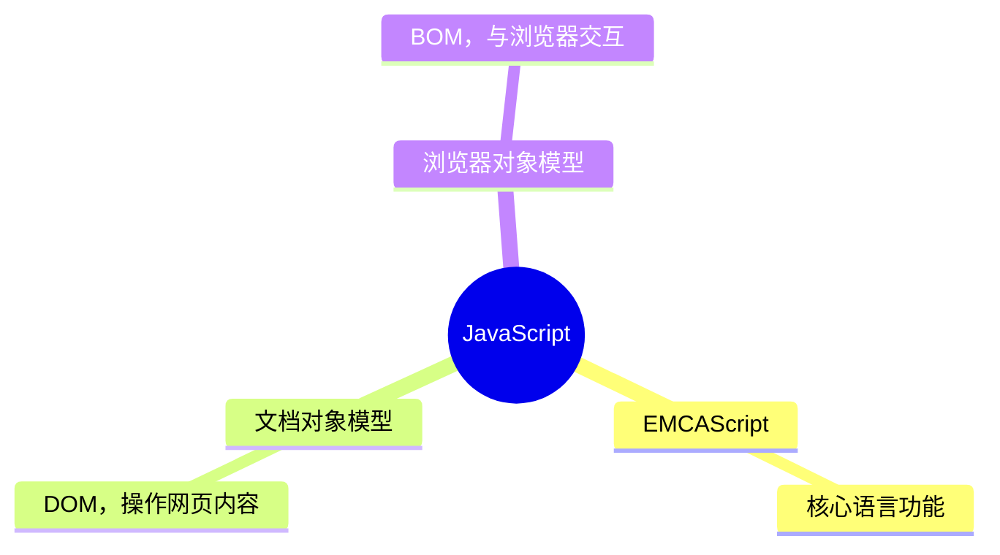

# 简介



要了解JavaScript，我们首先要回顾一下 JavaScript 的诞生。

在上个世纪的1995年，当时的网景公司正凭借其Navigator浏览器成为Web时代开启时最著名的第一代互联网公司。

由于网景公司希望能在静态HTML页面上添加一些动态效果，于是叫Brendan Eich这哥们在两周之内设计出了JavaScript语言。你没看错，这哥们只用了10天时间。

为什么起名叫 JavaScript ？原因是当时 Java 语言非常红火，所以网景公司希望能蹭到 Java 的热度，但事实上JavaScript除了语法上有点像Java，其他部分基本上没啥关系。

JavaScript语言是在10天时间内设计出来的，虽然语言的设计者水平非常NB，但谁也架不住“时间紧，任务重”，所以，JavaScript 有很多设计缺陷，我们后面会慢慢讲到。

此外，由于JavaScript的标准—— **ECMAScript** 在不断发展，最新版 *ECMAScript 6* 标准（简称ES6）已经在2015年6月正式发布了，所以，讲到JavaScript的版本，实际上就是说它实现了ECMAScript标准的哪个版本。

由于浏览器在发布时就确定了 JavaScript 的版本，加上很多用户还在使用 IE6 这种古老的浏览器，这就导致你在写 JavaScript 的时候，要照顾一下老用户，不能一上来就用最新的 ES6 标准写，否则，老用户的浏览器是无法运行新版本的 JavaScript 代码的。

JavaScript 是一种编程语言，它本身并不局限于网页开发，也可以用于其他领域。但在浏览器环境中，JavaScript 通过 **DOM（文档对象模型）** 和 **BOM（浏览器对象模型** 提供的接口来分别与网页和浏览器进行交互。在早期的网页开发中，JavaScript 操作网页的方式非常有限，只能做一些简单的表单验证等。随着网页功能的复杂化，需要一种更强大的方式来动态地修改网页内容和样式，于是 DOM 应运而生。而 BOM 的出现则是为了让 JavaScript 能够更好地控制浏览器本身的功能，比如窗口操作、历史记录管理等

可以把网页想象成一棵大树，树上的每个枝叶、果实都是网页的一部分。DOM 就是把这棵大树分解成一个个可以操作的小部分，每个小部分都有自己的名字和特性。比如，网页上的一个按钮、一段文字、一张图片，都是 DOM 中的一个“对象”。通过 DOM，我们可以用 JavaScript 来改变网页上的内容、样式或者结构，比如修改按钮的文字、改变文字的颜色、添加新的图片等；而如果说 DOM 是对网页内容的抽象，那 BOM 就是对浏览器这个“容器”的抽象。BOM 主要处理的是浏览器窗口、标签页以及与浏览器相关的功能。比如，我们可以用 BOM 来打开一个新的浏览器窗口、关闭当前窗口、获取浏览器的历史记录、获取当前页面的 URL 等。**简单来说，DOM 能让我们修改网页上的内容，而BOM 让我们能够通过 JavaScript 来控制浏览器的行为，而不仅仅是网页内容。**
# Hello World 与基本语法

```html
<!DOCTYPE html>
<html lang="en">
<head>
    <meta charset="UTF-8">
    <meta http-equiv="X-UA-Compatible" content="IE=edge">
    <meta name="viewport" content="width=device-width, initial-scale=1.0">
    <title>Document</title>

    <script>
        alert("hello world!"); //调用了BOM
        document.write("hello world!"); //调用了DOM
        console.log("hello world!"); //输出到控制台
    </script>
</head>
<body>
    
</body>
</html>
```
## 分号

JavaScript的语法和Java语言类似，每个语句以`;`结束，语句块用`{...}`。但是，JavaScript并不强制要求在每个语句的结尾加`;`，浏览器中负责执行JavaScript代码的引擎会自动在每个语句的结尾补上`;`。*不过让JavaScript引擎自动加分号在某些情况下会改变程序的语义，导致运行结果与期望不一致，所以最好还是加上。（尽管ES6 并不推荐我们使用分号）*

例如，下面的一行代码就是一个完整的赋值语句：

```js
var x = 1;
```

下面的一行代码是一个字符串，但仍然可以视为一个完整的语句：

```javascript
'Hello, world';
```

## 书写位置

JavaScript代码可以直接嵌在网页的任何地方：**内嵌、外链、行内**，都是可以的！

对某些 html 标签来说，你可以直接在它们的标签内写 JavaScript（不推荐，耦合度太高了）：

```html
<div onclick="alert('hello world!');">点我！</div>

<button onclick="alert('hello world!');">点我！</button>

<a href="javascript:alert('hello world!');">点我！</a>
```


除此外，由`<script>...</script>`包含的代码就是JavaScript代码，它将直接被浏览器执行。`<script>` 最好放于head中或是body的最后，通常我们都像示例那样把JavaScript代码放到`<head>`中。

另外还能把JavaScript代码放到一个单独的`.js`文件，然后在HTML中通过`<script src="..."></script>`引入这个文件，也可以在同一个页面中引入多个`.js`文件或在页面中多次编写`<script> js代码... </script>`，浏览器按照顺序依次执行。把JavaScript代码放入一个单独的`.js`文件中更利于维护代码，并且多个页面可以各自引用同一份`.js`文件。

有些时候你会看到`<script>`标签还设置了一个`type`属性：

```html
<script type="text/javascript">
    ...
</script>
```

但这是没有必要的，因为默认的`type`就是JavaScript，所以不必显式地把`type`指定为JavaScript。

## 注释

以`//`开头直到行末的字符被视为行注释，注释是给开发人员看到，JavaScript引擎会自动忽略：

```javascript
// 这是一行注释
alert('hello'); // 这也是注释
```

另一种块注释是用`/*...*/`把多行字符包裹起来：

```javascript
/* 从这里开始是块注释
仍然是注释
仍然是注释
注释结束 */
```

## 代码规范

- 合理使用空格与回车，不建议加分号（ES6）
## 关键字

JavaScript 的关键字是语言中具有特殊意义的保留字，不能用作变量名、函数名或其他标识符。以下是 JavaScript 中的所有关键字：

1. **`break`**：用于终止循环或 `switch` 语句。
2. **`case`**：用于 `switch` 语句中的一个分支。
3. **`catch`**：用于异常处理，与 `try` 和 `finally` 配合使用。
4. **`class`**：用于定义类。
5. **`const`**：用于声明常量。
6. **`continue`**：用于跳过当前循环的剩余部分，直接开始下一次循环。
7. **`debugger`**：用于插入断点，方便调试。
8. **`default`**：用于 `switch` 语句中的默认分支。
9. **`delete`**：用于删除对象的属性。
10. **`do`**：用于 `do...while` 循环。
11. **`else`**：用于 `if` 语句中的替代分支。
12. **`export`**：用于导出模块中的变量、函数或类。
13. **`extends`**：用于类的继承。
14. **`finally`**：用于异常处理，与 `try` 和 `catch` 配合使用。
15. **`for`**：用于循环。
16. **`function`**：用于定义函数。
17. **`if`**：用于条件判断。
18. **`import`**：用于导入模块中的变量、函数或类。
19. **`in`**：用于检查对象是否具有某个属性，或用于 `for...in` 循环。
20. **`instanceof`**：用于检查对象是否是某个类的实例。
21. **`new`**：用于创建对象的实例。
22. **`return`**：用于从函数中返回值。
23. **`super`**：用于访问父类的构造函数或方法。
24. **`switch`**：用于多分支条件判断。
25. **`this`**：用于指向当前对象或上下文。
26. **`throw`**：用于抛出异常。
27. **`try`**：用于异常处理，与 `catch` 和 `finally` 配合使用。
28. **`typeof`**：用于返回操作数的类型。
29. **`var`**：用于声明变量。
30. **`void`**：用于返回 `undefined`。
31. **`while`**：用于循环。
32. **`with`**：用于将代码的作用域设置为一个对象（不推荐使用）。
33. **`yield`**：用于暂停和恢复函数的执行，主要用于生成器函数。
34. **`async`**：用于定义异步函数。
35. **`await`**：用于等待异步操作完成，只能在异步函数中使用。

# 变量与数据类型

## 变量与标识符

**变量** 即计算机内存中存储数据的一个标识符，根据其名称可获取内存中存储的数据。变量名是大小写英文、数字、`$`和`_`的组合，且不能用数字开头，严格区分大小写。变量名也不能是JavaScript的关键字，如`if`、`while`等。声明一个变量要用`var`语句：

```js
var 变量名 = 值;

var x; //声明
x = 100; //赋值

var a = 1, b = 2, c = 3; //多重

var $b = 1; // 申明了变量$b，同时给$b赋值，此时$b的值为1
var s_007 = '007'; // s_007是一个字符串
```

**JavaScript变量本身类型不固定。** 这种变量本身类型不固定的语言称之为动态语言，与之对应的是静态语言。静态语言在定义变量时必须指定变量类型，如果赋值的时候类型不匹配，就会报错。所以和静态语言相比，动态语言更灵活：

```javascript
var a = 123; // a的值是整数123
a = 'ABC'; // a变为字符串
```

另一种声明变量的方式是`let`，这也是现代JavaScript推荐的方式：

```javascript
let s = 'hello';
```

后续我们还会详细讨论`var`和`let`的区别。
### strict模式

……不过事实上，JavaScript在设计之初，为了方便初学者学习，并不强制要求用`var`声明变量。这个设计错误带来了严重的后果：如果一个变量没有通过`var`声明就被使用，那么该变量就自动被申明为全局变量：

```javascript
i = 10; // i现在是全局变量
```

在同一个页面的不同的JavaScript文件中，如果都不用`var`申明，恰好都使用了变量`i`，将造成变量`i`互相影响，产生难以调试的错误结果。

使用`var`声明的变量则不是全局变量，它的范围被限制在该变量被申明的函数体内（函数的概念将稍后记录），同名变量在不同的函数体内互不冲突。

为了修补JavaScript这一严重设计缺陷，ECMA在后续规范中推出了strict模式，在strict模式下运行的JavaScript代码，强制通过`var`申明变量，未使用`var`声明变量就使用的，将导致运行错误。

启用strict模式的方法是在JavaScript代码的第一行写上：

```javascript
'use strict';
```

这是一个字符串，不支持strict模式的浏览器会把它当做一个字符串语句执行，支持strict模式的浏览器将开启strict模式运行JavaScript。使用以下代码来测试一下你的浏览器是否能支持strict模式：

```javascript
function hello() {
    'use strict';
    // 如果浏览器支持strict模式，
    // 下面的代码将报ReferenceError错误:
    helloStr = 'hello';
    console.log(helloStr);
}
hello();
```
## 基本数据类型

1. Number
2. String
3. Boolean
4. Undefined
5. Null
6. *Symbol（ES6新增）*

## 字面量

### Number

JavaScript不区分整数和浮点数，统一用Number表示，以下都是合法的Number类型：

```javascript
123; // 整数123
0.456; // 浮点数0.456
1.2345e3; // 科学计数法表示1.2345x1000，等同于1234.5
-99; // 负数
0x99; //十六进制
077; //八进制
0b1001; //二进制
NaN; // NaN表示Not a Number，当无法计算结果时用NaN表示
Infinity; // Infinity表示无限大，当数值超过了JavaScript的Number所能表示的最大值时，就表示为Infinity
```

#### BigInt

要精确表示比253还大的整数，可以使用内置的BigInt类型，它的表示方法是在整数后加一个`n`，例如`9223372036854775808n`，也可以使用`BigInt()`把Number和字符串转换成BigInt：

```javascript
// 使用BigInt:
var bi1 = 9223372036854775807n;
var bi2 = BigInt(12345);
var bi3 = BigInt("0x7fffffffffffffff");
console.log(bi1 === bi2); // false
console.log(bi1 === bi3); // true
console.log(bi1 + bi2);
```

使用BigInt可以正常进行加减乘除等运算，结果仍然是一个BigInt，但不能把一个BigInt和一个Number放在一起运算：

```javascript
// 使用BigInt:
console.log(1234567n + 3456789n); // OK
console.log(1234567n / 789n); // 1564, 除法运算结果仍然是BigInt
console.log(1234567n % 789n); // 571, 求余
console.log(1234567n + 3456789); // Uncaught TypeError: Cannot mix BigInt and other types
```

### String

字符串是以单引号'或双引号"括起来的任意文本，比如`'abc'`，`"xyz"`等等。

如果`'`本身也是一个字符，那就可以用`""`括起来，比如`"I'm OK"`包含的字符是`I`，`'`，`m`，空格，`O`，`K`这6个字符。但如果字符串内部既包含`'`又包含`"`怎么办？可以用转义字符`\`来标识：

```javascript
'I\'m \"OK\"!'; // I'm "OK"!
```

转义字符`\`可以转义很多字符，比如`\n`表示换行，`\t`表示制表符，字符`\`本身也要转义，所以`\\`表示的字符就是`\`。

ASCII字符可以以`\x##`形式的十六进制表示，例如：

```javascript
'\x41'; // 完全等同于 'A'
```

还可以用`\u####`表示一个Unicode字符：

```javascript
'\u4e2d\u6587'; // 完全等同于 '中文'
```

由于多行字符串用`\n`写起来比较费事，所以最新的ES6标准新增了一种多行字符串的表示方法，用反引号 \`...\` 表示：

```javascript
`这是一个
多行
字符串`;
```

关于字符串还有很多操作，我们会在 [[#字符串]] 中有详细记录。
### Boolean

`true` 和 `false` 。

### Null

`null（空对象）`表示一个“空”的值，它和`0`以及空字符串`''`不同，`0`是一个数值，`''`表示长度为0的字符串，而`null`表示“空”。在其他语言中，也有类似JavaScript的`null`的表示，例如Java也用`null`，Swift用`nil`，Python用`None`表示。

### Undefined

在JavaScript中，还有一个和 `null` 类似的 `undefined`，它表示 “未定义（也是声明后未赋值时变量的值）”。JavaScript的设计者希望用 `null` 表示一个空的值，而 `undefined` 表示值未定义。事实证明，这并没有什么卵用，区分两者的意义不大。

**大多数情况下，我们都应该用 `null`。`undefined` 仅仅在判断函数参数是否传递的情况下有用。**

## 检测数据类型

使用 `typeof` 运算符

## 类型转换

JavaScript 向来因为它运算之中的类型转换机制相当复杂且玄学而饱受诟病，我在此尝试尽我自己所能将所有的这些整理清楚。

JS 中有六种简单数据类型：`undefined`、`null`、`boolean`、`string`、`number`、`symbol`，以及一种复杂类型：`object`。 但是 JavaScript 只有到运行期间才会确定当前变量的类型。在运行期间，由于 JavaScript 没有对类型做严格限制，导致不同类型之间可以进行运算，这样就需要允许类型之间互相转换。

一般来说，类型转换主要是基本类型转基本类型、复杂类型转基本类型两种。 转换的目标类型主要分为以下几种：

1. 转换为 `string`
2. 转换为 `number`
3. 转换为 `boolean`

我们也将按照这样的逻辑尝试总结各种类型转换：

### 显式类型转换

- 转字符串：`String(x)`
- 转数字：`Number(x)`
- 转布尔：`Boolean(x)`

**各种值转字符串的结果**：

```tx
原始类型 | 转换结果
--- | ---
Undefined | 'undefined'
Null | 'null'
Boolean | 'true' 或 'false'
Number | 对应的字符串
String | 不变
Symbol | 报错
Object | 调用toPrimitive(obj, String)
```

除使用 `String(x)` 外，也可以使用模板字符串或拼串利用隐式类型转换机制来实现转为字符串。

```js
`${undefined}` // 'undefined'
`${true}` // 'true'
''+NaN // 'NaN'
```

**各种值转数字的结果**：

```tx
原始类型 | 转换结果
--- | ---
Undefined | NaN
Null | 0
Boolean | true -> 1
^^ | false -> 0
Number | 不变
String | 根据转换规则（见下文）
Symbol | 报错
Object | 调用toPrimitive(obj, Number)
```

### 隐式类型转换

隐式类型转换一般是在涉及到运算符的时候才会出现的情况，比如我们将两个变量相加，或者比较两个变量是否相等。 隐式类型转换其实在我们上面的例子中已经有所体现。对于对象转原始类型的转换，也会遵守 `ToPrimitive` 的规则

# 运算符

## 算术运算

Number可以直接做四则运算，规则和数学差不多一致，：

```javascript
1 + 2; // 3
(1 + 2) * 5 / 2; // 7.5
2 / 0; // Infinity
0 / 0; // NaN
10 % 3; // 1
10.5 % 3; // 1.5
```

要注意，JavaScript的 Number 不区分整数和浮点数，也就是说，`12.00 === 12`。（在大多数其他语言中，整数和浮点数不能直接比较）并且，JavaScript的整数最大范围不是±2<sup>63</sup>，而是±2<sup>53</sup>，因此，超过2<sup>53</sup>的整数就可能无法精确表示。

```javascript
// 打印Number能表示的最大整数:
console.log(Number.MAX_SAFE_INTEGER); // 9007199254740991
```

## 逻辑运算

|  与  |  或   |  非  |
| :-: | :--: | :-: |
| &&  | \|\| |  !  |

## 关系运算

`>` 、`<` 、`>=` 、`<=`、**`==（宽松等于）` 、`===（严格等于）`**

当我们对Number做比较时，可以通过比较运算符得到一个布尔值：

```javascript
2 > 5; // false
5 >= 2; // true
7 == 7; // true
```

实际上，JavaScript允许对任意数据类型做比较：

```javascript
false == 0; // true
false === 0; // false
```

**要特别注意相等运算符`==`！** JavaScript在设计时，有两种比较运算符：

第一种是`==`比较，它会自动转换数据类型再比较，很多时候，会得到非常诡异的结果；

```javascript
console.log(5 == "5"); // true，因为 "5" 被转换为数字 5
console.log(true == 1); // true，因为 true 被转换为 1
console.log(false == 0); // true，因为 false 被转换为 0
console.log(null == undefined); // true
```

关于这些我会在下文 [[#== 宽松等于]] 中作为扩展内容来尝试进行详细的记录，仅供感兴趣者参考。

第二种是`===`比较，它不会自动转换数据类型，如果数据类型不一致，返回`false`，如果一致，再比较。

由于JavaScript这个设计缺陷，**不要使用`==`比较，始终坚持使用`===`比较。**

另一个例外是`NaN`这个特殊的Number与所有其他值都不相等，**包括它自己**：

```javascript
NaN === NaN; // false
```

唯一能判断`NaN`的方法是通过`isNaN()`函数：

```javascript
isNaN(NaN); // true
```

最后要注意浮点数的相等比较：

```javascript
1 / 3 === (1 - 2 / 3); // false
```

这不是JavaScript的设计缺陷。浮点数在运算过程中会产生误差，因为计算机无法精确表示无限循环小数。要比较两个浮点数是否相等，只能计算它们之差的绝对值，看是否小于某个阈值：

```javascript
Math.abs(1 / 3 - (1 - 2 / 3)) < 0.0000001; // true
```

除了这些外还有 `Object.is()` 静态方法确定两个值是否为相同值，不过这当然不算是一个运算符，所以相应的内容还是留给后文吧。

```javascript
console.log(Object.is("1", 1));
// Expected output: false

console.log(Object.is(NaN, NaN));
// Expected output: true

console.log(Object.is(-0, 0));
// Expected output: false

const obj = {};
console.log(Object.is(obj, {}));
// Expected output: false

// 案例 1：评估结果和使用 === 相同
Object.is(25, 25); // true
Object.is("foo", "foo"); // true
Object.is("foo", "bar"); // false
Object.is(null, null); // true
Object.is(undefined, undefined); // true
Object.is(window, window); // true
Object.is([], []); // false
const foo = { a: 1 };
const bar = { a: 1 };
const sameFoo = foo;
Object.is(foo, foo); // true
Object.is(foo, bar); // false
Object.is(foo, sameFoo); // true

// 案例 2: 带符号的 0
Object.is(0, -0); // false
Object.is(+0, -0); // false
Object.is(-0, -0); // true

// 案例 3: NaN
Object.is(NaN, 0 / 0); // true
Object.is(NaN, Number.NaN); // true
```

#### == 宽松等于

如果两个操作数的类型不同，`==`相等操作符也可能会认为它们相等。（事实上，使用 `==` 会发生隐式类型转换。）检测相等将会遵守下面的规则和类型转换：

如果一个值是`null`, 另一个是`undefined`，则它们是相等:

```javascript
null == undefined; // => true
```

如果一个值是数字，另一个是字符串，先将字符串转换为数值，然后使用转换后的值进行比较:

```javascript
1 == '1'; // => true
```

如果其中一个值是`true`，则将其转换为`1`再进行比较。如果其中一个值是`false`，则将其转换为`0`再进行比较：

```javascript
true == 0;   // => false
false == 1;  // => false
true == 1;   // => true
false == 0;  // => true
true == '1'; // => true
false == '0';// => true
```

如果一个值是对象，另一个值是数字或字符串，将会先使用`toString()`和`valueOf()`将对象转换为原始值，然后再进行比较。

```javascript
var a = [1,2,3];
var b = [1,2,3];
var c = { x: 1, y: 2 };
var d = { x: 1, y: 2 };
var e = "text";
var f = "te" + "xt";

a == b // => false 
c == d // => false 
e == f // => true
```

两个操作数在进行比较时则要遵循下列规则：

- `null`和`undefined`是相等的
- 要比较相等性之前，不能将`null`和`undefined`转换成其他任何值
- 如果有一个操作是`NaN`，则相等操作符返回`false`，而不相等操作符返回`true`。**重要提示：** 即使两个操作数都是`NaN`，相等操作符也返回`false`，因为按照规则 ，`NaN`不等于`NaN`
- 如果两个操作数都是对象，则比较它们是不是同一个对象。如果两个操作数都指向同一个对象，则相等操作符返回`true`，否则返回`false`

## 自增自减

请参阅  [[从（0）开始学 C ！#自增自减]] 前半部分内容（忽略掉什么左值右值之类的）。

## 优先级

[运算符优先级 - JavaScript | MDN](https://developer.mozilla.org/zh-CN/docs/Web/JavaScript/Reference/Operators/Operator_precedence)

简单的说，括号 先于 后置自增自减 先于 `|（逻辑非）`、 `~（按位非）` 、正负号、前置自增自减、`typeof`、`delete` 先于 `**（幂运算）` 先于 乘除取余 先于 加减法 先于 位移运算 先于 关系运算 先于 逻辑运算 先于 三元运算 先于 赋值 先于 `,`

~~（其实也没简单到哪里去吧）~~

# 字符串

获取字符串长度：

```javascript
let s = 'Hello, world!';
s.length; // 13
```

要获取字符串某个指定位置的字符，使用类似Array的下标操作，索引号从0开始：

```javascript
let s = 'Hello, world!';

s[0]; // 'H'
s[6]; // ' '
s[7]; // 'w'
s[12]; // '!'
s[13]; // undefined 超出范围的索引不会报错，但一律返回undefined
```

**需要特别注意的是，字符串是不可变的，如果对字符串的某个索引赋值，不会有任何错误，但是，也没有任何效果**：

```javascript
let s = 'Test';
s[0] = 'X';
console.log(s); // s仍然为'Test'
```

JavaScript为字符串提供了一些常用方法，**注意，调用这些方法本身不会改变原有字符串的内容，而是返回一个新字符串**：

`toUpperCase()`把一个字符串全部变为大写：

```javascript
let s = 'Hello';
s.toUpperCase(); // 返回'HELLO'
```

`toLowerCase()`把一个字符串全部变为小写：

```javascript
let s = 'Hello';
let lower = s.toLowerCase(); // 返回'hello'并赋值给变量lower
lower; // 'hello'
```

`indexOf()`会搜索指定字符串出现的位置：

```javascript
let s = 'hello, world';
s.indexOf('world'); // 返回7
s.indexOf('World'); // 没有找到指定的子串，返回-1
```

`substring()`返回指定索引区间的子串：

```javascript
let s = 'hello, world'
s.substring(0, 5); // 从索引0开始到5（不包括5），返回'hello'
s.substring(7); // 从索引7开始到结束，返回'world'
```

`split('<char>')` 则将字符串以指定字符分隔为一个数组。

## 拼串

要把多个字符串连接起来，可以用`+`号连接：

```javascript
let name = '小明';
let age = 20;
let message = '你好, ' + name + ', 你今年' + age + '岁了!';
alert(message);
```

如果有很多变量需要连接，用`+`号就比较麻烦。ES6新增了一种模板字符串，表示方法和多行字符串一样，但是它会自动替换字符串中的变量：

```javascript
let name = '小明';
let age = 20;
let message = `你好, ${name}, 你今年${age}岁了!`;
alert(message);
```

# 对象

啊，我有说过JavaScript其实是一门面向对象语言吗？不过与 Java 语言不同，JavaScript 中并没有在语言层面上明确有 ”类“ 这样的说法，**事实上，JavaScript 所拥有的是一个又一个的具体的对象** ，JavaScript 的对象是一组由键-值组成的无序集合，也更像是 map 或 pytohn 中的 Dictionary 而非传统意义上的 Object，例如：

```js
var person = {
    name: 'Bob',
    age: 20,
    tags: ['js', 'web', 'mobile'],
    city: 'Beijing',
    hasCar: true,
    zipcode: null
};
```

## 访问属性

JavaScript对象的键都是字符串类型，值可以是任意数据类型。上述`person`对象一共定义了6个键值对，而每个键值对又可以被称为对象的 *属性* ，键就是其属性名，值就是其属性值，一般我们就会这么说：`person`的`name`属性为`'Bob'`，`zipcode`属性为`null`。

要获取一个对象的属性，我们用`对象变量.属性名`的方式：

```javascript
person.name; // 'Bob'
person.zipcode; // null
```

但这种访问方式要求属性名必须是一个有效的变量名，如果不是有效的变量名又该怎么办？首先，如果属性名包含特殊字符，在对象声明时就必须用`''`括起来：

```javascript
let xiaohong = {
    name: '小红',
    'middle-school': 'No.1 Middle School'
};
```

像这里`xiaohong`的属性名`middle-school`不是一个有效的变量，就需要用`''`括起来。然后访问这个属性也无法使用`.`操作符，必须用`['xxx']`来访问：

```javascript
xiaohong['middle-school']; // 'No.1 Middle School'
xiaohong['name']; // '小红'
xiaohong.name; // '小红'
```

也可以用`xiaohong['name']`来访问`xiaohong`的`name`属性，不过`xiaohong.name`的写法显然更简洁。**我们在编写JavaScript代码的时候，属性名尽量使用标准的变量名，这样就可以直接通过`object.prop`的形式访问一个属性了。**

JavaScript规定，访问不存在的属性不报错，而是返回`undefined`：

```js
let xiaoming = {
    name: '小明'
};

console.log(xiaoming.name);
console.log(xiaoming.age); // undefined
```

## 操作对象

由于JavaScript的对象是动态类型，你可以自由地给一个对象添加或删除属性：

```javascript
let xiaoming = {
    name: '小明'
};

xiaoming.age; // undefined
xiaoming.age = 18; // 新增一个age属性
xiaoming.age; // 18

delete xiaoming.age; // 删除age属性
xiaoming.age; // undefined

delete xiaoming['name']; // 删除name属性
xiaoming.name; // undefined

delete xiaoming.school; // 删除一个不存在的school属性也不会报错
```

如果我们要检测`xiaoming`是否拥有某一属性，可以用`in`操作符：

```javascript
let xiaoming = {
    name: '小明',
    birth: 1990,
    school: 'No.1 Middle School',
    height: 1.70,
    weight: 65,
    score: null
};

'name' in xiaoming; // true
'grade' in xiaoming; // false
```

不过要小心，如果`in`判断一个属性存在，这个属性不一定是`xiaoming`的，它可能是`xiaoming`*继承* 得到的：

```javascript
'toString' in xiaoming; // true
```

因为`toString`定义在`object`对象中，而所有对象最终都会在原型链上指向`object`，所以`xiaoming`也拥有`toString`属性。

要判断一个属性是否是`xiaoming`自身拥有的，而不是继承得到的，可以用`hasOwnProperty()`方法：

```javascript
let xiaoming = {
    name: '小明'
};
xiaoming.hasOwnProperty('name'); // true
xiaoming.hasOwnProperty('toString'); // false
```

# 数组

数组是一组按顺序排列的集合，集合的每个值称为元素。JavaScript 的数组可以包括任意数据类型，严格来说这更像 python 中的 List（列表）而非传统意义上的 Array。例如：

```javascript
[1, 2, 3.14, 'Hello', null, true];
```

上述数组包含6个元素。数组用`[]`表示，元素之间用`,`分隔。

上面那样是使用 *数组字面量* 来创建数组的方法，另一种创建数组的方法是通过 `Array()` 构造函数实现：

```javascript
new Array(1, 2, 3); // 创建了数组[1, 2, 3]
```

这么写也许更加接近于JavaScript中数组的本质，即 *Array 类的一个对象。（这一点之后有详细的讨论）* 然而，出于代码的可读性考虑，强烈建议直接使用`[]`。

数组的元素可以通过索引来访问。请注意，索引的起始值为`0`：

```javascript
var arr = [1, 2, 3.14, 'Hello', null, true];
arr[0]; // 返回索引为0的元素，即1
arr[5]; // 返回索引为5的元素，即true
arr[6]; // 索引超出了范围，返回undefined
console.log(arr[0], arr[5], arr[6]);
```

## 操作数组

取数组的长度直接访问`length`属性：`arr.length` 。**不过请注意，直接给`Array`的`length`赋一个新的值会导致`Array`大小的变化**：

```javascript
let arr = ['A', 'B', 'C'];
console.log(arr.length); // 3
// 调整数组大小:
arr.length = 6;
console.log(arr); // arr变为['A', 'B', 'C', undefined, undefined, undefined]
// 调整数组大小:
arr.length = 2;
console.log(arr); // arr变为['A', 'B']
```

可以通过索引把对应的数组元素修改为新的值，即对数组的索引进行赋值会直接修改这个数组：

```javascript
let arr = ['A', 'B', 'C'];
arr[1] = 99;
console.log(arr); // arr现在变为['A', 99, 'C']
console.log(arr[1]); // 99
```

**如果通过索引赋值时，索引超过了范围，同样会引起`Array`大小的变化**：

```js
let arr = ['A', 'B', 'C'];
arr[5] = 'x';
console.log(arr); // arr变为['A', 'B', 'C', undefined, undefined, 'x']
```

大多数其他编程语言不允许直接改变数组的大小，越界访问索引会报错。然而，JavaScript的`Array`却不会有任何错误。**在编写代码时，不建议直接修改`Array`的大小，访问索引时要确保索引不会越界。**

## 常用方法

### indexOf

数组也可以通过`indexOf()`来搜索一个指定的元素的位置：

```javascript
let arr = [10, 20, '30', 'xyz'];
arr.indexOf(10); // 元素10的索引为0
arr.indexOf(20); // 元素20的索引为1
arr.indexOf(30); // 元素30没有找到，返回-1
arr.indexOf('30'); // 元素'30'的索引为2，注意数字30和字符串'30'是不同的元素。
```

### slice

`slice()`就是对应String的`substring()`版本，它截取`Array`的部分元素，然后返回一个新的`Array`：

```javascript
let arr = ['A', 'B', 'C', 'D', 'E', 'F', 'G'];
arr.slice(0, 3); // 从索引0开始，到索引3结束，但不包括索引3: ['A', 'B', 'C']
arr.slice(3); // 从索引3开始到结束: ['D', 'E', 'F', 'G']
```

注意到`slice()`的起止参数包头不包尾。

如果不给`slice()`传递任何参数，它就会从头到尾截取所有元素。利用这一点，我们可以很容易地复制一个`Array`：

```javascript
let arr = ['A', 'B', 'C', 'D', 'E', 'F', 'G'];
let aCopy = arr.slice();
aCopy; // ['A', 'B', 'C', 'D', 'E', 'F', 'G']
aCopy === arr; // false
```

### push和pop

`push()`向`Array`的末尾添加若干元素，`pop()`则把`Array`的最后一个元素删除掉：

```javascript
let arr = [1, 2];
arr.push('A', 'B'); // 返回Array新的长度: 4
arr; // [1, 2, 'A', 'B']
arr.pop(); // pop()返回'B'
arr; // [1, 2, 'A']
arr.pop(); arr.pop(); arr.pop(); // 连续pop 3次
arr; // []
arr.pop(); // 空数组继续pop不会报错，而是返回undefined
arr; // []
```

### unshift和shift

如果要往`Array`的头部添加若干元素，使用`unshift()`方法，`shift()`方法则把`Array`的第一个元素删掉：

```javascript
let arr = [1, 2];
arr.unshift('A', 'B'); // 返回Array新的长度: 4
arr; // ['A', 'B', 1, 2]
arr.shift(); // 'A'
arr; // ['B', 1, 2]
arr.shift(); arr.shift(); arr.shift(); // 连续shift 3次
arr; // []
arr.shift(); // 空数组继续shift不会报错，而是返回undefined
arr; // []
```

### sort

`sort()`可以对当前`Array`进行排序，它会直接修改当前`Array`的元素位置，直接调用时，按照默认顺序排序：

```javascript
let arr = ['B', 'C', 'A'];
arr.sort();
arr; // ['A', 'B', 'C']
```

能否按照我们自己指定的顺序排序呢？完全可以，我们将在后面的函数中讲到。

### reverse

`reverse()`把整个`Array`的元素给调个个，也就是反转：

```javascript
let arr = ['one', 'two', 'three'];
arr.reverse(); 
arr; // ['three', 'two', 'one']
```

### splice

`splice()`方法是修改`Array`的“万能方法”，它可以从指定的索引开始删除若干元素，然后再从该位置添加若干元素：

```javascript
let arr = ['Microsoft', 'Apple', 'Yahoo', 'AOL', 'Excite', 'Oracle'];

// 从索引2开始删除3个元素,然后再添加两个元素:
arr.splice(2, 3, 'Google', 'Facebook'); // 返回删除的元素 ['Yahoo', 'AOL', 'Excite']
arr; // ['Microsoft', 'Apple', 'Google', 'Facebook', 'Oracle']

// 只删除,不添加:
arr.splice(2, 2); // ['Google', 'Facebook']
arr; // ['Microsoft', 'Apple', 'Oracle']

// 只添加,不删除:
arr.splice(2, 0, 'Google', 'Facebook'); // 返回[],因为没有删除任何元素
arr; // ['Microsoft', 'Apple', 'Google', 'Facebook', 'Oracle']
```

### concat

`concat()`方法把当前的`Array`和另一个`Array`连接起来，并返回一个新的`Array`：

```javascript
let arr = ['A', 'B', 'C'];
let added = arr.concat([1, 2, 3]);
added; // ['A', 'B', 'C', 1, 2, 3]
arr; // ['A', 'B', 'C']
```

_请注意_，`concat()`方法并没有修改当前`Array`，而是返回了一个新的`Array`。

实际上，`concat()`方法可以接收任意个元素和`Array`，并且自动把传进来的`Array`拆开，然后全部添加到新的`Array`里：

```javascript
let arr = ['A', 'B', 'C'];
arr.concat(1, 2, [3, 4]); // ['A', 'B', 'C', 1, 2, 3, 4]
```

### join

`join()`方法是一个非常实用的方法，它把当前`Array`的每个元素都用指定的字符串连接起来，然后返回连接后的字符串。如果`Array`的元素不是字符串，将自动转换为字符串后再连接：

```javascript
let arr = ['A', 'B', 'C', 1, 2, 3];
arr.join('-'); // 'A-B-C-1-2-3'
```

## 数组的本质？

还记得先前提到过 “JavaScript中数组的本质是 Array 类的一个对象” 吗？是这样的，数组相当于一个对象，而其索引就是其属性名，也就是说

```js
let a = ['A', 'B', 'C'];
```

实际上与

```js
let a = { 
	0: 'A', 
	1: 'B', 
	2: 'C'
};
```

*几乎* 就是等价的。

当然这里有一些细节值得讨论，比如有人可能会疑惑一个对象的属性名难道不是 string 类型的吗，是这样的，在 JavaScript 中，对象的键（包括数组的索引）在内部都是以字符串形式存储的，这里代码这样写也是合法的，无论你是在声明时还是在调用时使用数字作为对象的键，在底层它都会被转换为一个字符串，实际上存储的也是个字符串，简单的说整个流程也就像这样：

```js
// 在创建对象时

let a = {
	0: 'A',
	1: 'B'
}

// 而实际上底层存储的是

let a = {
	'0': 'A',
	'1': 'B'
}

// 这样，而当你像这样访问时

a[0];

// 实际上也就会被转换成这样

a['0'];
```

对于数组也差不多如此…… *几乎* 就是如此！只是数组实际上还有个属性 `length`，还有一堆方法，并且数组在 JavaScript 引擎内部进行了优化，以提高性能和内存使用效率。而普通对象没有这些优化，除了这些外它真的就和一个对象没有区别了：

```js
let arr = ['A', 'B', 'C'];

// 实际上底层存储的是
let arr = {
    '0': 'A',
    '1': 'B',
    '2': 'C',
    'length': 3
};

// 访问 arr[0] 时，实际上会被转换为 arr['0']
console.log(arr[0]); // 输出 'A'
console.log(arr['0']); // 输出 'A'
```

不信的话，这里还有一些实验来验证此处的说法：

> [!NOTE] 实验
> 一：看看这段代码会输出什么样的结果
>
>```js
>let a = ['A', 'B', 'C'];
>
>for (let x in a) {
>    console.log(typeof x);
>}
>```
>
>二：一个对象可以随意添加或删除数组属性，可以尝试一下你能否给一个数组添加属性，比如 `a.name = "EBAOBAO"`。
>
>三：随便定义一个数组，然后看看 `a['0']` 这样的访问方式能不能访问到其中的元素。


# 流程控制

## 条件分支

使用`if () { ... } else { ... }`来进行条件判断。例如，根据年龄显示不同内容，可以用`if`语句实现如下：

```javascript
let age = 20;
if (age >= 18) { // 如果age >= 18为true，则执行if语句块
    console.log('adult');
} else { // 否则执行else语句块
    console.log('teenager');
}
```

其中`else`语句是可选的。如果语句块只包含一条语句，那么可以省略`{}`：

```javascript
let age = 20;
if (age >= 18)
    console.log('adult');
else
    console.log('teenager');
```

省略`{}`的危险之处在于，如果后来想添加一些语句，却忘了写`{}`，就改变了`if...else...`的语义，例如：

```js
let age = 20;
if (age >= 18)
    console.log('adult');
else
    console.log('age < 18'); // 添加一行日志
    console.log('teenager'); // <- 这行语句已经不在else的控制范围了
```

相反地，有`{}`的语句就不会出错，这就是为什么我们建议永远都要写上`{}`。

还可以使用多个`if...else...`的组合：

```javascript
let age = 3;
if (age >= 18) {
    console.log('adult');
} else if (age >= 6) {
    console.log('teenager');
} else {
    console.log('kid');
}
```

上述多个`if...else...`的组合实际上相当于两层`if...else...`：

```javascript
let age = 3;
if (age >= 18) {
    console.log('adult');
} else {
    if (age >= 6) {
        console.log('teenager');
    } else {
        console.log('kid');
    }
}
```

但是我们通常把`else if`连写在一起，来增加可读性。这里的`else`略掉了`{}`是没有问题的，因为它只包含一个`if`语句。注意最后一个单独的`else`不要略掉`{}`。

### 条件表达式

如果`if`的条件判断语句结果不是`true`或`false`怎么办？例如：

```javascript
let s = '123';
if (s.length) { // 条件计算结果为3
    //
}
```

**JavaScript把`null`、`undefined`、`0`、`NaN`和空字符串`''`视为`false`，其他值一概视为`true`** ，因此上述代码条件判断的结果是`true`。

## 循环

### for

通过初始条件、结束条件和递增条件来循环执行语句块。

```javascript
let x = 0;
let i;
for (i=1; i<=10000; i++) {
    x = x + i;
}
x; // 50005000
```

`for`循环的3个条件都是可以省略的，如果没有退出循环的判断条件，就必须使用`break`语句退出循环，否则就是死循环：

```javascript
let x = 0;
for (;;) { // 将无限循环下去
    if (x > 100) {
        break; // 通过if判断来退出循环
    }
    x ++;
}
```

### for ... in

`for`循环的一个变体是`for ... in`循环，它可以把一个对象的所有属性依次循环出来：

```javascript
let o = {
    name: 'Jack',
    age: 20,
    city: 'Beijing'
};
for (let key in o) {
    console.log(key); // 'name', 'age', 'city'
}
```

要过滤掉对象继承的属性，用`hasOwnProperty()`来实现：

```javascript
let o = {
    name: 'Jack',
    age: 20,
    city: 'Beijing'
};
for (let key in o) {
    if (o.hasOwnProperty(key)) {
        console.log(key); // 'name', 'age', 'city'
    }
}
```

由于`Array`也是对象，而它的每个元素的索引被视为对象的属性，因此，`for ... in`循环可以直接循环出`Array`的索引：

```javascript
let a = ['A', 'B', 'C'];
for (let i in a) {
    console.log(i); // '0', '1', '2'
    console.log(a[i]); // 'A', 'B', 'C'
}
```

**请注意，`for ... in`对`Array`的循环得到的是`String`而不是`Number`。**

### while

`for`循环在已知循环的初始和结束条件时非常有用。而上述忽略了条件的`for`循环容易让人看不清循环的逻辑，此时用`while`循环更佳。

`while`循环只有一个判断条件，条件满足，就不断循环，条件不满足时则退出循环。比如我们要计算100以内所有奇数之和，可以用while循环实现：

```javascript
let x = 0;
let n = 99;
while (n > 0) {
    x = x + n;
    n = n - 2;
}
x; // 2500
```

在循环内部变量`n`不断自减，直到变为`-1`时，不再满足`while`条件，循环退出。

### do ... while

最后一种循环是`do { ... } while()`循环，它和`while`循环的唯一区别在于，不是在每次循环开始的时候判断条件，而是在每次循环完成的时候判断条件：

```javascript
let n = 0;
do {
    n = n + 1;
} while (n < 100);
n; // 100
```

用`do { ... } while()`循环要小心，循环体会至少执行1次，而`for`和`while`循环则可能一次都不执行。

# Map 和 Set

JavaScript的默认对象表示方式`{}`可以视为其他语言中的`Map`或`Dictionary`的数据结构，即一组键值对，但是JavaScript的对象有个小问题，就是键必须是字符串。但实际上Number或者其他数据类型作为键也是非常合理的。

为了解决这个问题，最新的ES6规范引入了新的数据类型`Map`。

### Map

`Map`是一组键值对的结构，具有极快的查找速度。

举个例子，假设要根据同学的名字查找对应的成绩，如果用`Array`实现，需要两个`Array`：

```javascript
let names = ['Michael', 'Bob', 'Tracy'];
let scores = [95, 75, 85];
```

给定一个名字，要查找对应的成绩，就先要在names中找到对应的位置，再从scores取出对应的成绩，Array越长，耗时越长。

如果用Map实现，只需要一个“名字”-“成绩”的对照表，直接根据名字查找成绩，无论这个表有多大，查找速度都不会变慢。用JavaScript写一个Map如下：

```javascript
let m = new Map([['Michael', 95], ['Bob', 75], ['Tracy', 85]]);
m.get('Michael'); // 95
```

初始化`Map`需要一个二维数组，或者直接初始化一个空`Map`。`Map`具有以下方法：

```javascript
let m = new Map(); // 空Map
m.set('Adam', 67); // 添加新的key-value
m.set('Bob', 59);
m.has('Adam'); // 是否存在key 'Adam': true
m.get('Adam'); // 67
m.delete('Adam'); // 删除key 'Adam'
m.get('Adam'); // undefined
```

由于一个key只能对应一个value，所以，多次对一个key放入value，后面的值会把前面的值冲掉：

```javascript
let m = new Map();
m.set('Adam', 67);
m.set('Adam', 88);
m.get('Adam'); // 88
```

### Set

`Set`和`Map`类似，也是一组key的集合，但不存储value。**由于key不能重复，所以，在`Set`中，不能有重复的元素。**

要创建一个`Set`，需要提供一个`Array`作为输入，或者直接创建一个空`Set`：

```javascript
let s1 = new Set(); // 空Set
let s2 = new Set([1, 2, 3]); // 含1, 2, 3
```

重复元素在`Set`中自动被过滤：

```javascript
let s = new Set([1, 2, 3, 3, '3']);
s; // Set {1, 2, 3, "3"}
```

注意数字`3`和字符串`'3'`是不同的元素。

通过`add(key)`方法可以添加元素到`Set`中，可以重复添加，但不会有效果：

```javascript
s.add(4);
s; // Set {1, 2, 3, 4}
s.add(4);
s; // 仍然是 Set {1, 2, 3, 4}
```

通过`delete(key)`方法可以删除元素：

```javascript
let s = new Set([1, 2, 3]);
s; // Set {1, 2, 3}
s.delete(3);
s; // Set {1, 2}
```

## Iterable 与 for ... of

遍历`Array`可以采用下标循环，遍历`Map`和`Set`就无法使用下标。为了统一集合类型，ES6标准引入了新的`iterable`类型，`Array`、`Map`和`Set`都属于`iterable`类型。

具有`iterable`类型的集合可以通过新的`for ... of`循环来遍历。

用法如下：

```javascript
let a = ['A', 'B', 'C'];
let s = new Set(['A', 'B', 'C']);
let m = new Map([[1, 'x'], [2, 'y'], [3, 'z']]);
for (let x of a) { // 遍历Array
    console.log(x);
}
for (let x of s) { // 遍历Set
    console.log(x);
}
for (let x of m) { // 遍历Map
    console.log(x[0] + '=' + x[1]);
}
```

你可能会有疑问，`for ... of`循环和`for ... in`循环有何区别？

`for ... in`循环由于历史遗留问题，它遍历的实际上是对象的属性名称。也正如前文所述，一个数组实际上也是一个对象，它的每个元素的索引被视为一个属性。当我们手动给`Array`对象添加了额外的属性后，`for ... in`循环将带来意想不到的意外效果：

```javascript
let a = ['A', 'B', 'C'];
a.name = 'Hello';
for (let x in a) {
    console.log(x); // '0', '1', '2', 'name'
}
```

`for ... in`循环将把`name`包括在内，但`Array`的`length`属性却不包括在内。


> [!info] Tips
> 为什么遍历不到 `length` 属性呢？事实上，`length` 在 JavaScript 引擎内部被设计为当数组的索引属性发生变化时，自动进行更新的属性，而不是作为一个普通的、**可枚举的属性** 被 `for...in` 循环遍历。
> 
> 准确地说是这样：在 JavaScript 中，每个对象属性都有一个关联的描述符对象，它包含以下关键标志：
> ```javascript
> {
 > 	value: 2,         // 属性值
 > 	writable: true,    // 是否可修改
 > 	enumerable: false, // 是否可枚举 ← 关键点
 > 	configurable: false // 是否可删除或修改特性
 > }
> ```
> 其中的 `enumerable` 决定了该属性是否可以被 `for...in` 循环遍历（可枚举）。而数组的 `length` 属性的`enumerable`会被 JavaScript 引擎**刻意设计为不可枚举**。
> 
> 以下实验理论上可以验证这里的说法：
> ```js
> // 1. 正常数组的 length 不可枚举
const arr = ['a', 'b'];
for (const key in arr) {
  console.log(key); // 只输出 "0", "1"
}
> 
// 2. 手动修改为可枚举
Object.defineProperty(arr, 'length', {
  enumerable: true // 强制设为可枚举，不过由于 configurable 也是 false 所以其实这里会报错 
});
> 
// 3. 此时 for...in 会包含 length
for (const key in arr) {
  console.log(key); // 输出 "0", "1", "length"
}
> ```
> 
> ……这里的强制修改是失败的，虽然也存在一些更麻烦的方法可以修改它的这些标签，不过经过以上的讨论我们已经明白了为什么 `for...in` 不能遍历到 `length`，不必执着于此了。更何况 JavaScript 需要通过限制核心属性的修改来保证语言稳定性和性能，尊重 JavaScript 的内置属性设计别乱搞对我们用户而言显然也是更好的选择。 

**`for ... of`循环则完全修复了这些问题，它通过调用可迭代对象的迭代器（iterator）来获取元素，这样就会只循环集合本身的元素：**

```javascript
let a = ['A', 'B', 'C'];
a.name = 'Hello';
for (let x of a) {
    console.log(x); // 'A', 'B', 'C'
}
```

> [!info] info
> 如果一个对象是是可迭代的，那么它就应该实现一个 `Symbol.iterator` 方法，这个方法应当返回一个迭代器对象。`for...of` 循环会调用该对象的 `Symbol.iterator` 方法以获取这个迭代器对象，然后不断调用迭代器对象的 `next()` 方法，循环变量就会取到该方法返回的对象的属性 `value`，那就是元素的值，直到 `next()` 方法返回的对象中的 `done` 为 `true`。

更不用说 `for ... in` 还无法遍历 Map 和 Set 了（*它们的内容不是作为属性存储的，而是保存在引擎内部的 \[\[SetData\]\] 和 \[\[MapData\]\] 槽中*），这就是为什么要引入新的`for ... of`循环。

```js title=Set和Map为什么不能被for...in遍历
const set = new Set([1, 2, 3]);
const map = new Map([['a', 1], ['b', 2]]);

// 检查可枚举属性
console.log(Object.keys(set));    // []
console.log(Object.keys(map));    // []

// 检查所有自身属性（包含不可枚举）
console.log(Object.getOwnPropertyNames(set)); // []
console.log(Object.getOwnPropertyNames(map)); // []
// 显然 set 和 map 好像都是没有属性的
```

然而，更好的方式是直接使用`iterable`内置的`forEach`方法，它接收一个函数，每次迭代就自动回调该函数。以`Array`为例：

```js
let a = ['A', 'B', 'C'];
a.forEach(function (element, index, array) {
    // element: 指向当前元素的值
    // index: 指向当前索引
    // array: 指向Array对象本身
    console.log(`${element}, index = ${index}`);
});
```

（注意，`forEach()`方法是ES5.1标准引入的，你需要测试浏览器是否支持。）

`Set`与`Array`类似，但`Set`没有索引，因此回调函数的前两个参数都是元素本身：

```javascript
let s = new Set(['A', 'B', 'C']);
s.forEach(function (element, sameElement, set) {
    console.log(element);
});
```

`Map`的回调函数参数依次为`value`、`key`和`map`本身：

```javascript
let m = new Map([[1, 'x'], [2, 'y'], [3, 'z']]);
m.forEach(function (value, key, map) {
    console.log(value);
});
```

如果对某些参数不感兴趣，由于JavaScript的函数调用不要求参数必须一致，因此可以忽略它们。例如，只需要获得`Array`的`element`：

```javascript
let a = ['A', 'B', 'C'];
a.forEach(function (element) {
    console.log(element);
});
```

其实这个被回调的函数的参数名是什么都无所谓，重要的是 `foreach()` 会按照什么样的顺序向函数的参数列表中传入什么样的值（在 [[#回调函数]] 中我们会有详细记载）。

# 函数

基本上所有的高级语言都支持函数，JavaScript也不例外。JavaScript的函数不但是“头等公民”，而且可以像变量一样使用，具有非常强大的抽象能力。

## 定义和调用

要定义一个函数，可以像这样：

```javascript
function abs(x) {
    if (x >= 0) {
        return x;
    } else {
        return -x;
    }
}
```

上述`abs()`函数的定义如下：

- `function`指出这是一个函数定义；
- `abs`是函数的名称；
- `(x)`括号内列出函数的参数，多个参数以`,`分隔；
- `{ ... }`之间的代码是函数体，可以包含若干语句，甚至可以没有任何语句。

请注意，函数体内部的语句在执行时，一旦执行到`return`时，函数就执行完毕，并将结果返回。因此，函数内部通过条件判断和循环可以实现非常复杂的逻辑。

由于JavaScript的函数也是一个对象，上述定义的`abs()`函数实际上是一个函数对象，而函数名`abs`可以视为指向该函数的变量。

因此，第二种定义函数的方式如下：

```javascript
let abs = function (x) {
    if (x >= 0) {
        return x;
    } else {
        return -x;
    }
};
```

在这种方式下，`function (x) { ... }`是一个 *匿名函数*，它 **没有函数名。但是，这个匿名函数赋值给了变量`abs`，所以，通过变量`abs`就可以调用该函数。**

上述两种定义 **完全等价** ，注意第二种方式按照完整语法需要在函数体末尾加一个`;`，表示赋值语句结束。

调用函数时，就按顺序传入参数即可：

```javascript
abs(10); // 返回10
abs(-9); // 返回9
```

**由于JavaScript允许传入任意个参数而不影响调用，因此传入的参数比定义的参数多也没有问题，虽然函数内部并不需要这些参数** ：

```javascript
abs(10, 'blablabla'); // 返回10
abs(-9, 'haha', 'hehe', null); // 返回9
```

**传入的参数比定义的少也没有问题**：

```javascript
abs(); // 返回NaN
```

此时`abs(x)`函数的参数`x`将收到`undefined`，计算结果为`NaN`。

要避免收到`undefined`，可以对参数进行检查：

```javascript
function abs(x) {
    if (typeof x !== 'number') {
        throw 'Not a number';
    }
    if (x >= 0) {
        return x;
    } else {
        return -x;
    }
}
```

### arguments

JavaScript还有一个免费赠送的关键字`arguments`，它只在函数内部起作用，并且永远指向当前函数的调用者传入的所有参数。`arguments`类似`Array`但它不是一个`Array`。利用`arguments`，你可以获得调用者传入的所有参数。也就是说，即使函数不定义任何参数，还是可以拿到参数的值：

```javascript
function abs() {
    if (arguments.length === 0) {
        return 0;
    }
    let x = arguments[0];
    return x >= 0 ? x : -x;
}

abs(); // 0
abs(10); // 10
abs(-9); // 9
```

实际上`arguments`最常用于判断传入参数的个数。你可能会看到这样的写法：

```javascript
// foo(a[, b], c)
// 接收2~3个参数，b是可选参数，如果只传2个参数，b默认为null：
function foo(a, b, c) {
    if (arguments.length === 2) {
        // 实际拿到的参数是a和b，c为undefined
        c = b; // 把b赋给c
        b = null; // b变为默认值
    }
    // ...
}
```

**要把中间的参数`b`变为“可选”参数，就只能通过`arguments`判断，然后重新调整参数并赋值。**

### rest参数

由于JavaScript函数允许接收任意个参数，于是我们就不得不用`arguments`来获取所有参数：

```javascript
function foo(a, b) {
    let i, rest = [];
    if (arguments.length > 2) {
        for (i = 2; i<arguments.length; i++) {
            rest.push(arguments[i]);
        }
    }
    console.log('a = ' + a);
    console.log('b = ' + b);
    console.log(rest);
}
```

为了获取除了已定义参数`a`、`b`之外的参数，我们不得不用`arguments`，并且循环要从索引`2`开始以便排除前两个参数，这种写法很别扭，只是为了获得额外的`rest`参数，有没有更好的方法？

ES6标准引入了rest参数，上面的函数可以改写为：

```javascript
function foo(a, b, ...rest) {
    console.log('a = ' + a);
    console.log('b = ' + b);
    console.log(rest);
}

foo(1, 2, 3, 4, 5);
// 结果:
// a = 1
// b = 2
// Array [ 3, 4, 5 ]

foo(1);
// 结果:
// a = 1
// b = undefined
// Array []
```

rest参数只能写在最后，前面用`...`标识，从运行结果可知，传入的参数先绑定`a`、`b`，多余的参数以数组形式交给变量`rest`，所以，不再需要`arguments`我们就获取了全部参数。

如果传入的参数连正常定义的参数都没填满，也不要紧，rest参数会接收一个空数组（注意不是`undefined`）。

### **小心你的return语句**

前面我们讲到了JavaScript引擎有一个在行末自动添加分号的机制，这可能让你栽到return语句的一个大坑：

```javascript
function foo() {
    return { name: 'foo' };
}

foo(); // { name: 'foo' }
```

如果把return语句拆成两行：

```javascript
function foo() {
    return
        { name: 'foo' };
}

foo(); // undefined
```

**要小心了，由于JavaScript引擎在行末自动添加分号的机制，上面的代码实际上变成了：**

```javascript
function foo() {
    return; // 自动添加了分号，相当于return undefined;
        { name: 'foo' }; // 这行语句已经没法执行到了
}
```

所以正确的多行写法是：

```javascript
function foo() {
    return { // 这里不会自动加分号，因为{表示语句尚未结束
        name: 'foo'
    };
}
```

## 变量作用域与解构赋值

在JavaScript中，用`var`申明的变量实际上是有作用域的。

如果一个变量在函数体内部申明，则该变量的作用域为整个函数体，在函数体外不可引用该变量：

```javascript
function foo() {
    var x = 1;
    x = x + 1;
}

x = x + 2; // ReferenceError! 无法在函数体外引用变量x
```

JavaScript的函数可以嵌套，此时，内部函数可以访问外部函数定义的变量，反过来则不行：

```javascript
function foo() {
    var x = 1;
    function bar() {
        var y = x + 1; // bar可以访问foo的变量x!
    }
    var z = y + 1; // ReferenceError! foo不可以访问bar的变量y!
}
```

如果内部函数和外部函数的变量名重名则遵循就近原则……这是当然的。

### 变量提升

JavaScript的函数定义有个特点，它会先扫描整个函数体的语句，把所有用`var`申明的变量“提升”到函数顶部：

```javascript
function foo() {
    var x = 'Hello, ' + y;
    console.log(x);
    var y = 'Bob';
}

foo();
```

虽然是strict模式，但语句`var x = 'Hello, ' + y;`并不报错，原因是变量`y`在稍后申明了。但是`console.log`显示`Hello, undefined`，说明变量`y`的值为`undefined`。这正是因为JavaScript引擎自动提升了变量`y`的声明，但不会提升变量`y`的赋值。

对于上述`foo()`函数，JavaScript引擎看到的代码相当于：

```javascript
function foo() {
    var y; // 提升变量y的申明，此时y为undefined
    var x = 'Hello, ' + y;
    console.log(x);
    y = 'Bob';
}
```

由于JavaScript的这一怪异的“特性”，我们在函数内部定义变量时，请严格遵守“在函数内部首先申明所有变量”这一规则。最常见的做法是用一个`var`申明函数内部用到的所有变量：

```javascript
function foo() {
    var
        x = 1, // x初始化为1
        y = x + 1, // y初始化为2
        z, i; // z和i为undefined
    // 其他语句:
    for (i=0; i<100; i++) {
        ...
    }
}
```

如果不需要兼容低版本浏览器，完全可以用`let`代替`var`来申明变量。

***建议使用 `let` 申明变量，避免 `var` 申明变量时带来的隐患。***

### 全局作用域

不在任何函数内定义的变量就具有全局作用域。实际上，JavaScript默认有一个全局对象`window`，全局作用域的变量实际上被绑定到`window`的一个属性：

```javascript
var course = 'Learn JavaScript';
console.log(course); // 'Learn JavaScript'
console.log(window.course); // 'Learn JavaScript'
```

因此，直接访问全局变量`course`和访问`window.course`是完全一样的。

你可能猜到了，由于函数定义有两种方式，以变量方式`var foo = function () {}`定义的函数实际上也是一个全局变量，因此，顶层函数的定义也被视为一个全局变量，并绑定到`window`对象：

```javascript
function foo() {
    alert('foo');
}

foo(); // 直接调用foo()
window.foo(); // 通过window.foo()调用
```

进一步大胆地猜测，我们每次直接调用的`alert()`函数其实也是`window`的一个变量：

```js
window.alert('调用window.alert()');
// 把alert保存到另一个变量:
let old_alert = window.alert;
// 给alert赋一个新函数:
window.alert = function () {}

alert('无法用alert()显示了!');

// 恢复alert:
window.alert = old_alert;
alert('又可以用alert()了!');
```

这说明JavaScript **实际上只有一个全局作用域。** 任何变量（函数也视为变量），如果没有在当前函数作用域中找到，就会继续往上查找，最后如果在全局作用域中也没有找到，则报`ReferenceError`错误。

### 命名空间

全局变量会绑定到`window`上，不同的JavaScript文件如果使用了相同的全局变量，或者定义了相同名字的顶层函数，都会造成命名冲突，并且很难被发现。

减少冲突的一个方法是把自己的所有变量和函数全部绑定到一个全局变量中。例如：

```javascript
// 唯一的全局变量MYAPP:
let MYAPP = {};

// 其他变量:
MYAPP.name = 'myapp';
MYAPP.version = 1.0;

// 其他函数:
MYAPP.foo = function () {
    return 'foo';
};
```

把自己的代码全部放入唯一的这个命名空间`MYAPP`中，会大大减少全局变量冲突的可能。

许多著名的JavaScript库都是这么干的：jQuery，YUI，underscore等等。

### 块级作用域

由于JavaScript的变量作用域实际上是函数内部，我们在`for`循环等语句块中是无法定义具有局部作用域的变量的：

```javascript
function foo() {
    for (var i=0; i<100; i++) {
        //
    }
    i += 100; // 仍然可以引用变量i
}
```

为了解决块级作用域，ES6引入了新的关键字`let`，用 **`let`替代`var`可以申明一个块级作用域的变量** ：

```javascript
function foo() {
    let sum = 0;
    for (let i=0; i<100; i++) {
        sum += i;
    }
    // SyntaxError:
    i += 1;
}
```

### 常量

由于`var`和`let`申明的是变量，如果要申明一个常量，在ES6之前是不行的，我们通常用全部大写的变量来表示“这是一个常量，不要修改它的值”：

```javascript
let PI = 3.14;
```

ES6标准引入了新的关键字`const`来定义常量，`const`与`let`都具有块级作用域：

```javascript
const PI = 3.14;
PI = 3; // 某些浏览器不报错，但是无效果！
PI; // 3.14
```

### 解构赋值

从ES6开始，JavaScript引入了解构赋值，可以同时对一组变量进行赋值。

什么是解构赋值？我们先看看传统的做法，如何把一个数组的元素分别赋值给几个变量：

```javascript
let array = ['hello', 'JavaScript', 'ES6'];
let x = array[0];
let y = array[1];
let z = array[2];
```

现在，在ES6中，可以使用解构赋值，直接对多个变量同时赋值：

```js
// 如果浏览器支持解构赋值就不会报错:
let [x, y, z] = ['hello', 'JavaScript', 'ES6'];

// x, y, z分别被赋值为数组对应元素:
console.log(`x = ${x}, y = ${y}, z = ${z}`);
// x = hello, y = JavaScript, z = ES6
```

## 高阶函数

*高阶函数（Higher-order function）* 即 **接收另一个函数作为参数** 以在执行过程中调用或 **返回函数** 的函数，其中那个作为参数递给高阶函数并在其内部被调用的函数被称为 *回调函数（Callback function）* 。

> [!info] 补充说明：关于“回调函数”
> ……至少根据Stack Overflow某位大神的描述"回调函数"的含义就如同这里所记述的，不过也有人会将回调函数理解为“回头执行调用动作的函数”，即这里所说的"高阶函数"，我在此姑且将“回调函数”与“高阶函数”区分开。

一个最简单的高阶函数：

```javascript
function add(x, y, f) {
    return f(x) + f(y);
}
```

这样在调用 `add` 时就可以通过向 `f` 传入不同的函数来对 `x` 跟 `y` 进行不同的处理了！

除了可以自己编写高阶函数外，javascript 本身也提供了许多有用的高阶函数：

### map/reduce

#### map

举例说明，比如我们有一个函数 $f(x)=x^2$，要把这个函数作用在一个数组`[1, 2, 3, 4, 5, 6, 7, 8, 9]`上，就可以用`map`实现如下：

```
            f(x) = x * x

                  │
                  │
  ┌───┬───┬───┬───┼───┬───┬───┬───┐
  │   │   │   │   │   │   │   │   │
  ▼   ▼   ▼   ▼   ▼   ▼   ▼   ▼   ▼

[ 1   2   3   4   5   6   7   8   9 ]

  │   │   │   │   │   │   │   │   │
  │   │   │   │   │   │   │   │   │
  ▼   ▼   ▼   ▼   ▼   ▼   ▼   ▼   ▼

[ 1   4   9  16  25  36  49  64  81 ]
```

`map()`方法定义在JavaScript的`Array`中，我们调用`Array`的`map()`方法，传入我们自己的函数，就得到了一个新的`Array`作为结果：

```js
function pow(x) {
    return x * x;
}

let arr = [1, 2, 3, 4, 5, 6, 7, 8, 9];
let results = arr.map(pow);
console.log(results); // [1, 4, 9, 16, 25, 36, 49, 64, 81]
```

```js
let arr = [1, 2, 3, 4, 5, 6, 7, 8, 9];
arr.map(String); // ['1', '2', '3', '4', '5', '6', '7', '8', '9']
```

还可以往 `map` 中传入带更多参数的函数，`map` 调用这个回调函数时，会将当前项传入第一个参数，将当前项的之前一项（如果当前项是第一项的话就传入0）传入第二个参数，将整个数组传入第三个参数：

```js
console.log([1,2,3].map(function (x, y, z) {
  console.log(x); // 第一次的输出：1，第二次的输出：2
  console.log(y); // 第一次的输出：0，第二次的输出：1
  console.log(z); // 第一二次的输出：[1, 2, 3]
  return x + y;
})); // [1, 3, 5]
```

#### reduce

Array的`reduce()`把一个函数作用在这个`Array`的`[x1, x2, x3...]`上，这个函数必须接收两个参数，`reduce()`把结果继续和序列的下一个元素做累积计算，其效果就是：

```javascript
[x1, x2, x3, x4].reduce(f) = f(f(f(x1, x2), x3), x4)
```

比方说对一个`Array`求和，就可以用`reduce`实现：

```javascript
let arr = [1, 3, 5, 7, 9];
arr.reduce(function (x, y) {
    return x + y;
}); // 25
```

如果数组元素只有1个，那么还需要提供一个额外的初始参数以便至少凑够两（**凑进去的那个参数会作为回调函数的第一个参数**），否则reduce会 **直接返回该元素，而不会执行回调函数**：

```javascript
let arr = [123];
arr.reduce(function (x, y) {
    return x + y;
}, 0); // 123
```

```js
let arr = [123];
let r = arr.reduce(function (x, y) {
    console.log(x); // 没输出
    return x + y;
});
console.log(r); //123
```

```js
let arr = [123];
arr.reduce(function (x, y) {
    console.log(x); // 0
    console.log(y); // 123
    return x + y;
}, 0);
```

```js
[10, 20].reduce((x, y) => {
  console.log(y); // 输出 10 \n 20 (执行2次)
  return x + y;
}, 0);
// 实际过程：
// 第一轮: x=0(初始), y=10 → 返回10
// 第二轮: x=10, y=20 → 返回30
```

而且若 `reduce` 的回调函数没被传入任何参数的话就会报错，故也是 **为了安全考虑，我们建议任何时候使用 `reduce` 时，始终提供初始值。**

## filter

ilter也是一个常用的操作，它用于把`Array`的某些元素过滤掉，然后返回剩下的元素。

和`map()`类似，`Array`的`filter()`也接收一个函数。和`map()`不同的是，`filter()`把传入的函数依次作用于每个元素，然后根据返回值是`true`还是`false`决定保留还是丢弃该元素。

例如，在一个`Array`中，删掉偶数，只保留奇数，可以这么写：

```javascript
let arr = [1, 2, 4, 5, 6, 9, 10, 15];
let r = arr.filter(function (x) {
    return x % 2 !== 0;
});
r; // [1, 5, 9, 15]
```

把一个`Array`中的空字符串删掉，可以这么写：

```javascript
let arr = ['A', '', 'B', null, undefined, 'C', '  '];
let r = arr.filter(function (s) {
    return s && s.trim(); // 注意：IE9以下的版本没有trim()方法
});
r; // ['A', 'B', 'C']
```

可见用`filter()`这个高阶函数，关键在于正确实现一个“筛选”函数。

## 数组的其他高阶函数

